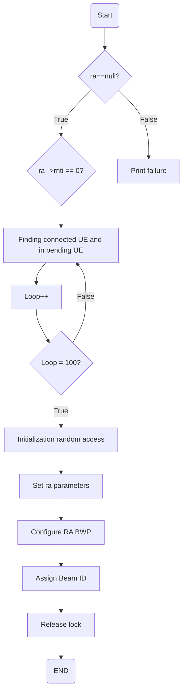
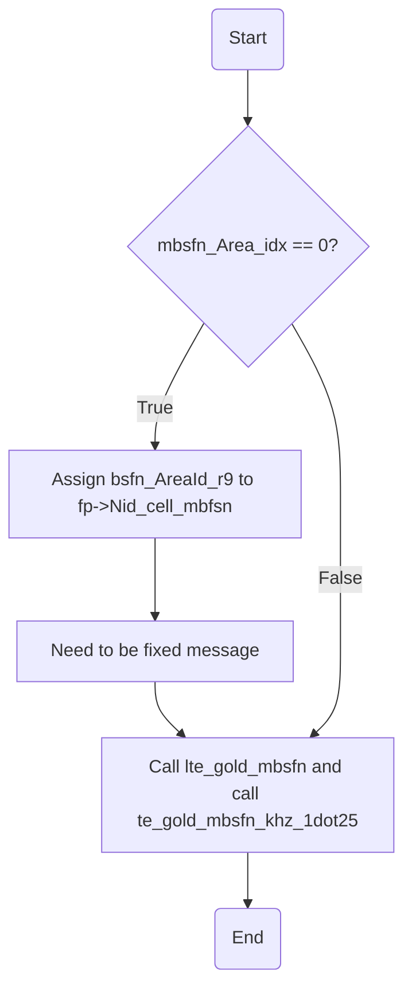
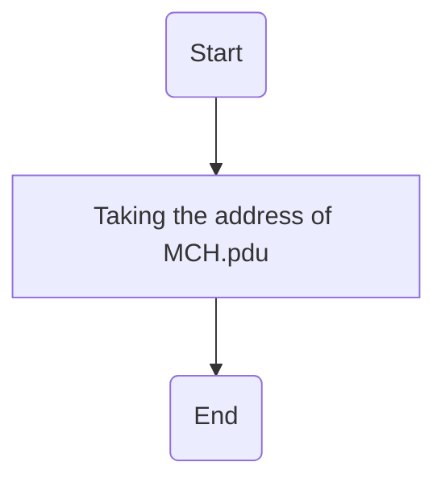

# nr_initiate_ra_proc
Assigning Unique identifiers (RNTIs) to new users (UEs) in 5G network

> [!NOTE]
> `Assign Beam ID` : Unique identifier for a specific beam direction used by the base station for directional communication with UE (User Equipment)

# phy_config_sib13_eNB
Configuration making sure each area are appropriately labeled

> [!NOTE]
> `Log Applying MBSFN Area ID` : MBFSN (Multicast Broadcast Single Frequency Networks). Enable tv services to be used by multiple users simultaneously

# get_mch_sdu
Accesses a branch (module_idP) and goes to a specific section (CC_id), and  returns the address where the MCH_pdu is stored in memory.

> [!NOTE]
> `MCH_pdu` is a data unit used to encapsulate and transmit multicast or broadcast data in LTE systems.

