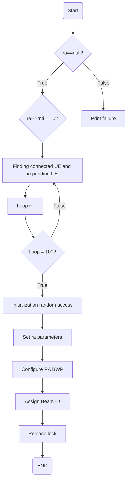
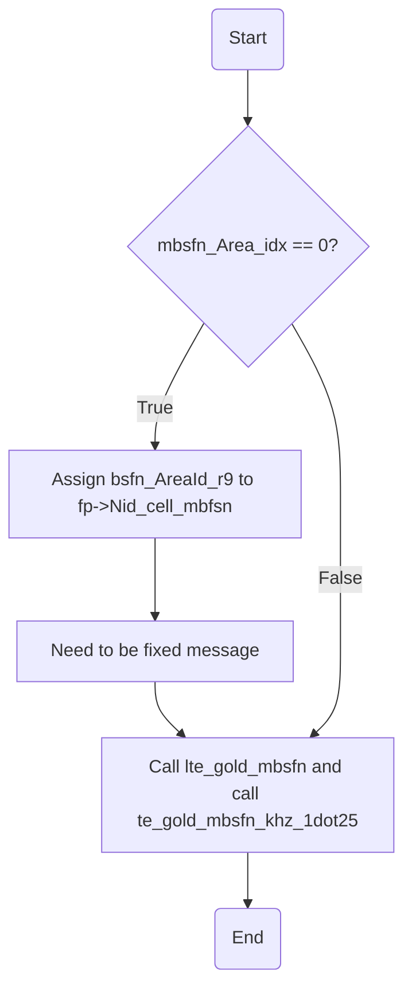
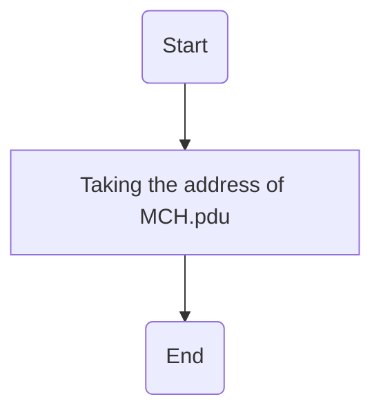

# nr_initiate_ra_proc
Assigning Unique identifiers (RNTIs) to new users (UEs) in 5G network



> [!NOTE]
> `Assign Beam ID` : Unique identifier for a specific beam direction used by the base station for directional communication with UE (User Equipment)


# phy_config_sib13_eNB
Configuration making sure each area are appropriately labeled

> [!NOTE]
> `Log Applying MBSFN Area ID` : MBFSN (Multicast Broadcast Single Frequency Networks). Enable tv services to be used by multiple users simultaneously

# get_mch_sdu
Accesses a branch (module_idP) and goes to a specific section (CC_id), and  returns the address where the MCH_pdu is stored in memory.



> [!NOTE]
> `MCH_pdu` is a data unit used to encapsulate and transmit multicast or broadcast data in LTE systems.

# get_dlsch_sdu
Finding few types of data
1. SI_RNTI : Broadcast system - wide information
2. P_RNTI : Direct message to specific UE
3. UE_id : Individual user-specific data peyloads

```
  if (rntiP == SI_RNTI) {
    LOG_D(MAC, "[eNB %d] CC_id %d Frame %d Get DLSCH sdu for BCCH \n",
          module_idP,
          CC_id,
          frameP);
    return ((unsigned char *) &eNB->common_channels[CC_id].BCCH_pdu.payload[0]);
  }
```
This block of code specifically handles the case where the requested RNTI is the SI_RNTI, which is used for broadcasting system information via the BCCH (Broadcast Control Channel). It logs the action and **returns a pointer to the payload (core data or information that is being transmitted or stored) of the BCCH PDU** (Broadcast Control Channel Protocol Data Unit), allowing the **system information to be transmitted over the DLSCH (Downlink Shared Channel)**. This mechanism ensures that all UEs in the cell can receive necessary system information, essential for proper network operation and UE configuration.

```
  if (rntiP == P_RNTI) {
    LOG_D(MAC, "[eNB %d] CC_id %d Frame %d Get PCH sdu for PCCH \n",
          module_idP,
          CC_id,
          frameP);
    return ((unsigned char *) &eNB->common_channels[CC_id].PCCH_pdu.payload[0]);
  }

  UE_id = find_UE_id(module_idP, rntiP);
```
Checking whether rntiP equals with P_RNTI which usually represents Paging Radio Network Temporary Identifier (Paging messages in the LTE and 5G Networks). The function **returns a pointer to the payload of the PCCH SDU**. This is accessed through eNB->common_channels[CC_id].PCCH_pdu.payload[0], which likely points to the start of the PCCH payload buffer.

```
  if (UE_id != -1) {
    LOG_D(MAC, "[eNB %d] Frame %d:  CC_id %d Get DLSCH sdu for rnti %x => UE_id %d\n",
          module_idP,
          frameP,
          CC_id,
          rntiP,
          UE_id);
    return ((unsigned char *) &eNB->UE_info.DLSCH_pdu[CC_id][TBindex][UE_id].payload[0]);
  }
```
Checking the User Equipment whether it is recognized as invalid or uninitialized as '-1' often used to signify those conditions. The function will run when the UE ID is valid. `CC_id is Carrier Component`. It then returns a pointer to the **payload of the DLSCH SDU associated with the identified UE**. 

```
  LOG_E(MAC, "[eNB %d] Frame %d: CC_id %d UE with RNTI %x does not exist\n",
        module_idP,
        frameP,
        CC_id,
        rntiP);
  return NULL;
}
```
This part of the code ensures robust error handling. If the function is called with an RNTI for which no corresponding UE exists, it logs an error message and returns NULL. This informs the calling function or module that the requested operation could not be completed due to the non-existence of the specified UE.

> [!NOTE]
> `data payloads` : actual information that is transmitted or stored within a communication system

# eNB_dlsch_ulsch_scheduler
Managing and making sure an efficient process. Handling UE & resources


