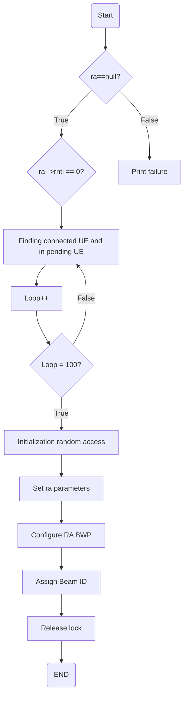

# nr_initiate_ra_proc
Assigning Unique identifiers (RNTIs) to new users (UEs) in 5G network

> [!NOTE]
> `Assign Beam ID` : Unique identifier for a specific beam direction used by the base station for directional communication with UE (User Equipment)

# phy_config_sib13_eNB

