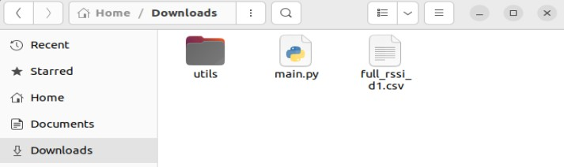
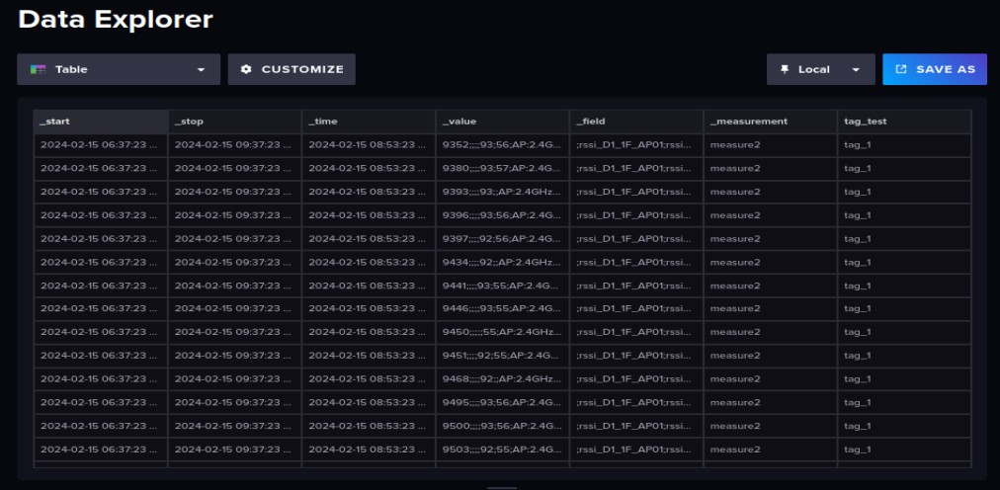

# **Importing Data to InfluxDB**

**Goal：**

* Successfully importing data to influxdb using python script

**Main Reference：**

* [InfluxDB_Data_Movement](https://github.com/bmw-ece-ntust/internship/blob/00bf762eb341ace96cd3d1e00179a407aa3df8a3/learning_notes/InfluxDB_Data_Movement.md)

## **Table of Contents**
- [**Importing Data to InfluxD**](#importing-data-to-influxdb)
  - [**Table of Contents**](#table-of-contents)
  - [**Overview**](#overview)
  - [**Step-by-step using Python**](#step-by-step-using-python)

## **Overview**

This document outlines the process of importing data into InfluxDB using a Python script. The data import is achieved by utilizing a provided Python script named InfluxImporter.py and a main script named main.py.

## **Step-by-step using Python**

1. Start the InfluxDB and Grafana servers using the following commands:

```cmd
sudo systemctl start influxdb
sudo systemctl start grafana-server
```

2. Utilize the code provided by Michael, [InfluxImporter.py](https://github.com/bmw-ece-ntust/internship/blob/4db5f593b386c6a34b0e6fbb189b777c9af8bcf5/utils/InfluxImporter.py) for importing data. This script defines a class InfluxDBCSVImporter that facilitates the sequential movement of CSV data into an InfluxDB database. Ensure the script is saved in the utils folder with the name InfluxImporter.py.

```python
import csv
import influxdb_client, os, time
from influxdb_client import InfluxDBClient, Point, WritePrecision
from influxdb_client.client.write_api import SYNCHRONOUS

class InfluxDBCSVImporter:
    """ Move csv data into InfluxDB database sequentially.

    Args:
        url (str): InfluxDB hostname, or ip address with the port
        org (str): InfluxDB organization name to save the imported data
    
    Methods:
        import_csv(csvfile,bucket): Import CSV file with the filename defined by the csvfile argument into InfluxDB bucket

    """
    def __init__(self, url, org):
        self.url = url
        self.org = org
        


    def import_csv(self,csvfile="default.csv",bucket="target_bucket"):
        token = os.environ.get("INFLUXDB_TOKEN")
        client = influxdb_client.InfluxDBClient(url=self.url, token=token, org=self.org)

        #Initiate influx client
        write_api = client.write_api(write_options=SYNCHRONOUS)
        # Open your csv file
        with open(csvfile, 'r') as f:
            j = 0
            reader = csv.reader(f)
            headers = next(reader)  # Get the headers of the file
            for row in reader:
                #for debugging purpose
                j += 1
                #fields = {headers[i]: row[i] for i in range (len(row))}
                point = Point("measure2") \
                    .tag("tag_test", "tag_1")
                for i in range(len(row)):
                    point.field(headers[i],row[i])
                write_api.write(bucket=bucket, org=self.org, record=point)
                #for debugging purpose
                print("sent data:" + str(j))
                #time.sleep(1) # separate points by 1 second        
            client.close()
        return 0

```
3. Create a main script named [main.py](https://github.com/bmw-ece-ntust/internship/blob/4db5f593b386c6a34b0e6fbb189b777c9af8bcf5/main.py) (originally made by Michael) outside the utils folder. This script will utilize the InfluxImporter.py script to import data into InfluxDB. Replace the host, organization name, CSV filename, and bucket name in the script.

```python
import os
import argparse
from utils.InfluxImporter import InfluxDBCSVImporter

if __name__ == '__main__':
    # Parse command-line arguments
    parser = argparse.ArgumentParser()
    parser.add_argument('--url', type=str, default="http://localhost:8086'", help='The host of the InfluxDB server.')
    parser.add_argument('--org', type=str, required=True, help='The name of the database to write to.')
    parser.add_argument('--csv', type=str, required=True, help='CSV filename')
    parser.add_argument('--bucket', type=str, required=True, help='influxDB bucket name')
    args = parser.parse_args()
    
    csv_import = InfluxDBCSVImporter(url=args.url,org=args.org)
    if (csv_import.import_csv(csvfile=args.csv,bucket=args.bucket) == 0):
        print(" CSV successfully transferred! ")

```

4. Save the file to be imported into the same folder as main.py.



5. Export the API token in the terminal using the following command:
```cmd
export INFLUXDB_TOKEN=[YOUR TOKEN HERE]
```

6. Execute the main.py code in the command line with the following command (adjust the values of the arguments according to your setup):
```cmd
python3 ./main.py --url "influxdb-url" --org "organization-name" --csv "filename.csv" --bucket "bucket-name"
```

Now, when you run the main.py script and the CSV data is successfully imported, you'll see the output:

```
sent data: 1
sent data: 2
.
.
.
CSV successfully transferred!
```

This will indicate that the data import process was completed successfully.

You can also see the imported data in table as shown below:

