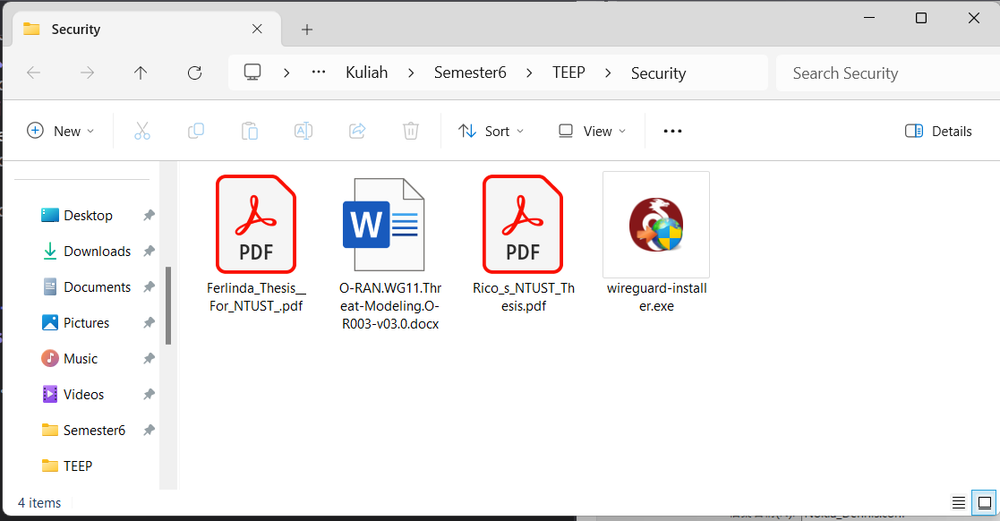
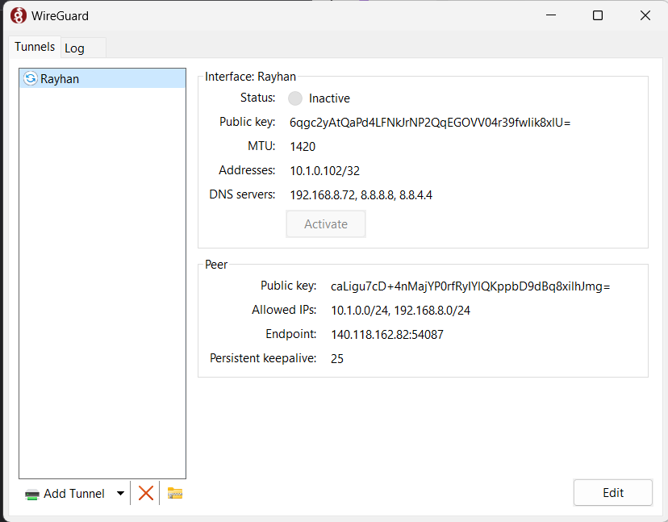
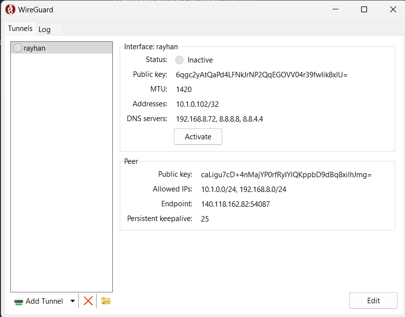
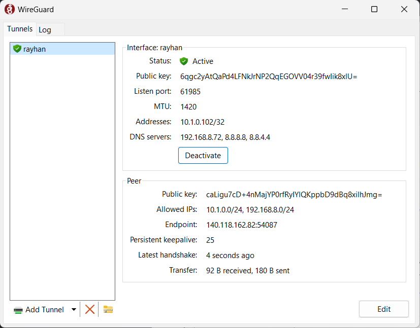
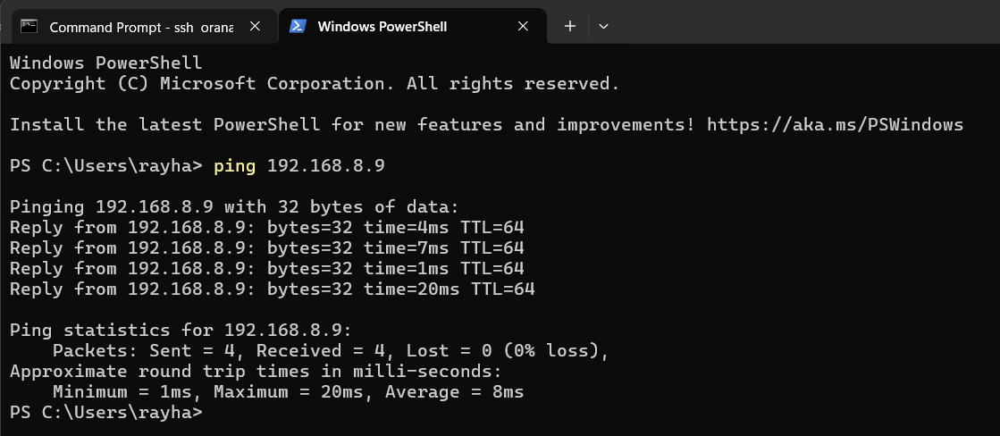
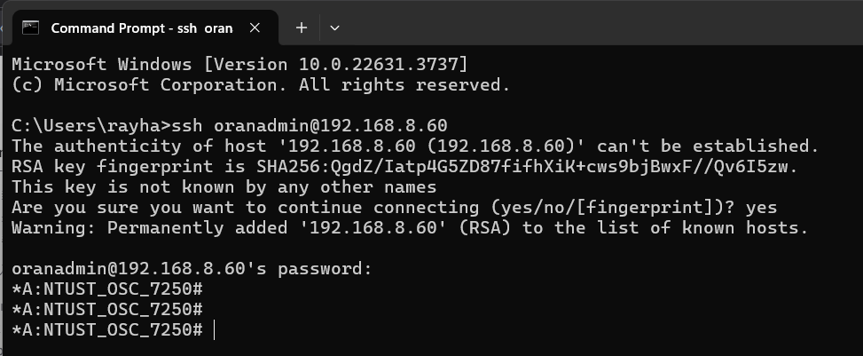

# 1. WireGuard Installation Documentation

### Reference
[Sylvia's Wireguard Installation Guide](https://hackmd.io/7uFpsm4PRu-igD04dZhrlw?view)

## 1.1 Download the installation file that match your OS


## 1.2 Add new tunnel


## 1.3 Put conf. file in tunnel

## 1.4 click connect
* unconnected

* connected


## 1.5 ping test



# 2. Nokia Switch

## 2.1 SSH Switch
```code=
ssh oranadmin@192.168.8.60
```

