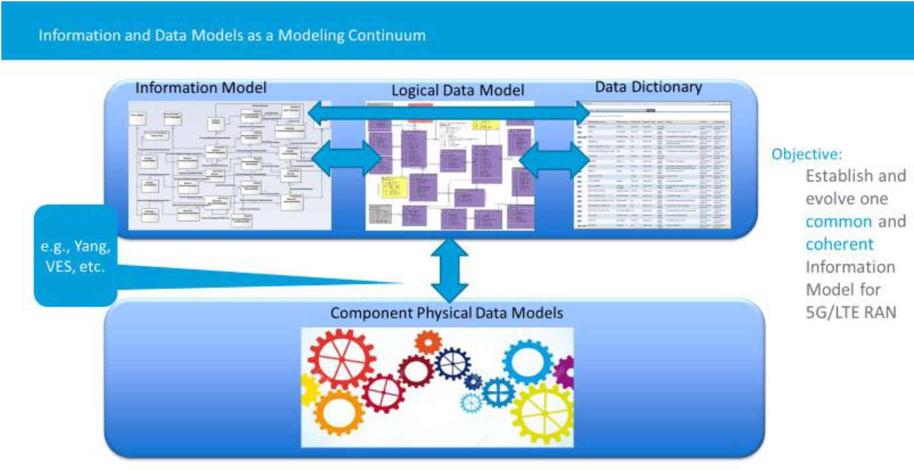
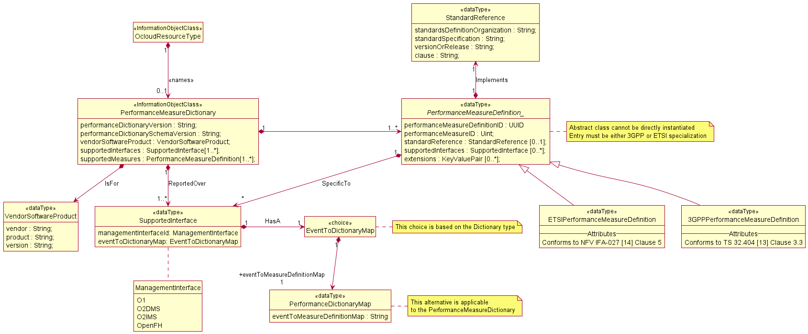
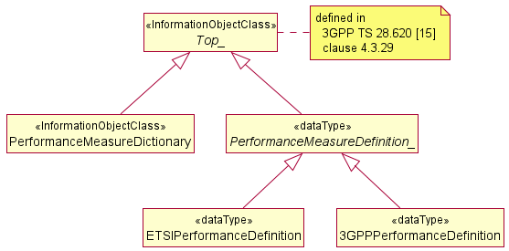

# O-RAN Information Model and Data Models
### 1. Overview
#### 1.1 Terms
* Information Model 
An information model is a representation of concepts as well as the relationships, constraints, rules, and actions used to provide data semantics for a particular domain of discourse. An Information Model often specifies relationships between types of objects, but it may also include relationships with specific entities. It can give a sharable, stable, and well-organized structure of information or knowledge for the domain context.
*  Data Model
A data model is an abstract model that organizes the data elements and standardizes their relationships to one another as well as to the attributes of real-world entities. The word "data model" can refer to two separate but closely related concepts: (1) an abstract formalization of the objects and relationships that exist in a specific application domain; (2) a set of concepts used to define such formalizations, such as entities, attributes, relations, or tables.
* Logical Data Model
A logical data model is a data model of a particular domain that is expressed in the form of data structures like relational tables and columns, object-oriented classes, or XML tags, rather than being dependent on a specific database management system or storage technology (physical data model).
* Data Dictionary
A data dictionary is a centralized repository of information about data such as meaning, relationships to other data, origin, 17 usage, and format
* Component Physical Data Models
A component's physical data model is a representation of the data design that has been implemented—or is expected to be implemented—in a database management system. In a project's lifecycle, it usually develops from a logical data model and will include the database artifacts required for creating relationships between tables or satisfy performance goals, such as indexes, constraint definitions, linked tables, partitioned tables or clusters.
#### 1.2 Information and Data Models as a Modeling Continuum

The O-RAN 'Modeling Continuum' aims to build a single, coherent Information Model for giving O-RAN enhancements to existing 4G/5G IMs, such as 3GPP NRMs, from which O-RAN Data Models can be built.
#### 1.3 Information and Data Modeling Co-Evolution

The previously shown "Modeling Continuum" is entirely conceptual and meant to serve as a foundation for the co-evolution of information and data modeling. Above is an example of how O-RAN modifies and implements it.
#### 1.4 Model and Use Case Development (process)

Above is an example of how O-RAN adapts and modifies its IM and DMs based on prioritized use cases.

### 2. O-RAN Information Model
#### 2.1 Modeling Approach
Modeling is the process of designing software applications prior to coding. In software projects, modeling is an important aspect. Models increase abstraction by hiding or masking details, revealing the "big picture," or focusing on different elements of a prototype. O-RAN's Information Model adopts the Unified Modeling Language™ (UML®) version 2.5.1 0 from the Object Management Group (OMG). 
#### 2.2 O-RAN Information Model Definitions
##### 2.2.1 Imported and associated information entities
Imported:

Associated:

##### 2.2.2 Class Diagram
##### Relationship:
ManagedApplication:

Performance Dictionary:

Alarm Dictionary:

##### Inheritance:
ManagedApplication:

Performance Dictionary:

Alarm Dictionary:

##### 2.2.3 Class definitions
