# AIMLFW

## 1. Try to familiar with AIMLFW
### 1-1. Enter the InfluxDB to check data

```shell
1| kubectl exec -it my-release-influxdb-56c6fdcfcd-j52z5 -- bash

2| influx query  'from(bucket: "UEData") |> range(start: -1000d)' -o primary -t UcxRTvArR5mk_-J2k17SEf1uvD_-PT_gi1L-zkXdvW1KcyiyqREs7aD3kxkdtDngmhCW5qBKM69h0djn_CfEgw==
```
result:
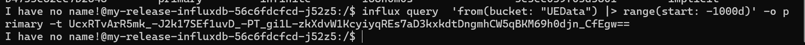

### 1-2. Change the code and token in insert.py

```shell
1| git clone -b f-release https://gerrit.o-ran-sc.org/r/ric-app/qp
2| cd qp/qp
3| sudo nano insert.py
```

result:
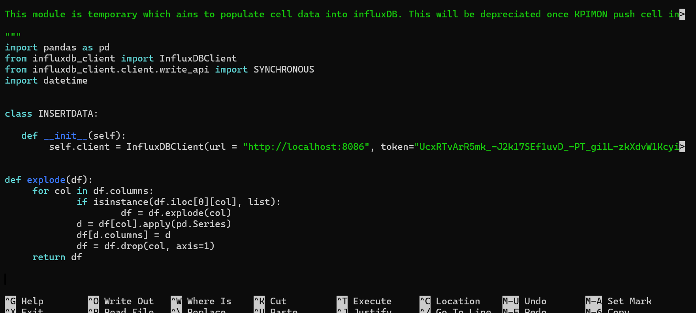

### 1-3. Check your influx service name and port
```shell
1| kubectl get service -A
```
result:


Move to another terminal and execute this command
```shell
2| kubectl port-forward svc/my-release-influxdb 8086:8086 -n ricplt
```
Back to first terminal and execute this command to insert data
```shell
3| python3 insert.py
```
result:
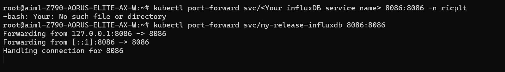

### 1-4. Check whether the data is in influxDB or not

```shell
1| kubectl exec -it my-release-influxdb-56c6fdcfcd-j52z5 -- bash

2| influx query  'from(bucket: "UEData") |> range(start: -1000d)' -o primary -t UcxRTvArR5mk_-J2k17SEf1uvD_-PT_gi1L-zkXdvW1KcyiyqREs7aD3kxkdtDngmhCW5qBKM69h0djn_CfEgw==
```

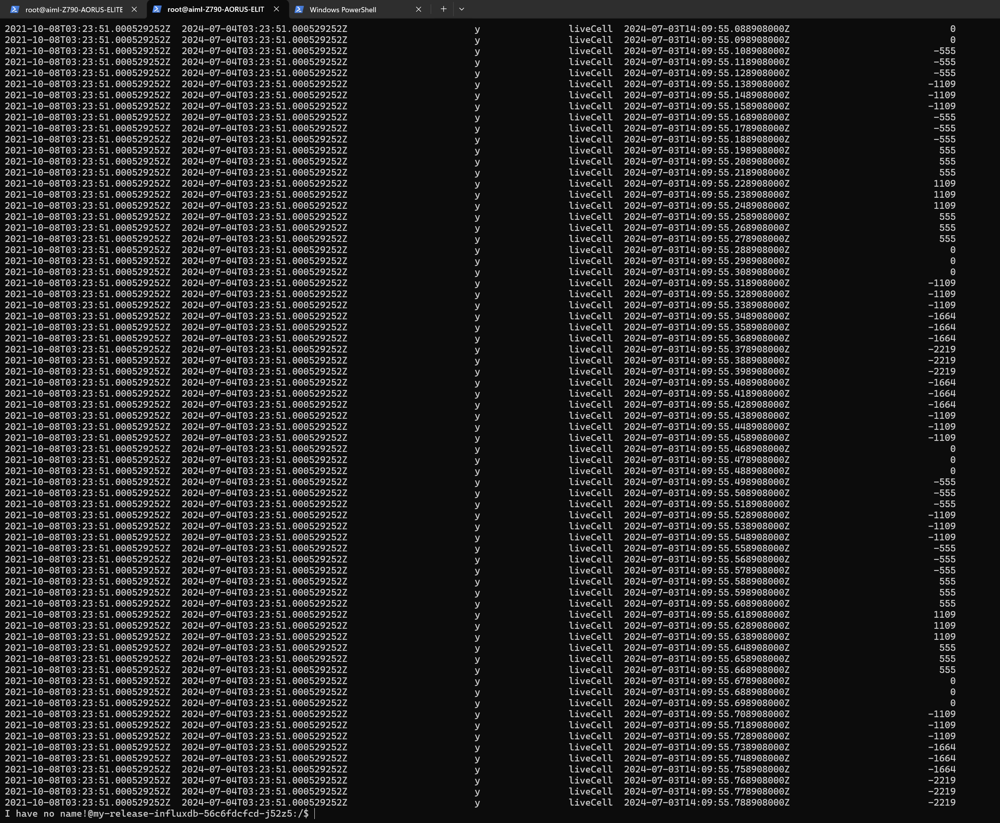

### 1-5. Trouble Shooting InfluxDB datalake (Optional)

```shell
1| cd aimlfw-dep/
2| vim RECIPE_EXAMPLE/example_recipe_latest_stable.yaml
```

Making sure ip address and datalake information are matching with yours
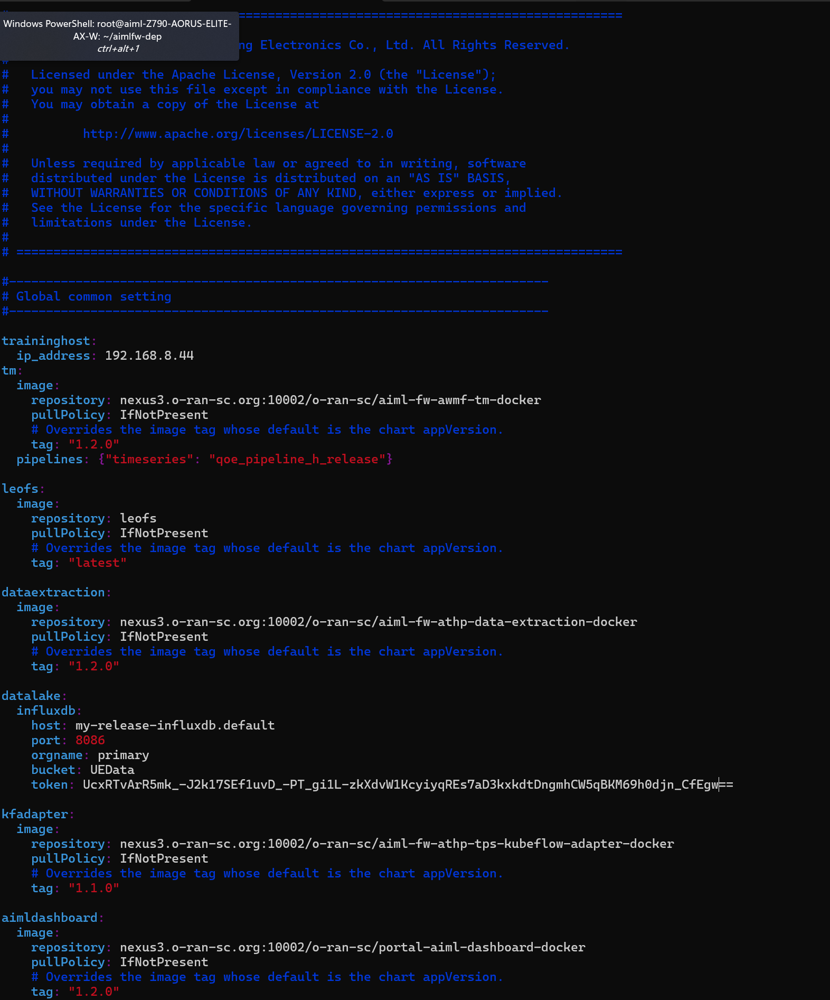

Use this command to reinstall
```shell
1| bin/uninstall.sh
2| bin/install.sh -f RECIPE_EXAMPLE/example_recipe_latest_stable.yaml
```
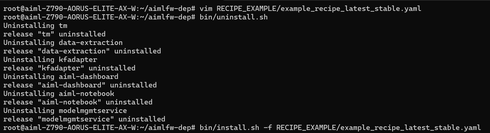
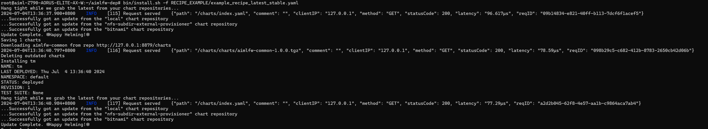

### 1-6. Deploy trained qoe prediction model on Kserve
#### 1-6-1. Use Enternet to enter the AIMLFW dashboard by using this url 
```shell
1| http://localhost:32005/
```
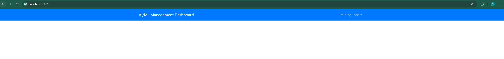

#### 1-6-2 Create Training Function
Go to Training Function and create a training function with Jupyter notebook that converted to zip file and upload it


#### 1-6-3 Create A Feature Group
Create a feature group with your own configuration, and dont forget to collect data that only needed in your model, mine is like this
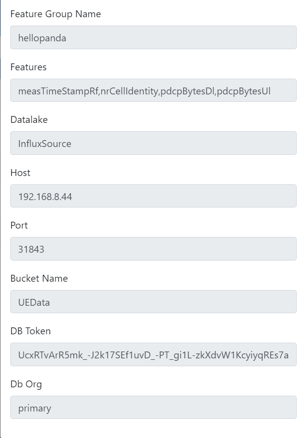


#### 1-6-4 Create A Training Job
Create a training Job with your own configuration, mine is like this


Wait a minute and go to training job status, if success, it will shown like this


### 1-7 Deploy Training qoe prediction model on server

Create a namespace using command below
```shell
1| kubectl create namespace kserve-test
```

create qoe.yaml with your own config
```shell
1| cd
2| vim qoe.yaml
```
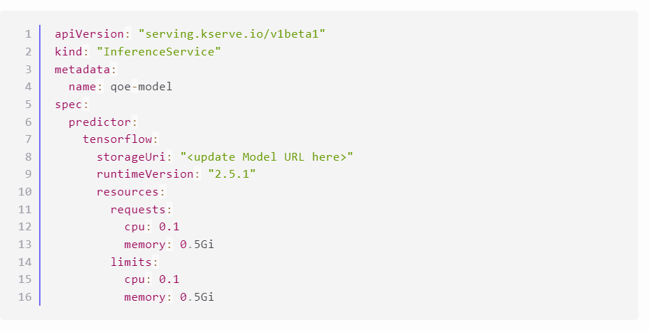

Update model URL with your own model
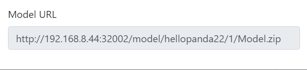


deploy model update with command below
```shell
kubectl apply -f qoe.yaml -n kserve-test
```
and make sure that model running with this command
```shell
kubectl get pods -A
```
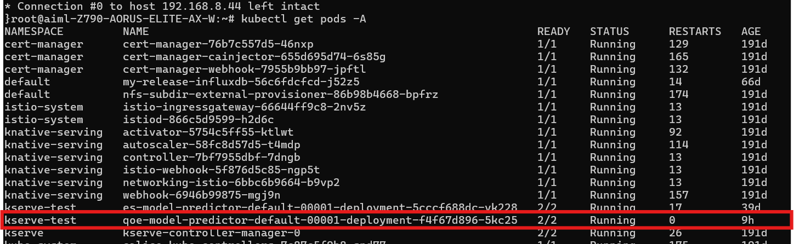


check running state with this command
```shell
kubectl get pods -n kserve-test
```

### 1-8 Test Prediction
Use this command to obtain port
```shell
kubectl get svc istio-ingressgateway -n istio-system
```
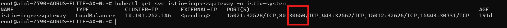

Use this command to obtain IP
```shell
ip a
```
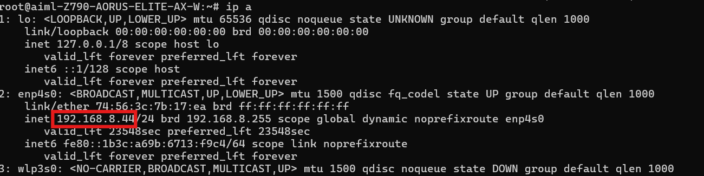

Create predict.sh with this following command and make sure to use your own IP and port
```shell
vim predict.sh
```
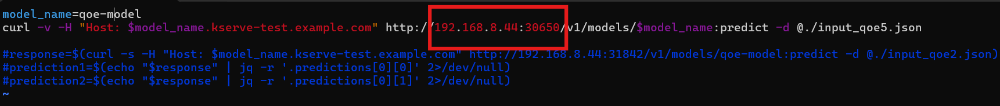

Create sample data for prediction in file input_qoe.json with this command
```shell
vim input_qoe.json
```

```shell
{"signature_name": "serving_default", "instances": [[[2.56, 2.56],
       [2.56, 2.56],
       [2.56, 2.56],
       [2.56, 2.56],
       [2.56, 2.56],
       [2.56, 2.56],
       [2.56, 2.56],
       [2.56, 2.56],
       [2.56, 2.56],
       [2.56, 2.56]]]}
```

Use this command to predict
```shell
source predict.sh
```
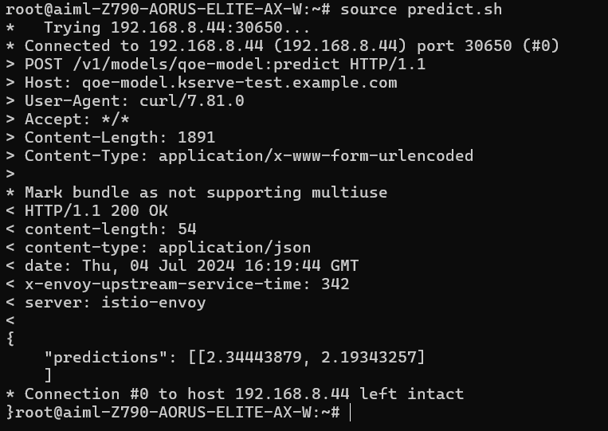

