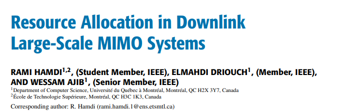
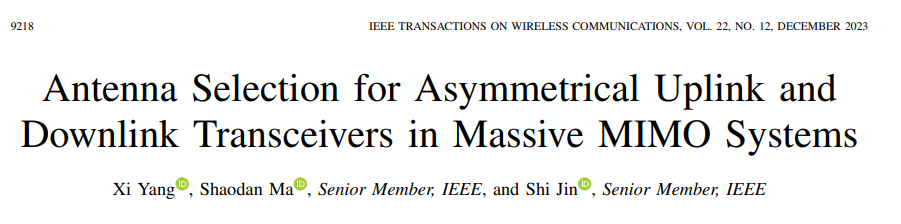
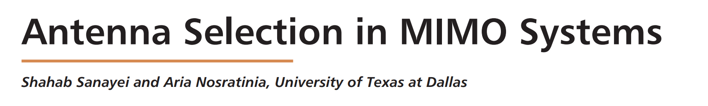

# Antenna Switching

## 1. Resource Allocation in Downlink Large-Scale MIMO Systems

**Key Effect of Switching Antenna**:
- **Positif**: 
  - Sum-Rate Maximization: The system can maximize the sum-rate. This is achieved through better channel utilization and reducing interference among user
  - Interference Reduction: Deactivating antennas that contribute to high interference can lead to cleaner communication channels

- **Negative**
  - Sensitivity to Channel Estimation Errors: The performance of antenna switching strategies can be highly sensitive to channel estimation errors. Imperfect channel state information (CSI) can degrade the benefits of antenna switching by leading to suboptimal decisions​
  - Initial Overhead: There is an initial overhead associated with determining the optimal antenna configuration. This includes the time and resources needed to perform the necessary calculations, which might not be feasible in all scenarios

## 2. Antenna Selection for Asymmetrical Uplink and Downlink Transceivers in Massive MIMO Systems

**Key Effect of Switching Antenna**:
- **Positif**: 
  - Improved Downlink Transmission Performance:
Proper antenna selection algorithms can accurately recover full-dimensional downlink channel state information (CSI), thereby achieving excellent downlink transmission performance despite fewer receive RF chains.

- **Negative**
  - Channel Dimension Inconsistency:
Asymmetrical transceivers create a dimension inconsistency between uplink and downlink channels. This means only partial downlink CSI can be obtained from the uplink, which complicates the recovery of full-dimensional downlink CSI.​
  - Potential Degradation in Uplink Performance:
Although the downlink performance can be maintained, the reduction in the number of receive RF chains can degrade uplink performance, impacting the overall system efficiency

## 3. Antenna Selection in MIMO Systems

**Key Effect of Switching Antenna**:
- **Positif**: 
  - Improved Signal Quality and Diversity:
Antenna switching can significantly enhance the signal quality by selecting the antenna with the best signal-to-noise ratio (SNR). 
  - Increased System Capacity:
In a rich scattering environment, antenna selection can lead to higher system capacities by allowing the transmission of parallel independent data streams. This improves the overall data throughput of the system​

- **Negative**
  - Feedback and Latency Issues:
Transmit antenna selection requires a feedback path from the receiver to the transmitter to inform which antennas to use. This feedback introduces additional latency and can complicate the system design
  - Limited Benefit in Frequency-Selective Channels:
In channels with high frequency selectivity, the optimal antenna selection may vary across different frequency bands, making it difficult to achieve significant gains. This limits the effectiveness of antenna selection in such environments
  - Suboptimal Performance in Dynamic Environments:
The performance of antenna selection techniques can degrade if the channel conditions change rapidly and are not quasi-stationary. 

## Trade Off & Effect of Antenna Selection

1. CSI Down -> Problem in Spatial Multiplexing -> Decreasing Troughput, Increasing interference
2. CSI Down -> UE cannot select the best beam 
3. Gain Down -> SNR Down -> UE Metrics Down
4. QOS and CSI can be the constraint for optimization problem
5. 