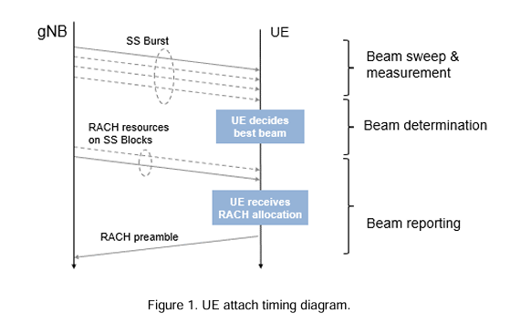
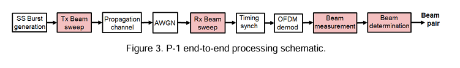
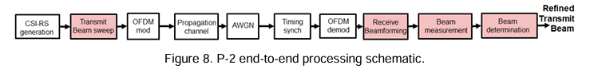
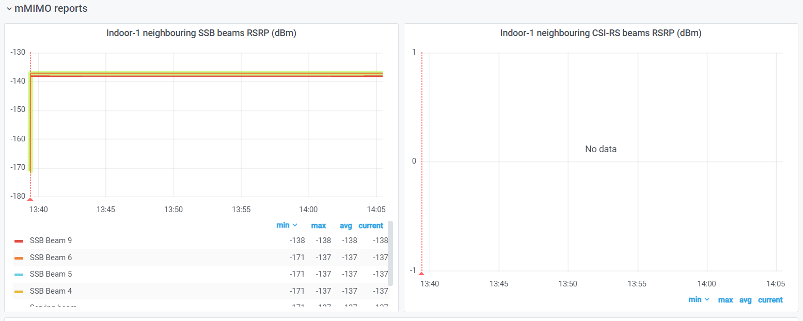
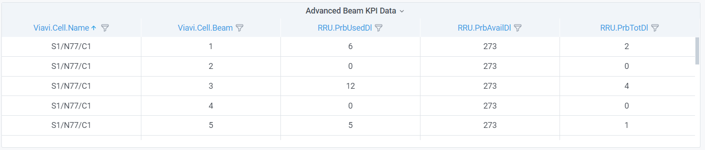

# Massive MIMO Parameter

## 1. 5G Beam Management

### 1.1 Components

Beam management is a set of Layer 1 (PHY) and Layer 2 (MAC) procedures to establish and 
retain an optimal beam pair for good connectivity. A beam pair consists of a transmit beam and a corresponding receive beam in one link direction. 

#### 1.1.1 Beam Sweeping

Beam sweeping is used during initial access by UE to choose the best beam.

A gNB transmits beams in all directions in a burst at regular defined intervals. Whenever a UE is synchronizing with the network, it reads the synchronization signal block (SSB) and extracts 
the following: 
- Primary synchronization signal (PSS): 

  - One of three possible sequences 
  - Provides timing estimate 
- Secondary synchronization signal (SSS): 
  - One of 336 possible sequences 
  - Provides cell ID (one of 3*336 = 1008) 
- Physical broadcast channel (PBCH) and demodulation reference signal (DMRS): 
  - Contains master information block (MIB) 
  - Includes basic information to take the next step, which is to decode the system information block (SIB)-1  

#### 1.1.2 Beam Measurement and Determination

The UE measures beam strength through received signal power. 
**In idle mode** , it uses **synchronization signals**, while in **connected mode**, it relies on the **channel state information reference signal (CSI-RS)** for downlink and the sounding reference signal (SRS) for uplink. Periodically, the UE searches for the best beam based on predefined threshold criteria set by the gNB and selects the beam with the highest **reference signal received power (RSRP)**.

#### 1.1.3 Beam Reporting

The UE identifies the **best beam** and informs the gNB through beam reporting. During initial access or when out of sync, the UE uses the **random access channel (RACH)** to establish synchronization. In idle mode, after selecting the best beam, the UE transmits the RACH preamble at specific intervals and offsets. This preamble corresponds to the SS block of the best beam. There is a one-to-one mapping between the received SS block and the transmitted RACH preamble. The network configures the UE to perform and report measurements at preconfigured intervals, known as measurement reporting. In connected mode, the UE reports the best beam through a measurement report during active data transfer with the gNB.

#### 1.1.4 Beam Recovery

In the case of beam failure due to poor channel condition, the beam recovery process is 
triggered to get back a new beam. UE monitors the reference signal and identifies the beam failure once the failure trigger conditions are met. 

UE chooses the next best beam for sending in a random access (RA) preamble when the 
beam failure happens. If first attempt of RA fails, it sweeps to another beam for another RA procedure. The RA preamble is sent in the PRACH. Finally, UE receives a downlink resource allocation and an uplink grant on the physical downlink control channel (PDCCH).  

#### 1.1.5 Beam Switching 

Beam switching is based on a trigger condition for a beam and the configured beam 
switching algorithm. This is applicable when UE is in connected mode and can be done 
through L1/ L2 procedures. On the other hand, handover is for inter-cell mobility and is an L3 procedure.

### 1.2 Beam Management Procedures

#### 1.2.1 SSB-Based Beam Sweeping

SSB-Based Beam Sweeping is a procedure used during the initial acquisition phase in 5G beam management to identify the best beam pair for communication between the User Equipment (UE) and the gNB. This process is crucial for establishing a directional link in idle mode, ensuring effective communication setup and maintenance.

- Synchronization Signal Block (SSB):
  - Contains Primary Synchronization Signal (PSS) and Secondary Synchronization Signal (SSS).
  - Provides timing estimates and cell ID, respectively.
  - Physical Broadcast Channel (PBCH) includes the Master Information Block (MIB).
- SS Block Structure:
  - Each SS block spans four OFDM symbols and 240 subcarriers.
  - SS blocks are grouped into an SS burst set spanning a 5ms window, repeated every 20ms.
  - Each SS block is beamformed in different directions to cover the entire cell area.
- Beam Sweeping Process:
  - gNB transmits beamformed SS blocks in all directions at regular intervals.
  - UE synchronizes with the network by reading the SSB and measuring the received signal power (RSRP) for each beam pair.
  - The process involves transmit-end and receive-end beam sweeping to cover all possible beam directions.
- Measurement and Determination:
  - UE measures the RSRP for each transmit-receive beam pair.
  - The best beam pair with the maximum RSRP is selected as the optimal beam pair for initial access.

#### 1.2.2 CSI-RS Based Transmit-End Beam Refinement

After the initial beam is established in 5G networks, transmit-end beam refinement is necessary to achieve unicast data transmission with high directivity and gain. This process uses non-zero-power Channel State Information Reference Signals (CSI-RS) for downlink refinement and Sounding Reference Signals (SRS) for uplink refinement. The main goal is to refine the initial beam to a finer beam for better communication quality.

- Beam Sweeping:
  - Transmit-end beam sweeping occurs by transmitting beams in various directions within the angular range of the initial beam.
  - The UE captures the signals with a fixed receive beam and measures the Reference Signal Received Power (RSRP) for each transmit beam.
- Procedure:
  - Generate and beamform CSI-RS signals before Orthogonal Frequency Division Multiplexing (OFDM) modulation.
  - Transmit the modulated signal across a scattering channel with added AWGN (Additive White Gaussian Noise).
  - At the receiver, perform timing synchronization, OFDM demodulation, and receive beamforming.
  - Measure the beam strength and determine the best transmit beam based on RSRP measurements.

#### 1.2.3 CSI-RS Based Receive-End Beam Refinement

P-3 focuses on receive-end beam adjustment, where the beam sweeping happens at the 
receive end given the current transmit beam. This process aims to find the best receive beam, which can be a neighbor beam or a refined beam.  
For this procedure, a set of reference signal resources (non-zero-power [NZP] CSI-RS for 
downlink and SRS for uplink) are transmitted with the same transmit beam, and the UE or 
gNB receives the signal using different beams from different directions covering an angular range. Finally, the best receive beam is selected based on the RSRP measurements on all receive beams.

## 2. mMIMO Reports

**Indoor-1 neighbouring SSB beams RSRP**: Receive Signal Receive Power of SSB beam in Indoor-1 UE. 

**Indoor-1 neighbouring CSI-RS beams RSRP**: Receive Signal Receive Power of CSI-RS beam in Indoor-1 UE. 

**Viavi.Cell.Beam**: Beam index in a mMIMO cell.

**RRU.PrbUsedDl**: Mean downlink Physical Resource Blocks (PRBs) used for data traffic. 

**RRU.PrbAvailDl**: Maximum number of Physical Resource Blocks (PRBs) available for downlink. 

**RRU.PrbTotDl**: Total usage (in percentage) of Physical Resource Blocks(PRBs) on the downlink for any purpose. 

## 3. Important Parameters

**CARR.AverageLayersDl**
- Reason: Indicates the number of spatial streams being used, which is crucial for understanding the capacity and performance of mMIMO systems.

**DRB.UEThpDl and DRB.UEThpUl**
- Reason: Measures the data rate performance from the user's perspective, essential for evaluating the efficiency of mMIMO deployments.

**PEE.AvgPower and Viavi.PEE.EnergyEfficiency**
- Reason: Key for assessing the power consumption and energy efficiency of the mMIMO system, which is critical for sustainable 5G deployments.

**RRC.ConnEstabSucc.mo-Data, RRC.ConnEstabSucc.mo-VoiceCall, RRC.ConnEstabSucc.mo-VideoCall**
- Reason: These metrics provide insight into the reliability and quality of service provided by the mMIMO system.

**Viavi.UE.targetThroughputDl**
- Reason: Indicates the expected performance and helps in evaluating if the mMIMO system meets the required service levels.

**Viavi.Radio.azimuth**
- Reason: Important for beamforming and coverage optimization in mMIMO systems.

**QosFlow.TotPdcpPduVolumeDl and QosFlow.TotPdcpPduVolumeUl**
- Reason: These parameters indicate the data throughput efficiency, which is vital for understanding the data handling capabilities of the network.

**RRC.ConnMax and RRC.ConnMean**
- Reason: These parameters provide insights into the network's capacity to handle multiple users simultaneously.

**RRU.PrbTotDl and RRU.PrbTotUl**
- Reason: Indicates the efficiency of resource utilization in the network.