# MIMO Scenario

## 1. Two Site
### 1.1 SSB Based

**Cell and UE map**: 

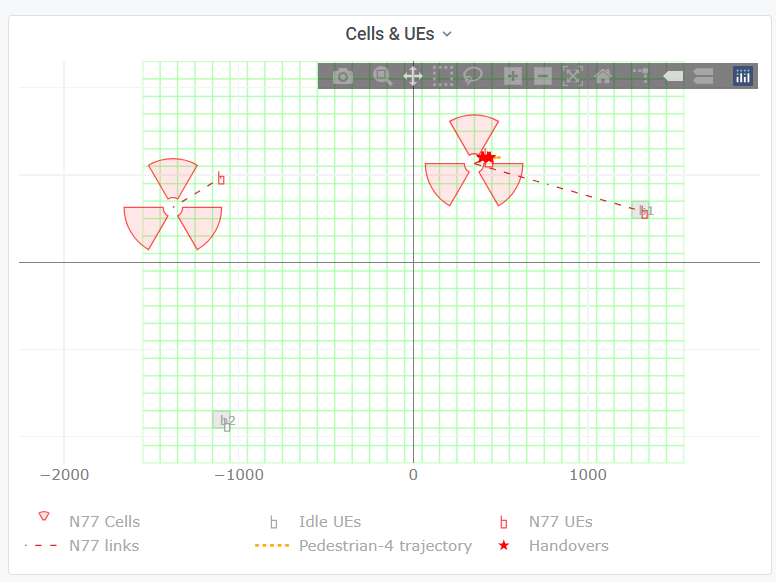

#### 1.1.1 **Pedestrian**

**RSRP**

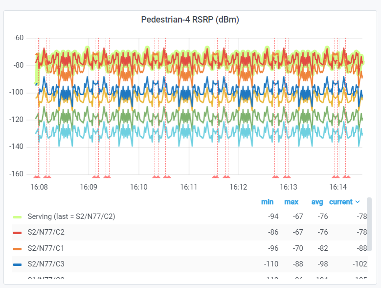

**THP**

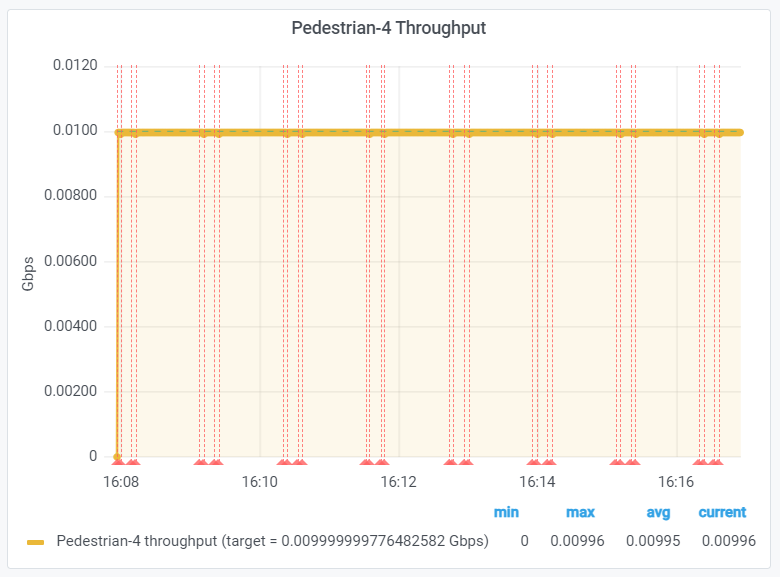

**THP & PRB per slice**

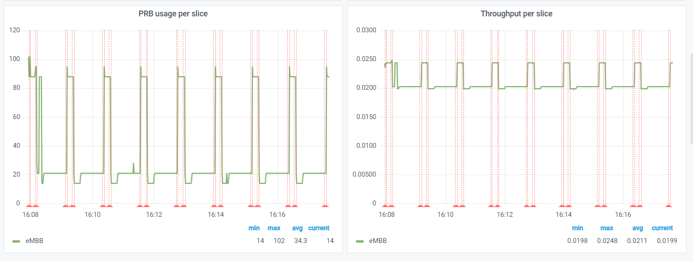

**SSB Beam RSRP**

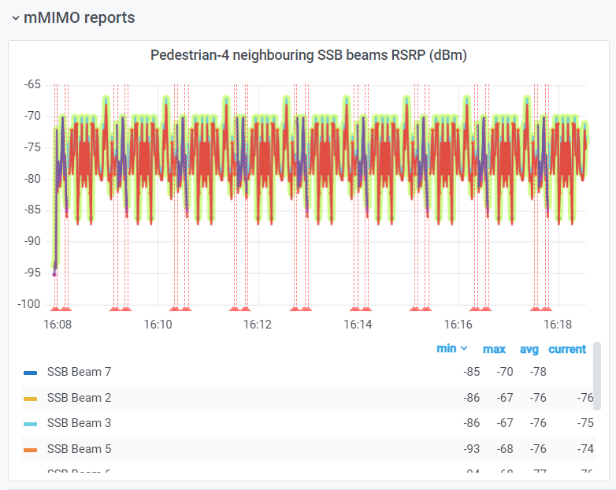

#### 1.1.2 **Indoor**

**RSRP**

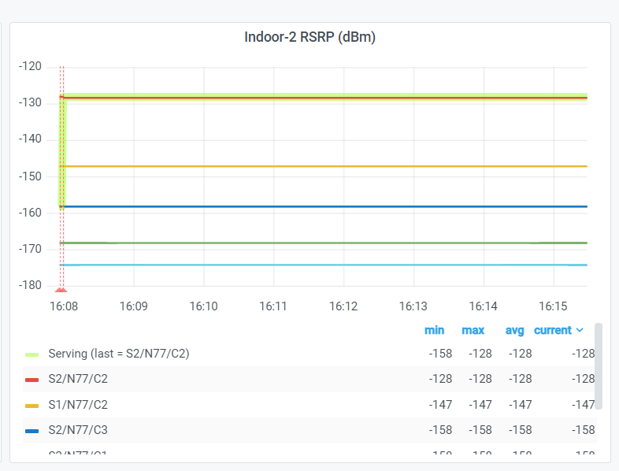

**THP**

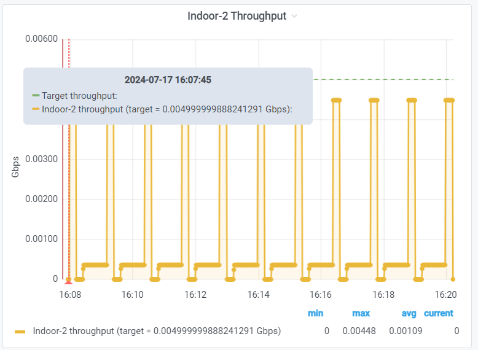

**THP & PRB per slice**

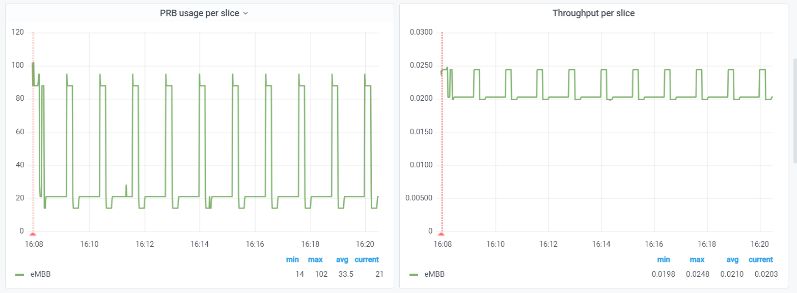

**SSB Beam RSRP**

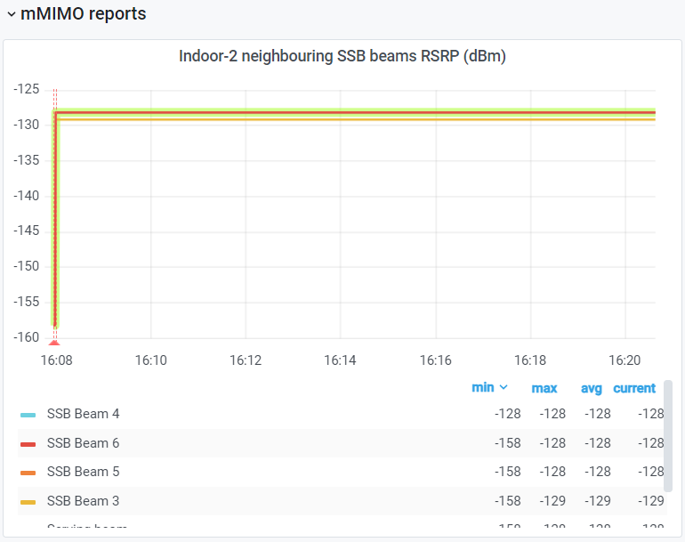

### 1.2 CSI-RS Based

#### 1.2.1 **Pedestrian**

**RSRP**

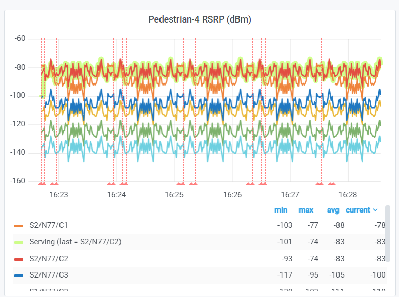

**THP**

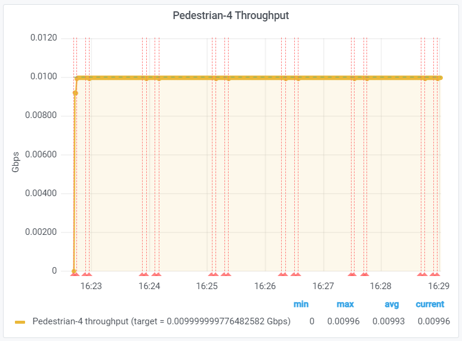

**THP & PRB per slice**

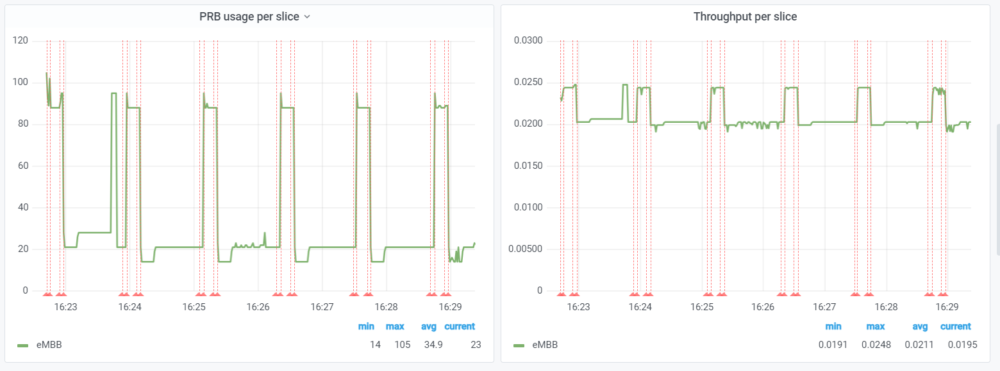

**CSI-RS Beam RSRP**

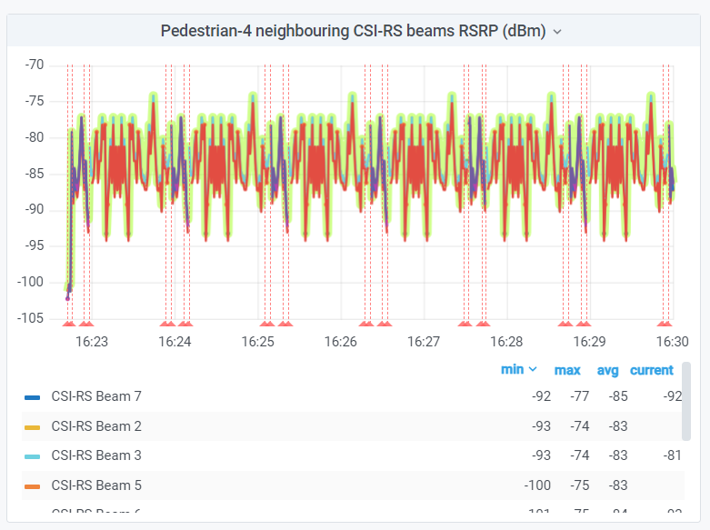

#### 1.2.2 **Indoor**

**RSRP**

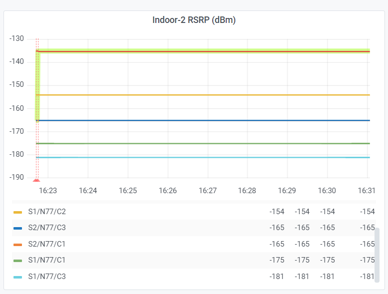

**THP**

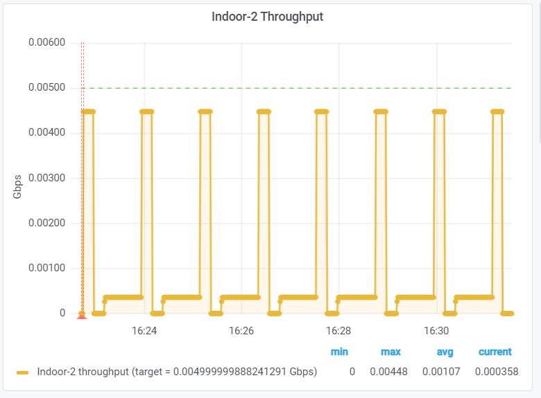

**THP & PRB per slice**

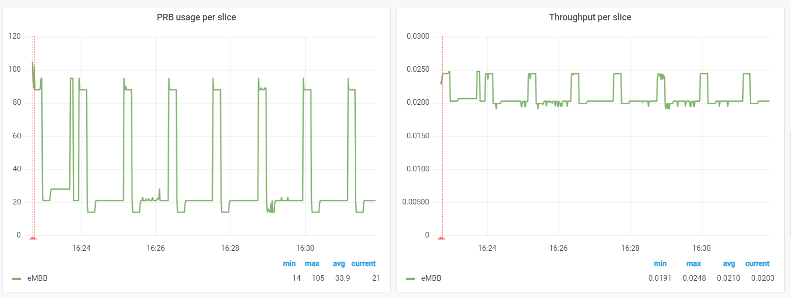

**CSI-RS Beam RSRP**

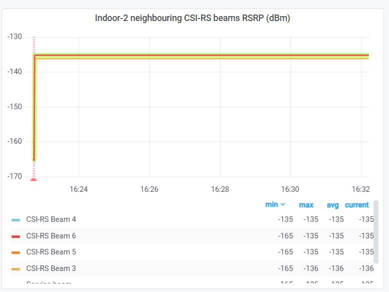

**Average Comparison**

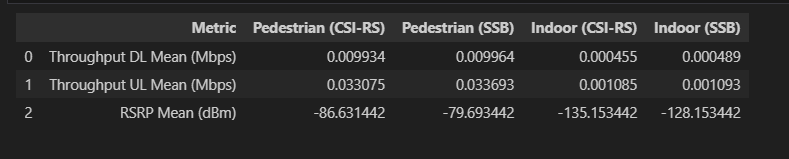

