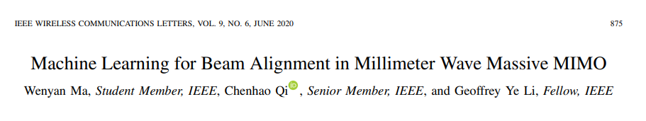
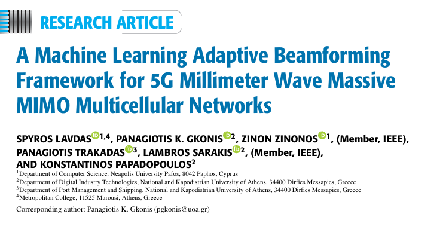

# Table of Content
1. [Paper 1](#paper-1)
   - [1.1 Summary](#11-summary)
   - [1.2 Data, Pros, and Cons](#12-data-pros-and-cons)
2. [Paper 2](#paper-2)
    - [2.1 Summary](#21-summary)
    - [2.2 Data, Pros, and Cons](#22-data-pros-and-cons)
3. [Paper 3](#paper-3)
    - [3.1 Summary](#31-summary)
    - [3.2 Data, Pros, and Cons](#32-data-pros-and-cons)
4. [Paper 4](#paper-4)
    - [4.1 Summary](#41-summary)
    - [4.2 Data, Pros, and Cons](#42-data-pros-and-cons)
5. [Paper 5](#paper-5)
    - [5.1 Summary](#51-summary)
    - [5.2 Data, Pros, and Cons](#52-data-pros-and-cons)

## 1. Paper 1

### 1.1 Summary

The primary challenge addressed by this paper is the inefficiency of traditional AMC methods, particularly the outer loop link adaptation (OLLA) technique, in rapidly changing environments and their inability to effectively utilize available signal-to-noise ratio (SINR) data.

The novelty of this work lies in the implementation of an online deep learning algorithm that can adapt to different environments, channel types, and user speeds. Unlike traditional methods, this approach leverages a fully connected neural network, initially trained on conventional algorithm outputs and incrementally retrained using service feedback.

### 1.2 Data

**DATA**  
The data for the online deep learning algorithm in the paper is generated through system-level simulations. 

**FEATURES**
- Subband SINR Measurements: Signal-to-noise-plus-interference ratio for each user antenna.
- CQI (Channel Quality Indicator): Reported by the user equipment.
Time Period from the Last Sounding: Time elapsed since the last sounding reference signal (SRS) measurement.
- RSRP (Reference Signal Received Power) Measurement: The last measured RSRP.

**TARGET**
- ACK (Acknowledgment) Probability: The probability of receiving a successful acknowledgment (ACK) for a given transmission. 

**REASON**
- Subband SINR Measurements:
By using subband SINR measurements, the model can accurately assess the channel conditions across different frequency bands. This enables more precise modulation and coding scheme (MCS) selection.
- CQI (Channel Quality Indicator):
Including CQI in the features helps the model incorporate the UE's perspective on the channel conditions, which is essential for making informed decisions about the optimal MCS.
- Time Period from the Last Sounding:
The time elapsed since the last sounding reference signal (SRS) measurement is important for understanding the temporal dynamics of the channel. 
- RSRP (Reference Signal Received Power) Measurement:
RSRP is a measure of the received signal strength. Including RSRP helps the model assess the overall power level of the received signal, which is crucial for determining the feasibility of higher-order modulation schemes that require higher signal quality.
Target
- ACK (Acknowledgment) Probability:
The primary objective of the AMC process is to maximize data throughput while ensuring reliable communication. The probability of receiving a successful acknowledgment (ACK) for a given transmission directly reflects the reliability of the chosen MCS. By predicting the ACK probability, the model can select the MCS that offers the highest expected throughput, balancing the trade-off between data rate and transmission reliability.

**CORRELATION WITH VIAVI DATASET**
- CQI = 'DRB.UECqiUL' and 'DRB.UECqiDL'

## 2. Paper 2

### 2.1 Summary
Existing methods for beam alignment, such as adaptive compressed sensing, hierarchical search, and multi-path decomposition and recovery, have limitations in terms of training time and spectral efficiency. These methods often rely on prior knowledge like user location information, which incurs additional system overhead.

The paper proposes an alignment method with partial beams using ML (AMPBML), which does not require prior knowledge of user locations. The neural network (NN) for AMPBML is trained offline in simulated environments and then deployed online to predict the beam distribution vector using partial beams. This method aligns beams for all users simultaneously, significantly reducing training time.

### 2.2 Data

**DATA**

The uplink and downlink channels are generated based on a specified channel model

**FEATURES**
- **Received Signal Vector (r)**: Stacked received signal vectors obtained during uplink beam training.
- **Analog Combining Matrix (Wt)**: Used for beam training, consists of columns selected from a beam steering codebook.
- **Channel Matrix (hu)**: Represents the channel between the base station and the users.

**TARGET**
- **Beam Distribution Vector(q)**: Indicates the alignment of the beams with the line-of-sight paths of the users.

**CORRELATION WITH VIAVI DATASET**
- **Received Signal Vector**: Can be related to uplink throughput metrics like "Average uplink throughput" (DRB.UEThpUl)
- **CQI** = 'DRB.UECqiUL' and 'DRB.UECqiDL'

## 3. Paper 3

### 3.1 Summary
The paper aims to evaluate the performance of an adaptive beamforming approach in 5G millimeter-wave (mmWave) multicellular networks using massive multiple-input multiple-output (m-MIMO) configurations. The focus is on improving spectral efficiency (SE) and energy efficiency (EE) while reducing hardware and algorithmic complexity.

### 3.2 Data

**DATA**

**FEATURES**
- **Physical Resource Blocks (PRBs)**
- **Transmitted Power (pk,s)**
- **Transmission Vector (tk,s)**
- **Energy Efficiency (EE)**
- **Throughput Demand**
- **Number of Active Users (MSs)**
- **Transmission Vector (tk,s)**

**TARGET**
- **Energy Efficiency (EE)**
- **Spectral Efficiency (SE)**
- **Blocking Probability (BP)**
- **Maximize Throughput**

**CORRELATION WITH VIAVI DATASET**
- 

## 4. Paper 4
### 4.1 Summary

### 4.2 Data, Pros, and Cons

**DATA**

**FEATURES**

**CORRELATION WITH VIAVI DATASET**

## 5. Paper 5
### 5.1 Summary

### 5.2 Data, Pros, and Cons

**DATA**

**FEATURES**

**CORRELATION WITH VIAVI DATASET**

