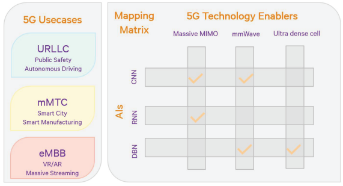
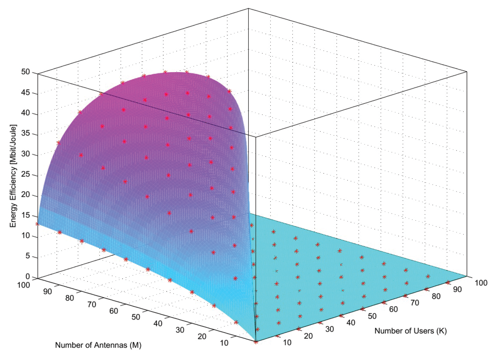
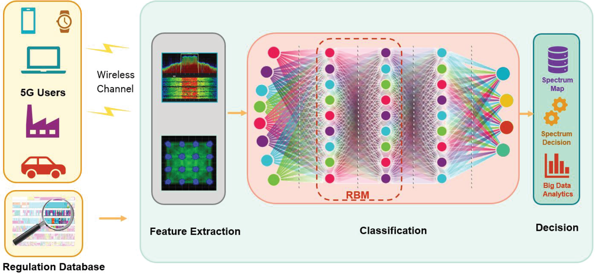

# Artificial Intelligence Defined 5G Radio Access Networks

## Table of Contents
- [Artificial Intelligence Defined 5G Radio Access Networks](#artificial-intelligence-defined-5g-radio-access-networks)
  - [Table of Contents](#table-of-contents)
  - [AI Supporting 5G Enablers](#ai-supporting-5g-enablers)
    - [Massive MIMO](#massive-mimo)
    - [Extended RF Spectrum and Spectrum Management](#extended-rf-spectrum-and-spectrum-management)
    - [Network Ultra-Densification](#network-ultra-densification)
  - [AI for Diverse 5G Application Scenarios and Services](#ai-for-diverse-5g-application-scenarios-and-services)
    - [Vehicular Networks](#vehicular-networks)
    - [VR and AR](#vr-and-ar)
  - [AI-Defined 5G RAT: PHY and MAC](#ai-defined-5g-rat-phy-and-mac)
    - [RNN for the PHY: AI-Aided Energy-Efficient Massive MIMO Beamforming](#rnn-for-the-phy-ai-aided-energy-efficient-massive-mimo-beamforming)
    - [DBN for the MAC: AI-Aided Spectrum Access System](#dbn-for-the-mac-ai-aided-spectrum-access-system)
  - [Limitation, Challenges, and Open Research Problems: A Discussion](#limitation-challenges-and-open-research-problems-a-discussion)
    - [AI at the Edge vs. AI over the Bridge](#ai-at-the-edge-vs-ai-over-the-bridge)
    - [Channel State Information](#channel-state-information)
    - [Security and Privacy](#security-and-privacy)

## AI Supporting 5G Enablers
Massively parallel processing devices such as graphic processing units (GPUs    ) and neural network processing units (NPUs), which can be deployed in a 5G BS/cloud, enable offloading the traditional data processing and have shown to be highly energy-efficient for neural network learning and inference . This section discusses the benefits of an AI framework to satisfy the technical challenges of 5G.

### Massive MIMO
m-MIMO is seen as leading candidate technology for 5G, yet has challenges in term of radio frequency power amplifiers (RFPA) it needed to support the high number of base station (BS) antennas, where highly linear PA is expensive and power-inefficient. 
- The excessive number of BS antennas makes the use of inexpensive components desirable to keep overall capital expenditures (CapEx) and operational expenditures (OpEx) manageable. 
- Emerging wideband wireless systems are vulnerable to nonlinear distortions from RF front-ends, especially high-power amplifiers (HPA) affecting network performance of the intended receiver and the entire network. 
- Other challenges is the goal of next generation communication that operate in more dynamic environments and different bands, makes PA need to have stricter linearity specifications and efficiency. The highest PA efficiency still not a feasibly solution for high peak-to-average power ratio (PAPR) signals and not realistic for 5G BS.

 Signal-processing-based solutions are used to provide a better cost-performance trade-off, including AI solution.
 - Artificial neural networks (ANNs) can tackle nonlinearity problems at the physical layer by predicting and correcting these distortions, enhancing energy efficiency and performance.
 - they are well suited to tackle nonlinearity problems at the PHY layer, including PA nonlinearity tracking, predistortion, and impairment 
correction. 

### Extended RF Spectrum and Spectrum Management

The milimeter-Wave Systems (mmWave) access large amount of bandwidth in high-frequency bands (30-300GHz) to enable multi-gigabit-per-second connectivity, using highly directional communication links to focus energy and reduce interference.
- 5G verticals use hybrid spectrum landscape, a combination of low (microwave, mmWave) and high frequencies that is necessary to maintain seamless network connectivity.
- AI can help manage the hybrid spectrum by learning from user behaviors and network conditions, providing real-time resource management, self-planning, self-organizing, and self-healing capabilities for multi-RAT BS.

### Network Ultra-Densification
The ultra-dense small cells are crucial for meeting the high data traffic demands of 5G, creates many technical challenges including finer-grained resource allocation and cross-tier interference mitigation. These challenges already have some solutions provided with the help of AI and other techniques:
- AI and small cell deployments enhance 5G by efficiently managing co-channel interference through massive MIMO beamforming and mmWave transmission.
- Radio Environment Map (REM) use dense geolocation databases to collect historical radio environment data, aiding AI-enabled interference mitigation.
- AI in Baseband Unit (BBU) pool optimize radio resource management, interference management, and handover control, improving network flexibility and reducing costs.
- AI in centralized processing of CSI provide additional insights into the channel that performs closer to channel capacity and schedulers that provide better fairness and end-user experience.

## AI for Diverse 5G Application Scenarios and Services 

### Vehicular Networks
Vehicular networks use wireless technologies to improve traffic safety and transportation efficiency, especially in active driving assistance. This application involve manufacturers, wireless policy regulators, and transportation authorities.
- Application for this scenario such as automated toll collection, autonomous driving systems, and information provisioning systems.
- AI enhance vehicular networks by providing reliable, efficient, low-latency, and cooperative communication. It can be done by defining AI in 5G BS, and make it capable to learn behaviours of autonomous vehicles, driving states, obstacles, and lane-changing behaviours to assist transportation systems.
- Data collected for vehicular networks such as vehicle-centric data (speed, global positioning, device functionality, and performance), road-centric data ( road surface condition, routing, collision), and passenger-centric information (drowsiness, length of continuous driving, etc).
### VR and AR
Online VR and AR need to process many kinds of information at the same time, including how to transfer those information. Ultra Reliable and Low Latency Communication (URLLC) and enhanced Mobile Broadband (eMBB) needed to avoid motion sickness and support ultra-high-definition video streaming.
- Current VR systems facing huge delays due to heavy image processing tasks. 5G networks provide possibility to process the tasks in the BS, reducing the end devices computing needs.
- Dense network nodes provide opportunity to decouple the image recognition and rendering tasks and relieve end devices.
- Using AI optimize resource scheduling and providing immersive user experiences by balancing the load for in-VR/AR computing and in-network computing adaptively.
## AI-Defined 5G RAT: PHY and MAC
### RNN for the PHY: AI-Aided Energy-Efficient Massive MIMO Beamforming
AI have been used for wireless communication systems to efficiently mitigate nonlinearities at the PHY layer, particularly Recurrent Neural Network (RNN) because it learns from historical information in loop-based structure.
- RNN are capable of automatically extracting nonlinear system features that are invariant to the environment and can outperform traditional approaches in PHY layer signal processing.
- mMIMO deploys many antennas, creating excessive degrees of freedom and allowing more efficient beamforming, enabling low-cost PA and their operation at higher power levels for increased energy efficiency.
- The nonlinear activation function in the RNN learns about the nonlinearities of the PA recursively and find suitable neuron weights that satisfy:
  - ZF beamforming, minimal MU interference
  - Minimum overall nonlinear distortion
- Simulation has been done using massive MU-MIMO-OFDM downlink system with 128 subcarriers, up to 100 antennas at the BS and up to 100 single-antenna users. the result shows a huge energy efficiency improvements can be achieved with this scheme as long as there is sufficient excess in the DoF.
  

### DBN for the MAC: AI-Aided Spectrum Access System
Spectrum Access System (SAS) is a system crucial for 5G networks, operating in sub-6GHz band, 24-71GHz mmWave bands, and unlicensed bands. Using distributed sensing nodes in the mmWave bands will likely be deployed to gather and extract meaningful information about the channel quality and use while providing massive datasets to the SAS.
- A deep learning framework is proposed to interpret the signaling environment, includes offline training and online spectrum access phases, leveraging deep belief networks (DBN) for efficient spectrum usage.
- To demonstrate the framework, stacked RBMs used to train the DBN in layer-by-layer manner to reduce the training complexity. The inputs are spectrum, regulation, and parameters. In the online spectrum access phase, a spectrum decision is made to generate proper transmission schemes that is a suitable access mehtod, carier frequency and bandwidth, modulation and coding scheme, and transmission power.
- The results of the inference recognition in the SAS for the demonstration can detect signals in the 3.5GHz band in high and low signal-to-noise ratio (SNR) regimes. DBNs are trained with frequency domain data, with the payload of 802.11ac and physical downlink shared channel (PDSCH) of LTE with both quadrature phase shift keying (QPSK) modulated.

## Limitation, Challenges, and Open Research Problems: A Discussion
### AI at the Edge vs. AI over the Bridge
- AI at the Edge approach involves deploying AI capabilities directly on mobile devices or local nodes, leverages geographical location services, connectivity, and various sensors. But it has challenges like limited computational power, memory, and battery life, making it difficult to implement large and complex AI-defined 5G functionalities.
- AI over the Bridge, use BS/cloud to deploy the AI where BS/cloud usually have a huge computing resources, memory bandwidth, and power supply to support efficient resources scheduling and coordination for 5G services with diverse requirements.
### Channel State Information
CSI is important for inference, prediction, and big data analytics in AI-defined 5G systems. Accurate channel estimation is crucial for coherent detection at the reveiver and for beamforming and power control at the transmitter.
- The overhead of channel estimation pilots in frequency-division duplex (FDD) mode scales linearly with the number of transmit antennas, limiting practical antenna numbers. In time-division duplex (TDD) mode, the uplink pilots provide uplink CSI but the downlink might be meisleading due to non-reciprocal RF components.
- AI have potential to facilitate novel applications by learning and adapting from massive CSI datasets generated by users and BS in different environments.
- The main issue is pilot contamination and massive volumes of CSI, pose challenges in storage, real-time processing, and decision-making.
### Security and Privacy
- Detecting malicious training content is difficult due to the massive ammounts of data required for AI training. It can disrupt the AI agent and create misbehaviours to the whole system.
- To counter this kind of challenge, collaborative efforts from various parties and stakeholders needed to prevent security breaches and privacy leaks coming from the training content to be fetched by the AI agent.