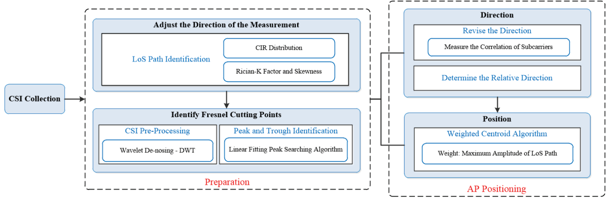
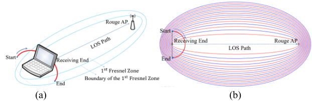
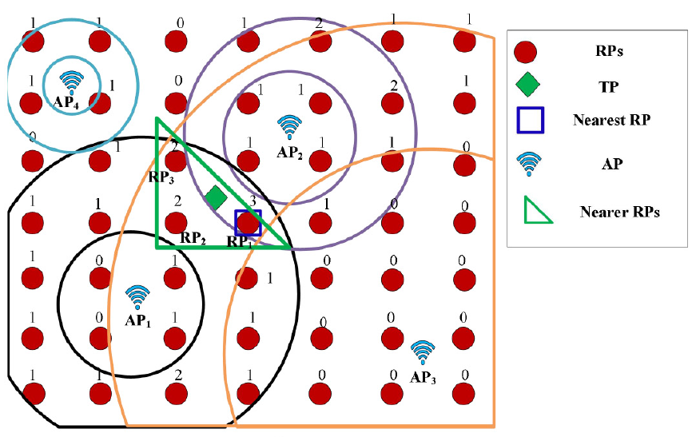

> Michael Harditya (TEEP)
# AP Positioning Literature Review 
This markdown is a compilation of literature reviews on different papers about Access Point Positioning, mainly from IEEE journals and papers. Purpose of this literature review is to find possible implementation into the proposed system.
## **Table of Contents**
- [**Table of Contents**](#table-of-contents)
- [**Localizing Access Point Through Simple Gesture**](#localizing-access-point-through-simple-gesture)
- [**AIPS: An Accurate Indoor Positioning System with Fingerprint Map Adaptation**](#aips-an-accurate-indoor-positioning-system-with-fingerprint-map-adaptation)

## **Localizing Access Point Through Simple Gesture**
Method proposed on this paper is CSI-based approach, stands for Channel State Information, without the use of AI. CSI is choosen rather than RSS because RSS need area that is closer to the AP, with Line-of-Sight (LoS) path is not blocked by obstacles. The paper also mentioned that there is 5dB fluctuation of the received signal strength for a period of about one minute (by experiment).

The term 'Simple Gesture' means that to localize (or find position) an AP on this paper, is done by simply move one Reference Point (an AP that is used to fetch the CSI value from the target AP) in semicircular path (creating a C-shaped motion with the arc facing the target AP). By moving the RP (Reference Point) in semicircular way, variation of corresponding CSI value can be analyzed, and used to determine AP position without additional hardware cost and extensive labor.

The paper mentioned about circular motion implementation, where the AP moved in circular way along a center point. This circular motion raise another problem of added obstacle, the center point itself where in this paper, the motion were done manually using hands. The circular motion would have a certain point where the signal is blocked by a human body, the center of the circle. This is why semicircle is choosen as the motion path.

The paper use the concept of Fresnel Zone, and propose a LoS path identification method using delay distribution and outlier detection in Channel Impulse Response (CIR) to identify the existence of LoS path. CIR is obtained by applying Inverse Fast Fourier Transform (IFFT) to the CSI values. Discrete Wavelet Transform (DWT) also used to eliminate background noise.

The paper use linear fitting peak searching algorithm to identify Fresnel zone cutting point, to improve the accuracy of AP direction and the correlation characteristics of the VSI subcarriers found in the experiment. As such the semicircular motion might cross multiple boundaries of Fresnel zone and created a cutting points, and those cutting points used to estimate the LoS path of the RougeAP.

## **AIPS: An Accurate Indoor Positioning System with Fingerprint Map Adaptation**
There are 3 kind of APs used in this paper, the first one is AP that exists in the map, then RP that is a fixed location where it receive RSS from multiple APs, and Target Point (TP) that is the location point to be predicted based on the RSS from recieved signal of multiple APs directed to the TP. 
> Note: this paper is not available for Rouge AP since the paper can access the TP to fetch the RSS from the signal sent by the APs.

The algorithm consists of 4 steps: AP Selection, RP Clustering, Coarse Positioning, and Fine Positioning.

1. **AP Selection**:
the algorithm take all RSS from all RPs, then find the difference between RSS from RP to the Target Point (TP) and *vice versa*. Then the algorithm choose the RPs that have RSS difference less than $\theta$. Then the algorithm use Gini impurity to make cluster of RPs, where AP with higher Gini values are going to be used for online positioning. Gini impurity provides faster operational speed than normal entropy algorithm.

2. **RP Clustering**: The algorithm is going to count RSS attenuation using difference between average RSS and RSS point. the difference between RSS attenuation to find different propagation paths, if it is near 0 then the signal use similar propagation path. the RSS attenuation difference used to cluster all the RP.
the algorithm use RSS value generated by each AP for every RPs and distance for LDPL model:
$$_{th}RSS^m_n=_{th}RSS^m_0+10\mu \times log(d_n/d_0)+\tau_n$$
$$d_n=\sqrt{(x_n-x_{AP_m})^2+(y_n-y_{AP_m})^2}$$
$\mu$ is path-loss exponent, $x_{AP_m}$ and $y_{AP_m}$ represents the location of AP . $d_n$ is distance between AP and each RPs. $_{th}RSS^m_n$, $\mu$, and $(x_{AP_m},y_{AP_m})$ can be solved using optimal function. The value then used to cluster AP based on a defined minimum and maximum RSS.

3. **Coarse Positioning**: the algorithm used again the RSS value of each clusters of RP (the RSS values between each RP), record the min and max RSS values of each clusters, and check the RSS value of the TP from each RPs in that cluster, and predict the position based on the RSS value of TP is between minimum value and maximum value of all the RSS values on each clusters.

4. **Fine Positioning**: done for each choosen clusters. it constructs rings for each RP based on the RSS value and fluctuation of TP, then selects the nearest RP and the nearer RP based on the number of rings that contain them. then it esptimates the location of TP by wieghted averaging the coordinates of the nearer RP for each AP, and averaging the results of all AP.
    - Nearest RP Selection: Constructs a ring for each AP based on the RSS value and the fluctuation amplitude at TP. then it selects the RP that is contained by the largest number of rings as the nearest RP.
    - Nearer RPs Selection: uses a region growing algorithm to select more RPs that are close to the nearest RP in terms of spatial location and number of rings. These RPs are called Nearer RPs and they are used to improve th positioning accuracy.
    - Weighted Average Positioning: calculates an estimated location of TP for each AP based on the nearer RPs, then averages them to get the final estimation.