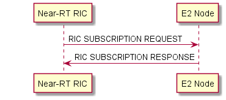
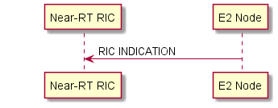
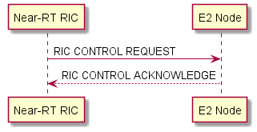

# O-RAN E2 Interface
## Table of Contents
- [O-RAN E2 Interface](#o-ran-e2-interface)
  - [Table of Contents](#table-of-contents)
  - [E2 Introduction](#e2-introduction)
  - [Protocol](#protocol)
  - [E2AP](#e2ap)
    - [Elementary Procedures](#elementary-procedures)
    - [RIC Functional Procedures](#ric-functional-procedures)
    - [Global Procedures](#global-procedures)
  - [E2SM](#e2sm)
  - [About Performance](#about-performance)
  - [About AI/ML Deployment](#about-aiml-deployment)
  - [References](#references)
  

## E2 Introduction

E2 Interface is the interface that is connected to specific entitites within the base station like O-DU, O-CU, and RU to near Real-Time RIC (nRT RIC). The interface provide possibility for users to control what is happening from xApps/nRT RIC, and gets data collection and feedback from the entities (O-DU, O-CU, RU). E2 interface operates over the Stream Control Transmission Protocol (SCTP), supporting real-time functions crucial to network adaptivity and resiliency [2].

 Use cases can be found in [2].

 ## Protocol
 E2 Protocol stacked above of IP Layer, they are SCTP, E2AP, and E2AP Messages carrying E2SM from IP to above. E2AP is a specific O-RAN Alliance over SCTP/IP as the transport protocol. On the top of E2AP, application-specific controls and events are conveyed through E2 service models (E2SM), also used by the xApps in the Near-RT RIC.

## E2AP
Terminologies:
 - E2 node: disaggregated network function O-CU-CP, O-CU-UP and O-DU of a gNB or a combined O-eNB are called the E2 nodes. The nodes supports E2 interface towards nRT RIC and O1 interface towards Non Real-Time RIC (NRT RIC).
 - RAN Functions: specific function in an E2 node, includes network interfaces and RAN internal functions handling user equipment context handlers, call handlers, paging, etc.
 - RIC Service: provided on an E2 Node to provide access to message and measure and/or enable control of the E2 Node from the nRT RIC, includes:
   - REPORT
   - INSERT
   - CONTROL
   - POLICY
   - QUERY
 - RAN Function ID: local identifier of a specific RAN function within an E2 Node that supports one or more RIC Services using a specific E2SM, and a same E2SM can be used by more than one RAN Function in the same E2 Node.
 - Style: Group of different types of data for each RIC Services, where E2SM may support many styles for each RIC services.

E2AP procedures are divided into:
1. RIC Functional Procedures, contains procedures used to pass application specific messages between Near-RT RIC applications and a target RAN Function in an E2 node.
2. Global Procedures, contains procedures that are not directly related to a specific application.
   
>E2AP Functions can be found on O-RAN WG3 Near-RT RIC, E2 General Aspects and Principles.

### Elementary Procedures
Elementary Procedures divided into Class 1 and Class 2, where Class 1 is basic procedures in communicating between the RIC and the Node (where successful and unsuccessful has different response), while Class 2 is more to sending messages by one device with less priority that the message is actually received each procedures (as Indicator) can be seen at [6].

### RIC Functional Procedures
Consists of 8 different procedures:
- RIC Subscription Procedures, to start connection between RIC and the Node, consisting an event trigger and a sequence of RIC Service Action initiated by Near-RT RIC. If it fails, the RIC is going to release any resources left, and RIC Subscription Delete Procedure is initiated.
  
- RIC Subscription Delete Procedures, to stop connection between RIC and the Node and release information and resource of the RIC abotu the node. Initiated by Near-RT RIC. When failed, the Near-RT RIC is going to terminate the procedure.
- RIC Subscription Delete Required Procedures, to stop connection but initiated by the E2 Node.
- RIC Subscription Audit Procedure, used to audit the list of established RIC Subscriptions on E2 Node, initiated by the Near-RT RIC. When failed, the RIC going to terminate the RIC Subscription procedure.
- RIC Indication Procedure, to transfer Report and/or insert RIC Service Action associated with a RIC Subscription procedure, initiated by the E2 Node. There are no failure operation in this procedure, and have varied action by the RIC depend on the conditions.
  
- RIC Control Procedure, to initiate or resume a specific functionality in the E2 Node, initiated by Near-RT RIC. When failed, the Node is going to return RIC CONTROL FAILURE and the near-RT RIC terminate the RIC Control Procedure.
  
- RIC Subscription Modification Procedure, to modify an existing RIC subscription on an E2 Node in terms of its event trigger definition and/or the sequence of actions, initiated by the Near-RT RIC. When failed, the near-RT RIC will terminate the RIC Subscription Modification procedures
- RIC Subscription Modification Required Procedure, to send a request to the Near-RT RIC for modifying an existing RIC Subscription in the E2 Node, initiated by E2 Node. When no service action can be modified in the existing RIC Subscription, the Near-RT RIC is going to send refusal.
- RIC Query Procedure, to request RAN and/or UE related information from E2 by Near-RT RIC.

### Global Procedures
Consists of 7 different procedures:
- E2 Setup Procedure,to exchange application level dat aneeded for the E2 Node and Near-RT RIC o correctly interoperate on the E2 interface, firstly triggered after the TNL association. It erases any existing application level config data in the two nodes and replaced by the new one, initiated by E2 Node.
- Reset Procedure, re-initialize the E2 Node in the event of Near-RT RIC failure or vice-versa, it does not affect the application level data exchanged during the E2 Setup procedure, E2 Node Config. Update Procedure, and RIC Service Update Procedure. It is initiated using the E2 Node or the Near-RT RIC.
- Error Indication, initiated by either E2 Node or Near-RT RIC to report detected errors in one incoming messages, and cannot be reported by failure message. Can be initiated by E2 Node or the Near-RT RIC.
- RIC Service Update Procedure, to update application level RIC Service related data needed to E2 Node and Near-RT RIC to interoperate correctly over the E2 Interface, initiated by E2 Node. When failure, there are a wait time before reinitiating the same procedure, while the Node continue with the previous service data.
- E2 Node Configuration Update Procedure, to update application level E2 Node configuration data needed for E2 Node and Near-RT RIC to interoperate correctly over the E2 interface and to support E2 Node initiated TNL association removal, initiated by E2 Node. When failed, the RIC and E Node is going to operate with the existing config. data.
- E2 Connection Update Procedure, to allow the Near-RT RIC to update the TNL information associated with the E2 interface connection between the E2 Node adn Near-RT RIC, initiated by  Near-RT RIC. When failed, the RIC is going to use timer before reinitiating E2 Connection Update procedure towards the same E2 node.
- E2 Removal Procedure, to remove the E2 signaling connection between the Near-RT RIC and the E2 Node in a controlled manner, initiated both E2 Node or the Near-RT RIC.

Various message functional definition and content can be accessed via the document [6].

More about E2 Nodes:

- Event trigger definition: contains the definition of event triggers for which E2 node can be requested to report the event to near-RT RIC. The definition includes the event styles supported by the E2 node.
- Report definition: contains the definition of event reports and the report styles supported by the E2 node.
- Insert definition: contains the definition of information on which the E2 node has to exhibit “report and wait for control” semantics and the insert styles supported by the E2 node.
- Control definition: contains the definition of attributes/configurations/call parameters to be controlled on the E2 node and the control styles supported by the E2 node.
- Policy definition: contains the definition of policy to apply at the E2 node when the specified event trigger is hit.

General Workflow of E2 Interface:

First the interface is being initialized between E2 node and nRT RIC. E2 node advertises the list of RAN functions that it supports and the corresponding E2SM supported for each RAN function. The xApps that runs on nRT RIC subscribe the E2 node, providing the event triggers and what actions to perform when it triggers. The action to perform is either REPORT or INSERT, the E2 node notifies the nRT RIC when the event occurs. If the nRT RIC detects REPORT, the xApp provide CONTROL request to the E2 node. the CONTROL enables xApp to control the call processing, radio resource allocation, handover control, idle mode mobility control, radio admission, carrier aggregation, and dual connectivity behaviors.

## E2SM
E2SM is the bridge between application layers, especially the xApps on the Near-RT RIC with the E2 nodes. E2SM define function-specific protocols that are implemented on top of the E2AP specification. E2SM are defined using ASN.1 (Abstract Syntax Notation One) syntax, which is a standard interface description language for defining data structures [7].

Few example of E2SM for O-RAN specified usage are:
E2SM Short Name|Scope
---|---
E2SM-NI|RAN Function NI (Network Interface) performs: Exposure of Network Interfaces, Modification of both incoming and outgoing network interface message contents, Execution of plicies that may result in charge of network behavior.
E2SM-KPM Version 1|RAN Function KPM (KPM Monitor) performs: Exposure of O-DU's cell related performance IEs through periodic KPM Report, Exposure of O-CU-CP's cell/UE related performance IEs through periodic KPM Report, Exposure of O-CU-UP's bearer related performance IEs through periodic KPM Report.
E2SM-KPM Version 2|RAN Function KPM (KPM Monitor) performs: Exposure of available measurements from O-DU, O-CU-CP, and/or O-CU-UP via the RAN Function Definition IE, Periodic reporting of measurements subscribed from Near-RT RIC.
E2SM-RC|RAN Function RC (RAN Control) performs: Exposure of RAN control and UE context related information, Modification and initiation of RAN control related call processes and messages, Execution of policies that may result in change of RAN control behaviour.
E2SM-CCC|RAN Function CCC (Cell Configuration and Control) performs: Exposure of node level and cell level configuration information, Initiate control and/or configuration of node level and cell level parameters

It is possible for new adaptation of new E2SM definition using the Information Element defined in the document [7]. Information element (IE) for the E2SM includes RAN Function name, RIC Style type, RIC Style name, RIC Format type, Cell Global ID, UE ID, Group ID, Core CP ID,QoS ID, and many more.

## About Performance
O-RAN Community released E2SM-KPM (E2SM Key Performance Measurement) document that specifies the capabilities exposed over the E2 interface [3]. 

O-RAN E2SM Key Performance Measurements [4] defines technical term and use case of how to measure E2SM performances. RAN Function defined to do this is called "KPM Monitor" with the short name as "ORAN-E2SM-KPM". This function is supported by several part of the E2 Node. The first one is the RIC Event Trigger to trigger the function. The trigger mentioned here shows that it is a **periodic report**, which use REPORT services periodically. There are 6 defined REPORT services used to measure:

RIC Style Type | Style Name | Style Type Description
---|---|---
1|E2 Node Measurement| Used to carry measurement report from a target E3 Node, belongs to *Fundamental* level REPORT Services
2|E2 Node Measurement for a single UE|Used to carry measurement report for a single UE of interest from a target E2 Node, belongs to *Fundamental* level REPORT Services
3|Condition-based, UE-level E2 Node Measurement|Used to carry UE-level measurement report for a group of UEs per measurement type matching subscribed conditions from a target E2 Node, belongs to *Fundamental* level REPORT Services
4|Common Condition-based, UE-level Measurement|Used to carry measurement report for a group of UEs accross a set of measurement types satisfying common subscribed conditions from a target E2 Node, belongs to *Fundamental* level REPORT Services
5|E2 Node Measurement for multiple UEs|Used to carry measurement report for multiple UEs of interest from a target E2 Node, belongs to *Fundamental* level REPORT Services
255|Multiple report measurements|Used for multiple actions of the selected *fundamental* level REPORT Service style(s), belongs to *Integrated* level REPORT Services.

There are O-RAN specific Performance Measurements mentioned on the document (more information in the document [4]):

Measurement Name|Purpose|Output|Description
---|---|---|---
DL Transmitted Data Volume|performance assurance (user plane connection quality)|Integer, number of bits (in kbits) of PLMNs x QoS levels x S-NSSAIs|Measure transmitted data volume in the downlink in a measurement time
UL Transmitted Data Volume|performance assurance (user plane connection quality)|Integer, number of bits (in kbits) of PLMNs x QoS levels x S-NSSAIs|Measure transmitted data volume in the uplink in a certain period
Distribution of Percentage of DL Transmitted Data Volume to Incoming Data Volume|Network Operator's Traffic Engineering Community|Set of Integers, representing samples with a percentage of DL transmitted data volume to incoming data volume in the range represented by that bin|Measure the distribution of the percentage of successfully transmitted data volume to incoming data volume in downlink for UEs
Distribution of Percentage of UL Transmitted Data Volume to Incoming Data Volume|Network Operator's Traffic Engineering Community|Set of Integers, representing samples with a percentage of UL transmitted data volume to incoming data volume in the range represented by that bin|Measure the distribution of the percentage of successfully transmitted data volume to incoming data volume in uplink for UEs
Distribution of DL Packet Drop Rate|Performance assurance (user plane connection quality)|Integer, represent the drop rate multiplied by 1E6 of each UE within the range of the bin|Measure fraction of RLC SDU packets which are dropped on the downlink, due to high traffic load, traffic management, etc. in the gNB-DU
Distribution of UL Packet Loss Rate|Performance assurance (user plane connection quality)|Integer, representing loss rate multiplied by 1E6 of each UE within the range of the bin|Measure the distribution of the fraction of PDCP SDU packets which are not successfully received at gNB-CU-UP
DL Synchronization Signal based Reference Signal Received Power (SS-RSRP)|mMIMO Non-GoB optimization|Real value representing average of the reported DL SS-RSRP values for each SSB|Measures average of the DL SS-RSRP values reported from UEs in the cell when SS-RSRP is used for L1-RSRP as configured by reporting configs
DL Synchronization Signal based Signal to Noise and Interference Ratio (SS-SINR)|mMIMO Non-GoB optimization|Real value representing average of the reported DL SS-SINR values for each SSB|Measure average of the DL SS-SINR values reported from UEs in the cell when SS-SINR is used for L1-SINR as congiured by reporting configs
UL Sounding Reference Signal based Reference Signal Received Power (SRS-RSRP)|mMIMO Non-GoB optimization|real value representing the average of the measured UL SRS-RSRP values|Measure the average of UL SRS-RSRP values measured for UEs in the cell

## About AI/ML Deployment
Here is the workflow of AI/ML in the O-RAN architecture [5]. The RAN infrastructure provides data through O-RAN interfaces to the data colection and preparation logical blocks, and the models are then trained, validated, and deployed within O-RAN nodes.

The case in the workflow defined by the image above is about an operator that aims to develop, train, and deploy an xApp that controls RAN slicing policies by adapting it in near-real-time according to current network load and traffic demand via AI-based algorithms. The goal is to control RAN slicing policies by assigning the available PRBs to each slice so that the diverse performance requirements for each slice can be provided.
1. Data Collection and Processing: The data is collected over the O1, A1, and E2 interfaces and stored in large datasets where it can be extracted upon request. The data to be taken is based on what is the purpose of the AI model, and can use autoencoders for dimensionality reduction and other preprocessing methods such as normalization, scaling, and reshaping.
2. Training: AI/ML models are required to go through an offline training phase to ensure the reliability of intelligence and avoid inaccuracies that might result in outages or inefficiencies in the network. It is possible to use online training, but only for fine-tuning models that has been pretrained previously.
3. Validation and Publishing: Trained models are validated once more according to the goal of the integration. If it is possible and ready for deployment, the models are published and stored in an AI/ML catalog on the SMO/non-RT RIC.
4. Deployment: The models stored in the AI/ML catalog can be downloaded, deployed, and executed using image-based and file-based deployments. both case use the O1 interface, using an *inference host* or a node that use the model to create inference.
   1. *image-based deployment* use containerized image of the AI/ML model in the form of an O-RAN application (xApp or rApp) deployed at the O-RAN nodes, where it is executed to perform online inference.
   2. *file-based deployment* use the AI/ML model as standalone file that executes within an inference environment outside the O-RAN application domain that forwards the inference output to one or more O-RAN applications.
5. AI/ML Execution and Inference: The deployed models on the inference host are given with data to perform diverse online inference tasks, at both RICs (transmitted over A1 and E2 interfaces), and taking management and control actions (over O1 and E2 interfaces respectively).
6. Continuous Operations: Another important aspect of AI/ML workflow is the ability to monitor and analyze the deployment throughout the network to verify the output are effective, accurate and not negatively affect performance of the network. Continuous Operations ensure the models can be refined and retrained to improve their functionalities.

## References
[1] https://rimedolabs.com/blog/o-ran-architecture-nodes-interfaces/ 

[2] https://www.5gtechnologyworld.com/how-does-5gs-o-ran-e2-interface-work/ 

[3] https://www.o-ran.org/blog/o-ran-alliance-introduces-48-new-specifications-released-since-july-2021

[4]O-RAN E2 Service Model (E2SM) KPM 5.0; https://specifications.o-ran.org/specifications 

[5] Understanding O-RAN: Architecture, Interfaces, Algorithms, Security, and Research Challenges; https://arxiv.org/pdf/2202.01032

[6] O-RAN E2 WG3 Near-RT RIC and E2 Interface: E2 Application Protocol (E2AP); https://specifications.o-ran.org/specifications 

[7] O-RAN WG3 E2SM; https://specifications.o-ran.org/specifications 