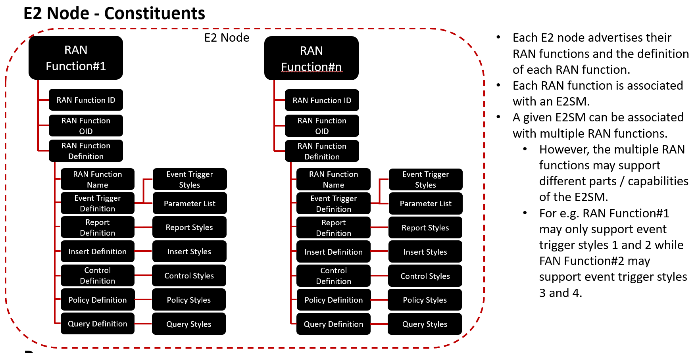
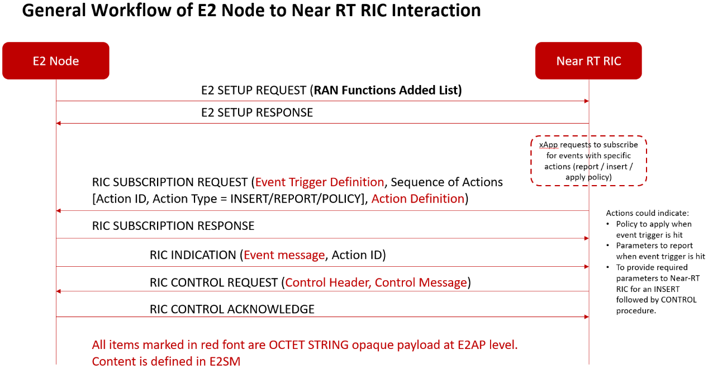
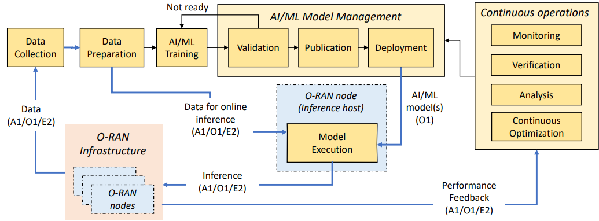

# O-RAN E2 Interface
## Table of Contents
- [O-RAN E2 Interface](#o-ran-e2-interface)
  - [Table of Contents](#table-of-contents)
  - [E2 Introduction](#e2-introduction)
  - [Protocol](#protocol)
  - [About Performance](#about-performance)
  - [About AI/ML Deployment](#about-aiml-deployment)
  - [References](#references)
  

## E2 Introduction

E2 Interface is the interface that is connected to specific entitites within the base station like O-DU, O-CU, and RU to near Real-Time RIC (nRT RIC). The interface provide possibility for users to control what is happening from xApps/nRT RIC, and gets data collection and feedback from the entities (O-DU, O-CU, RU). E2 interface operates over the Stream Control Transmission Protocol (SCTP), supporting real-time functions crucial to network adaptivity and resiliency [2].

 Use cases can be found in [2].

 ## Protocol
 E2 Protocol stacked above of IP Layer, they are SCTP, E2AP, and E2AP Messages carrying E2SM from IP to above. E2AP is a specific O-RAN Alliance over SCTP/IP as the transport protocol. On the top of E2AP, application-specific controls and events are conveyed through E2 service models (E2SM), also used by the xApps in the Near-RT RIC.

 E2AP Terminologies:
 - E2 node: disaggregated network function O-CU-CP, O-CU-UP and O-DU of a gNB or a combined O-eNB are called the E2 nodes. The nodes supports E2 interface towards nRT RIC and O1 interface towards Non Real-Time RIC (NRT RIC).
 - RAN Functions: specific function in an E2 node, includes network interfaces and RAN internal functions handling user equipment context handlers, call handlers, paging, etc.
 - RIC Service: provided on an E2 Node to provide access to message and measure and/or enable control of the E2 Node from the nRT RIC, includes:
   - REPORT
   - INSERT
   - CONTROL
   - POLICY
   - QUERY
 - RAN Function ID: local identifier of a specific RAN function within an E2 Node that supports one or more RIC Services using a specific E2SM, and a same E2SM can be used by more than one RAN Function in the same E2 Node.
 - Style: Group of different types of data for each RIC Services, where E2SM may support many styles for each RIC services.

More about E2 Nodes:

- Event trigger definition: contains the definition of event triggers for which E2 node can be requested to report the event to near-RT RIC. The definition includes the event styles supported by the E2 node.
- Report definition: contains the definition of event reports and the report styles supported by the E2 node.
- Insert definition: contains the definition of information on which the E2 node has to exhibit “report and wait for control” semantics and the insert styles supported by the E2 node.
- Control definition: contains the definition of attributes/configurations/call parameters to be controlled on the E2 node and the control styles supported by the E2 node.
- Policy definition: contains the definition of policy to apply at the E2 node when the specified event trigger is hit.

General Workflow of E2 Interface:

First the interface is being initialized between E2 node and nRT RIC. E2 node advertises the list of RAN functions that it supports and the corresponding E2SM supported for each RAN function. The xApps that runs on nRT RIC subscribe the E2 node, providing the event triggers and what actions to perform when it triggers. The action to perform is either REPORT or INSERT, the E2 node notifies the nRT RIC when the event occurs. If the nRT RIC detects REPORT, the xApp provide CONTROL request to the E2 node. the CONTROL enables xApp to control the call processing, radio resource allocation, handover control, idle mode mobility control, radio admission, carrier aggregation, and dual connectivity behaviors.

## About Performance
O-RAN Community released E2SM-KPM (E2SM Key Performance Measurement) document that specifies the capabilities exposed over the E2 interface [3]. 

O-RAN E2SM Key Performance Measurements [4] defines technical term and use case of how to measure E2SM performances. RAN Function defined to do this is called "KPM Monitor" with the short name as "ORAN-E2SM-KPM". This function is supported by several part of the E2 Node. The first one is the RIC Event Trigger to trigger the function. The trigger mentioned here shows that it is a **periodic report**, which use REPORT services periodically. There are 6 defined REPORT services used to measure:

RIC Style Type | Style Name | Style Type Description
---|---|---
1|E2 Node Measurement| Used to carry measurement report from a target E3 Node, belongs to *Fundamental* level REPORT Services
2|E2 Node Measurement for a single UE|Used to carry measurement report for a single UE of interest from a target E2 Node, belongs to *Fundamental* level REPORT Services
3|Condition-based, UE-level E2 Node Measurement|Used to carry UE-level measurement report for a group of UEs per measurement type matching subscribed conditions from a target E2 Node, belongs to *Fundamental* level REPORT Services
4|Common Condition-based, UE-level Measurement|Used to carry measurement report for a group of UEs accross a set of measurement types satisfying common subscribed conditions from a target E2 Node, belongs to *Fundamental* level REPORT Services
5|E2 Node Measurement for multiple UEs|Used to carry measurement report for multiple UEs of interest from a target E2 Node, belongs to *Fundamental* level REPORT Services
255|Multiple report measurements|Used for multiple actions of the selected *fundamental* level REPORT Service style(s), belongs to *Integrated* level REPORT Services.

There are O-RAN specific Performance Measurements mentioned on the document (more information in the document [4]):

Measurement Name|Purpose|Output|Description
---|---|---|---
DL Transmitted Data Volume|performance assurance (user plane connection quality)|Integer, number of bits (in kbits) of PLMNs x QoS levels x S-NSSAIs|Measure transmitted data volume in the downlink in a measurement time
UL Transmitted Data Volume|performance assurance (user plane connection quality)|Integer, number of bits (in kbits) of PLMNs x QoS levels x S-NSSAIs|Measure transmitted data volume in the uplink in a certain period
Distribution of Percentage of DL Transmitted Data Volume to Incoming Data Volume|Network Operator's Traffic Engineering Community|Set of Integers, representing samples with a percentage of DL transmitted data volume to incoming data volume in the range represented by that bin|Measure the distribution of the percentage of successfully transmitted data volume to incoming data volume in downlink for UEs
Distribution of Percentage of UL Transmitted Data Volume to Incoming Data Volume|Network Operator's Traffic Engineering Community|Set of Integers, representing samples with a percentage of UL transmitted data volume to incoming data volume in the range represented by that bin|Measure the distribution of the percentage of successfully transmitted data volume to incoming data volume in uplink for UEs
Distribution of DL Packet Drop Rate|Performance assurance (user plane connection quality)|Integer, represent the drop rate multiplied by 1E6 of each UE within the range of the bin|Measure fraction of RLC SDU packets which are dropped on the downlink, due to high traffic load, traffic management, etc. in the gNB-DU
Distribution of UL Packet Loss Rate|Performance assurance (user plane connection quality)|Integer, representing loss rate multiplied by 1E6 of each UE within the range of the bin|Measure the distribution of the fraction of PDCP SDU packets which are not successfully received at gNB-CU-UP
DL Synchronization Signal based Reference Signal Received Power (SS-RSRP)|mMIMO Non-GoB optimization|Real value representing average of the reported DL SS-RSRP values for each SSB|Measures average of the DL SS-RSRP values reported from UEs in the cell when SS-RSRP is used for L1-RSRP as configured by reporting configs
DL Synchronization Signal based Signal to Noise and Interference Ratio (SS-SINR)|mMIMO Non-GoB optimization|Real value representing average of the reported DL SS-SINR values for each SSB|Measure average of the DL SS-SINR values reported from UEs in the cell when SS-SINR is used for L1-SINR as congiured by reporting configs
UL Sounding Reference Signal based Reference Signal Received Power (SRS-RSRP)|mMIMO Non-GoB optimization|real value representing the average of the measured UL SRS-RSRP values|Measure the average of UL SRS-RSRP values measured for UEs in the cell

## About AI/ML Deployment
Here is the workflow of AI/ML in the O-RAN architecture [5]. The RAN infrastructure provides data through O-RAN interfaces to the data colection and preparation logical blocks, and the models are then trained, validated, and deployed within O-RAN nodes.

## References
[1] https://rimedolabs.com/blog/o-ran-architecture-nodes-interfaces/ 

[2] https://www.5gtechnologyworld.com/how-does-5gs-o-ran-e2-interface-work/ 

[3] https://www.o-ran.org/blog/o-ran-alliance-introduces-48-new-specifications-released-since-july-2021

[4]O-RAN E2 Service Model (E2SM) KPM 5.0; https://specifications.o-ran.org/specifications 

[5] Understanding O-RAN: Architecture, Interfaces, Algorithms, Security, and Research Challenges; https://arxiv.org/pdf/2202.01032