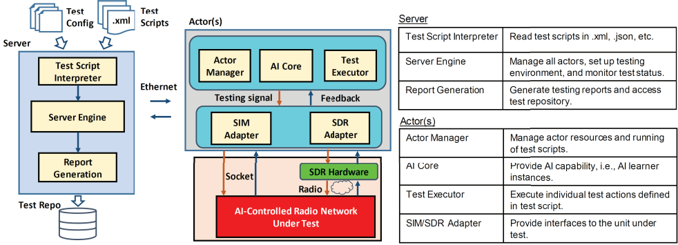

> Michael Harditya (TEEP)
# **GenAI Usage Review Summary**
GenAI (Generation Artificial Intelligence) is an algorithms or called as AI model that create new content, including audio, text, and videos [3].

GenAI have many branches divided by models and architecture of the algorithms, and the data that is going to be generated. Most of the models and architectures divided into Autoencoder (have its own new branch called Transformers [6]), Autoregressive, Generative Adverarial Network (GAN), Diffusion & Flow-based, and Foundation Model [5]. While the data to be generated are mainly Text and Image, or both (Multimodal).

## **Table of Contents**
- [**GenAI Usage Review Summary**](#genai-usage-review-summary)
  - [**Table of Contents**](#table-of-contents)
  - [**GenAI Usage in Computer Engineering Fields**](#genai-usage-in-computer-engineering-fields)
    - [**TestPilot by Max Schafer et. al.**](#testpilot-by-max-schafer-et-al)
  - [**GenAI Usage in 5G**](#genai-usage-in-5g)
    - [**Testing Framework**](#testing-framework)
      - [**AI Testing Framework for Next-G O-RAN Networks: Requirements, Design, and Research Opportunities**](#ai-testing-framework-for-next-g-o-ran-networks-requirements-design-and-research-opportunities)
    - [**Network Management**](#network-management)
      - [**LLM-Assisted Intent-Based 5G Core Network Management and Orchestration**](#llm-assisted-intent-based-5g-core-network-management-and-orchestration)
    - [**Interoperability**](#interoperability)
      - [**Poster: A Novel Adaptor Approach for O-RAN Interoperability**](#poster-a-novel-adaptor-approach-for-o-ran-interoperability)
    - [**Optimization**](#optimization)
      - [**O-RAN Transformer-based Traffic Prediction and Network Optimization**](#o-ran-transformer-based-traffic-prediction-and-network-optimization)
    - [**Usage Guide**](#usage-guide)
      - [**O-RAN Chatbot by Nvidia**](#o-ran-chatbot-by-nvidia)
    - [**Others**](#others)
  - [**References**](#references)

## **GenAI Usage in Computer Engineering Fields**
### **TestPilot by Max Schafer et. al.**
TestPilot is built for generating unit tests for npm packages written in JavaScript/TypeScript using a Large Language Model. it uses Open-AI gpt3.5-turbo on 25 npm packages to create a test case for the code using those 25 npm packages. There are no fine-tuning approach, but mainly about deployment into GitHub releases.

TestPilot Architecture [1].

TestPilot uses five main components:
1. API Explorer, analyzes the PUT to determine its API, includes set of functions, methods, constants, etc that is not private in the package (the code used as test case).
2. Documentation Miner, extract code snippets and comments from both separated documentation files, and inside code snippets. Authors mentioned about the limitation of the miner and using the doc comment (/**...*/)
3. Prompt Generator, constructs an initial prompt to send to the LLM for generating a test for a given function f, which has one signature and let the prompt refiner creates more metadata.
4. Test Validator, validate the candidate tests generated from the LLM, especially in syntatic errors using Mocha test runners.
5. Prompt Refiner, generate additional prompts to use for querying the model. It adds another prompts based on the cases happened in Test Validator.

LLM Model only used to generate candidate tests from the prompt generator, and all components in TestPilot doesn't use any LLM or AI algorithm, only hard coded rules. Note that the model using OpenAI inference server using it's API, without any training or architecture process.

## **GenAI Usage in 5G**

### **Testing Framework**
#### **AI Testing Framework for Next-G O-RAN Networks: Requirements, Design, and Research Opportunities**
RAN architecture creates a lot of possibility in deploying AI models into the network yet performance testing of the performance in realistic performance haven't been explored that much. The proposed Open AI Cellular Testing Framework is the proposed solution in testing the network, consists of three components: Test Input, Server, and Actor. 
- Test Inputs are test configuration and scripts for each task, that is used to automatically set up the testing environment.
- Server manages a number of remote testing actors, including maintaining the socket connection to each actor and monitoring its resource usage and test status. Server is going to interpret the inputs, manage the actors, and generate the reports.
- Actors are the sensor of the testing, consists of manager, AI core, test executor, and two interface for the unit under test, which can be an AI controlled radio network. Manager communicates to the server and check the integrity of actors, AI core enables AI-models to test and facilitate the testing, and Test executor is responsible for running sequential test actions instructed by the server and for monitoring their statuses.
  

Architecture of the proposed open AI cellular testing framework [11].

The framework enables the usage of AI in network testing (in the AI Core component inside the Actor). It is to bridge the gap of advancement of AI in networks, with the network testing by adding AI Core to dynamically creates test  actions and explore the capabilities of AI-controlled RANs. There are few scenarios to be used:
1. Sensitivity Analysis, by testing one by one parameters to find any change of the output, to map the AI behaviour in the network system.
2. AI Fuzzing, automatically creates input data with perturbation to find software defects and faults.
3. Adversarial Learning, creates automated test signals that captures similar characteristics of real-world channel conditions. These signals then reacted by the AI on the network to be solved, creating an adversarial scenario.
4. Reinforcement Learning, generates an action or adjustment, then define the reward. th reward then can be used to updates the AI model in the industry.

### **Network Management**
#### **LLM-Assisted Intent-Based 5G Core Network Management and Orchestration**
The paper proposes intent-based 5G Core by adding Semantic Router to process user prompts that translates the prompts into various commands to the core. Semantic Router itself is a method of deterministic decision-making of semantic meaning to route an input to the desired output. Semantic router enhance stability and reliability in LLM deployment, because its ability to define explicit routes without performance deterioration due to LLM hallucinations. There are 6 routes used in the semantic router: deployment, modification, performance assurance, intent report, intent feasibility, and regular notification.

Semantic Router Intents used in the paper [8].

Each routes use base utterances, and re-generated with three kind of prompts that has the same output. The paper mentioned about accuracy improvements between normal prompting with the usage of Semantic Router. 
dataset can be found in https://github.com/Western-OC2-Lab/

The LLM used by building prompts for each intents, consists of Role, Task Description, Background Context, and Expected Behaviour.

| Intent Type | Intent Structure Example |
| --- | --- |
|Deployment Intent|"Deploy a new network in [region] with the following specifications..."|
|Modification Intent| “Modify the existing [network] to address the performance issues caused by high loading...” |
|Performance Assurance Intent| “Ensure that the deployed network can support a [QoS Level] application with the following requirements...”|
|Intent Report Request|“Summarize the results of the previous request.”|
|Intent Feasibility Check|“Before proceeding, ensure that capacity exists in [region] to perform the required changes.”|
|Regular Notification Request|“Notify me of the status of [network] every [frequency].”|

5G Core intent types and examples [9]

### **Interoperability**
#### **Poster: A Novel Adaptor Approach for O-RAN Interoperability**
The paper [10] proposed AOR (Adaptor for O-RAN) that supposed to be a middleware between RAN components and its RIC (Near-Real-Time RAN Intelligent Controller). It serve as a bridge for multi-vendor and components of O-RAN devices, as another option of the current O-RAN E2 Application Protocol. AOR divided by three stage procedures:
1. Spec. Extraction: extracts a formal model from specifications using LLM, it will describe the standardized behaviour of O-RAN component when initiating new procedure and behaviour according to input message.
2. Testing-based Fine-tuning: capture discrepancies in implementation, by cross-validates model through online testing. It is done by learning differences in terms of implementation and service models by analyzing the real-time traffic and record any behaviour that is different from the standardized model.
3. Adapting Path Searching: after each component have its fine tuned model, AOR then check once more for possible compatibility issues. For each issue, AOR search for adapting paths from state machines.

### **Optimization**

#### **O-RAN Transformer-based Traffic Prediction and Network Optimization**
Transformer is an architecture of a machine learning algorithm that is popular in processing sequence data. It is implemented in this scenario to predict traffic in 5G, and optimize the network by defining a threshold for RIC application using the predicted values. The anticipated traffic generated by the Transformer is used in reinforcement leanring-based traffic steering xApp, or cell sleeping rApp to enhance the performance of the network [7]. The author mentions the energy efficiency gone up by 39.7% compared to the 'always on traffic steering xApp' and 10.1% increase in throughput compared to the 'always on cell sleeping rApp'.

Traffic prediction and network optimization [7].

### **Usage Guide**

#### **O-RAN Chatbot by Nvidia**
O-RAN Chatbot is another example of GenAI Examples from Nvidia that showcase the usage of Nvidia environments and products, especially Nvidia AI Foundation Endpoints and NIM. NVIDIA NIM is a set of easy-to-use microservices for accelerating the deployment of foundation models on any cloud or data center and helps keep your data secure. The chatbot implements Retrieval Augmented Generation that works by storing related documents into a vector database, then using similarity algorithm between the prompt and use the similar data as context in chatbot model to generate a response based on the context alone.

O-RAN Chatbot demo [4].

From the codes, the example uses streamlit as the front end UI. The framework uses LangChain which is possible for multiple processes as one chain. Some features also introduced in the example.

The Chatbot model use Mixtral 8x7B, which is a large language model with 7B parameters specialized in generating responses. Only one LLM Model used in the whole architecture.

### **Others**
Newest (2024-2022)
- Network Traffic Prediction
  -  Proactive Network Traffic Prediction using Generative Adversarial Network
https://ieeexplore.ieee.org/document/10572129/
- State Information Prediction
  - Spatial Channel State Information Prediction with Generative AI: Towards Holographic Communication and Digital Radio Twin https://ieeexplore.ieee.org/document/10580971/
  - Deep Learning Based Advanced Estimation of Wireless Channels State Information for 6G Communication https://ieeexplore.ieee.org/document/10547841/
- Synthetic Data Generation
  -  Utilizing Generative AI for Test Data Generation - use-cases for IoT and 5G Core Signaling https://ieeexplore.ieee.org/document/10574974/
  -  Generation of Synthetic 5G Network Dataset Using Generative Adversarial Network (GAN) https://ieeexplore.ieee.org/document/10419563
- Security
  -  An Enhanced AI-Based Network Intrusion Detection System Using Generative Adversarial Networks https://ieeexplore.ieee.org/document/9908159
  - Securing Vulnerabilities: Fuzzer Detection with Machine Learning Classification https://ieeexplore.ieee.org/document/10469056/
  - Experimental Study of Adversarial Attacks on ML-Based xApps in O-RAN https://ieeexplore.ieee.org/document/10437125/
  - Generative Adversarial Network-Based Network Anomaly Detection with Unlabeled Data https://ieeexplore.ieee.org/document/10287473/
- Optimization
  - Generative Adversarial Networks-Based AI/ML Model Adaptive Retraining for Beyond 5G Networks https://ieeexplore.ieee.org/document/10461408/
  -  Deep Learning based Mobile Network Management for 5G and Beyond https://ieeexplore.ieee.org/document/9088697
-  Review
   - Navigating Emerging Technologies: A Comprehensive Review of 5G and the Evolving Landscape of 6G Communication https://ieeexplore.ieee.org/document/10550305/
   - AI-Driven Zero Touch Network and Service Management in 5G and Beyond: Challenges and Research Directions https://ieeexplore.ieee.org/document/8994961
   - At the Dawn of Generative AI Era: A Tutorial-cum-Survey on New Frontiers in 6G Wireless Intelligence https://ieeexplore.ieee.org/document/10422716/

## **References**
[1] Max Schafer, et. al.; An Empirical Evaluation of Using Large Language Models for Automated Unit Test Generation; https://arxiv.org/pdf/2302.06527

[2] Nvidia; GenerativeAIExamples: O-RAN ChatBot Multimodal; https://github.com/NVIDIA/GenerativeAIExamples/tree/main/experimental/oran-chatbot-multimodal

[3] McKinsey; What is generative AI?; https://www.mckinsey.com/featured-insights/mckinsey-explainers/what-is-generative-ai#/

[4] Nvidia; Demo Debrief: O-RAN Chat Bot; Feb 19, 2024.

[5] B. Decardi-Nelson, et. al.; Generative AI and process systems engineering: The next frontier; Computers and Chemical Engineering; 2024; https://doi.org/10.1016/j.compchemeng.2024.108723

[6] Yi Tay, et. al.; Efficient Transformers: A Survey; ACM Computing Surveys 55 No. 6; 2022; https://doi.org/10.1145/3530811

[7] Md Arafat Habib, et. al.; Tranformer-Based Wireless Traffic Prediction and Network Optimization in O-RAN; IEEE; 2023; https://arxiv.org/pdf/2403.10808

[8] Dimitrios Michael Manias, et.al.; Semantic Routing for Enhanced Performance of LLM-Assisted Intent-Based 5G Core Network Management and Orchestration; 2024; ArXiv; https://arxiv.org/pdf/2404.15869

[9] Dimitrios Michael Manias, et.al.;Towards Intent-Based Network Management: Large Language Model for Intent Extraction in 5G Core Networks; 2024; ArXiv; https://arxiv.org/pdf/2404.15869

[10] Sixu Tan; et. al.; Poster: A Novel Adaptor Approach for O-RAN Interoperability; 2024; Proceedings of the 25th International Workshop on Mobile Computing Systems and Applications; HOTMOBILE '24: Proceedings of the 25th International Workshop on Mobile Computing Systems and Applications
; ACM Digital Library

[11] Bo Tang; et. al.; AI Testing Framework for Next-G O-RAN Networks: Requirements, Design, and Research Opportunities; IEEE Wireless Communications; 2023; DOI: 10.1109/MWC.001.2200213