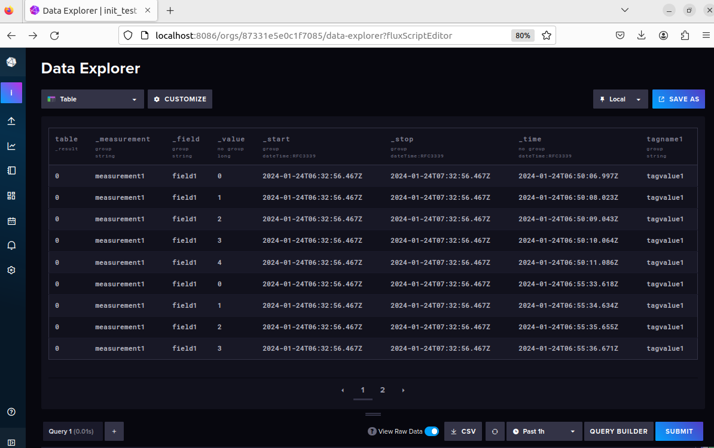

>Michael Harditya (TEEP)
# **InfluxDB Data Movement**
### **Table of Contents**
- [**InfluxDB Data Movement**](#influxdb-data-movement)
  - [**Table of Contents**](#table-of-contents)
  - [**Run the Docker**](#run-the-docker)
  - [**Writing Data Using Python**](#writing-data-using-python)

### **Run the Docker**
> please refer to [InfluxDB Docker Installation Guide](https://docs.influxdata.com/influxdb/v2/install/?t=Docker) for InfluxDB Docker installation guide, or my personal [InfluxDB OpenWiFi Installation Guide](https://github.com/bmw-ece-ntust/internship/blob/05f5030f262ea45898e597b1e4fe48f21cad5350/learning_notes/InfluxDB_OpenWiFi_Installation.md)
1. Move the active directory to the database directory that is used to save the data.
2. Run ```docker run -p 8086:8086 -v $PWD:/var/lib/influxdb influxdb```
3. Open browser and browse ```localhost:8086``` to make sure the InfluxDB is up and running, InfluxDB UI is expected to shown.

### **Writing Data Using Python**
Importing CSV to InfluxDB using Python can be done by installing InfluxDB python client using ```pip install influxdb-client```
First define the libraries used to send the data.
```python
import influxdb_client, os, time
from influxdb_client import InfluxDBClient, Point, WritePrecision
from influxdb_client.client.write_api import SYNCHRONOUS
```
The influxdb_client needs several arguments, they are url, token, and organization name.
```python
client = influxdb_client.InfluxDBClient(url="https://influxdomain:port", token="influxtoken", org="targetorganization")
```
After the client has been initialized, initiate the client write API with the options.
```python
    write_api = client.write_api(write_options=SYNCHRONOUS)
```
Then prepare the data points to be send into influxDB by using ```influxdb_client.Point```.
```python
point = Point("measurename") \
            .tag("tagname", "tagvalue") \
            .field("fieldname", "fieldvalue")
```
Send the data point by calling ```writer_api.write()```.
```python
write_api.write(bucket=buc"targetbucket", org="targetorganization", record=point)
```
The data points should be saved into the bucket after the code has been run. To check the data, using InfluxDB UI Dashboard is possible by creating the necessary InfluxQuery.
Here is example after sending 5 repetitive values into influxDB and shown into the Dashboard.



>for more information, [```InfluxImporter.py```](../codes/InfluxImporter.py) in ```utils``` shows example of how to send a csv data to InfluxDB using the ```influxdb-client``` library. The code also can be executed using arguments in command line by running the [```main.py```](https://github.com/bmw-ece-ntust/internship/blob/4c375b453ad1318ce14d85f3ac002f27c910745c/main.py).
