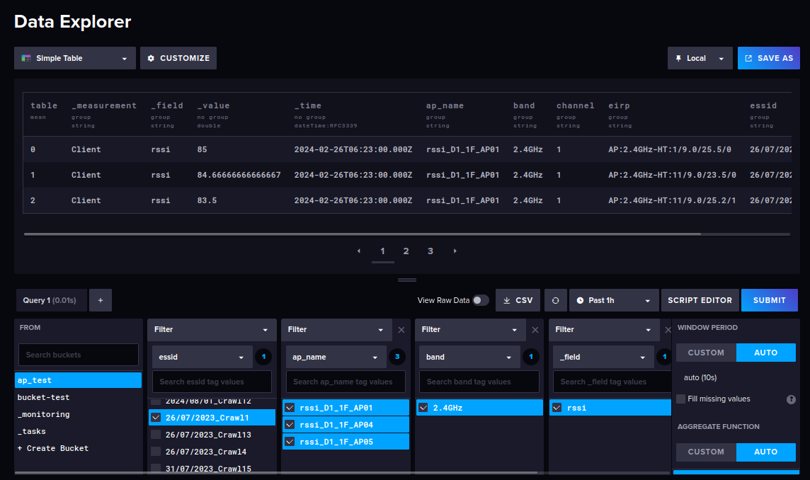

>Michael Harditya (TEEP)
# **InfluxDB Data Movement**
### **Table of Contents**
- [**InfluxDB Data Movement**](#influxdb-data-movement)
  - [**Table of Contents**](#table-of-contents)
  - [**Run the InfluxDB Docker**](#run-the-influxdb-docker)
  - [**Writing Data Using Python**](#writing-data-using-python)
  - [**Example Run**](#example-run)
  - [**Updates**](#updates)

### **Run the InfluxDB Docker**
> please refer to [InfluxDB Docker Installation Guide](https://docs.influxdata.com/influxdb/v2/install/?t=Docker) for InfluxDB Docker installation guide, or my personal [InfluxDB OpenWiFi Installation Guide](https://github.com/bmw-ece-ntust/internship/blob/05f5030f262ea45898e597b1e4fe48f21cad5350/learning_notes/InfluxDB_OpenWiFi_Installation.md)
1. Move the active directory to the database directory that is used to save the data.
2. Run ```docker run -p 8086:8086 -v $PWD:/var/lib/influxdb influxdb```
3. Open browser and browse ```localhost:8086``` to make sure the InfluxDB is up and running, InfluxDB UI is expected to shown.

### **Writing Data Using Python**
Importing CSV to InfluxDB using Python can be done by installing InfluxDB python client using ```pip install influxdb-client```
First define the libraries used to send the data.
```python
import influxdb_client, os, time
from influxdb_client import InfluxDBClient, Point, WritePrecision
from influxdb_client.client.write_api import SYNCHRONOUS
```
The influxdb_client needs several arguments, they are url, token, and organization name.
```python
client = influxdb_client.InfluxDBClient(url="https://influxdomain:port", token="influxtoken", org="targetorganization")
```
>Token needs to be created first from the InfluxDB, it can be done by going to ```API Tokens menu``` in ```Load Data page```.

After the client has been initialized, initiate the client write API with the options.
```python
write_api = client.write_api(write_options=SYNCHRONOUS)
```
Then prepare the data points to be send into influxDB by using ```influxdb_client.Point```.
```python
point = Point("measurename") \
            .tag("tagname", "tagvalue") \
            .field("fieldname", "fieldvalue")
```
Send the data point by calling ```writer_api.write()```.
```python
write_api.write(bucket=buc"targetbucket", org="targetorganization", record=point)
```
### Example Run
This commit have [```main.py```](../main.py) which is runnable via command-line. The code will call [```APDataCollector.py```](../controller/APDataCollector.py) in ```controller``` that shows example of how to send a csv data to InfluxDB using the ```influxdb-client``` library. To use the code, export the API Token first (get the token via ```API Token menu```) then run the following line in the terminal. It will save the token in the environment (that is going to be called back in the code):

```cmd
export INFLUXDB_TOKEN=[YOUR TOKEN HERE]
```

Then call the code via command-line:

```cmd
python3 ./main.py --url "influxdb-url" --org "organization-name" --csv "filename.csv" --bucket "bucket-name"
```

Change the value of the arguments used above with the names used on local computer. After being run, the data now can be accessed via InfluxDB web interface. The updated data structure in InfluxDB database can be found in ```write_csv_data_to_influxdb``` function inside the [```InfluxImporter.py```](../utils/InfluxImporter.py) file.

### Updates
Up to this commit, there are few changes being made in the code:
- Data processing is now being added in [```data_process.py```](../utils/data_process.py). The csv data that previously crawled now is being structured before being added into the database.
- InfluxDB Importer ([```InfluxImporter.py```](../utils/InfluxImporter.py)) now separate the data into fields and tags so it can be easily processed by the InfluxDB or another application.
- Controller now is being used for better documentation and readability, see [```APDataCollector.py```](../controller/APDataCollector.py).
