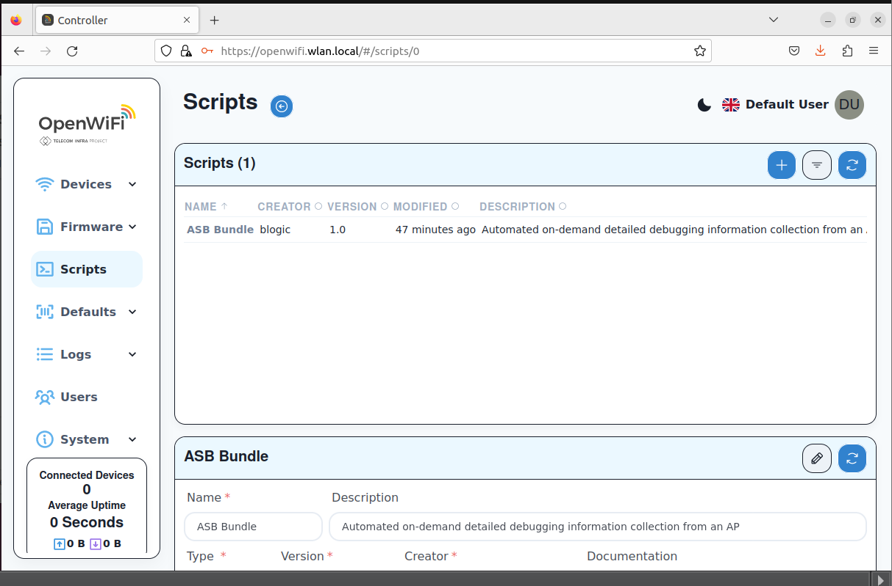
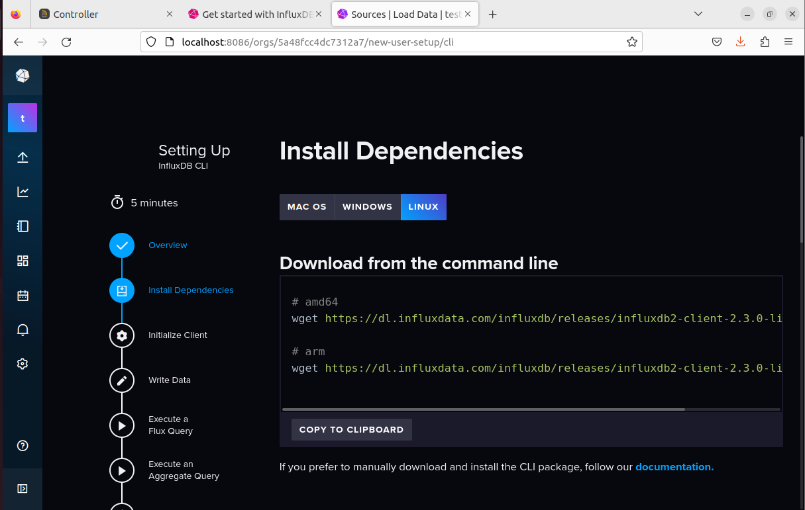
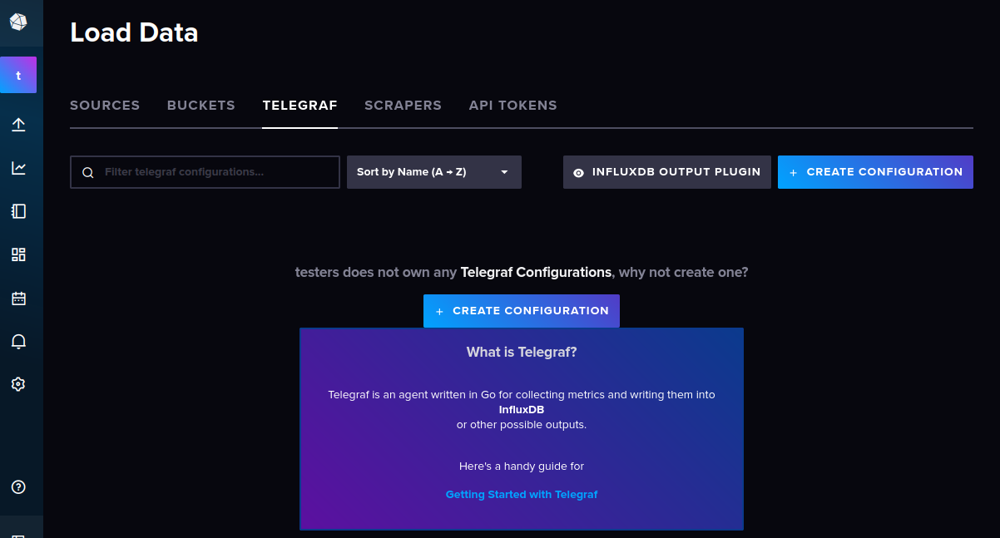
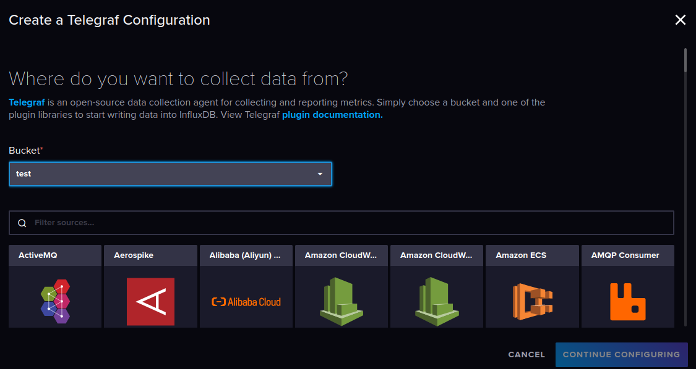

>Michael Harditya (TEEP)
# Learning Notes
## 08/01/2024
### Goals
- Install OpenWiFi and InfluxDB into Linux VM (Ubuntu 22.04)
- Learn InfluxDB data processing
- Learn OpenWiFi Dashboard

### OpenWiFi Installation 
#### Troubleshooting on Oracle VM (Ubuntu 22.04)
Condition: Docker installed via ```sudo apt-get```, and installed ```docker-compose```.

##### Trial 1, Update:
1. ```sudo apt-get update```
2. close and reopen terminal
##### Trial 2, Add current user to docker group, enabling it to run without sudo:
1. ```sudo usermod -aG docker $USER```
2. close and reopen terminal
##### Check:
1. ```sudo docker pull ubuntu:latest```
2. ```sudo docker images```
3. ```sudo docker run -i -t --name test ubuntu:latest```
4. exit by typing 'exit'
5. sudo docker ps -a

#### Renaming IP
1. ```sudo nano /etc/hosts```
2. add this: ```127.0.0.1 openwifi.wlan.local```

#### Successful Execution:

### InfluxDB Installation (Docker Version)
1. ```sudo docker pull influxdb:2.7.5```
2. change the current directory to the folder to save the data of the database.
3. run ```sudo docker run -p 8086:8086 -v $PWD:/var/lib/influxdb influxdb```
4. open browser and browse ```localhost:8086```

Explanations:
8086 is the port usually used for InfluxDB, defined in step 3.

### Successful Execution


### Additional Information
#### Regarding Data Writing
There are many option to write data to InfluxDB, if batched we can use Influx CLI, with its own library and program. But for writing datastream continuously, we can use Telegraf.
##### Telegraf
Telegraf is InfluxData's data collection agent for collecting and reporting metrics.
Telegraf can be easily created using InfluxDB UI, it only needs the Bucket name and the plugin libraries. It can be accessed via Load Data Menu.




