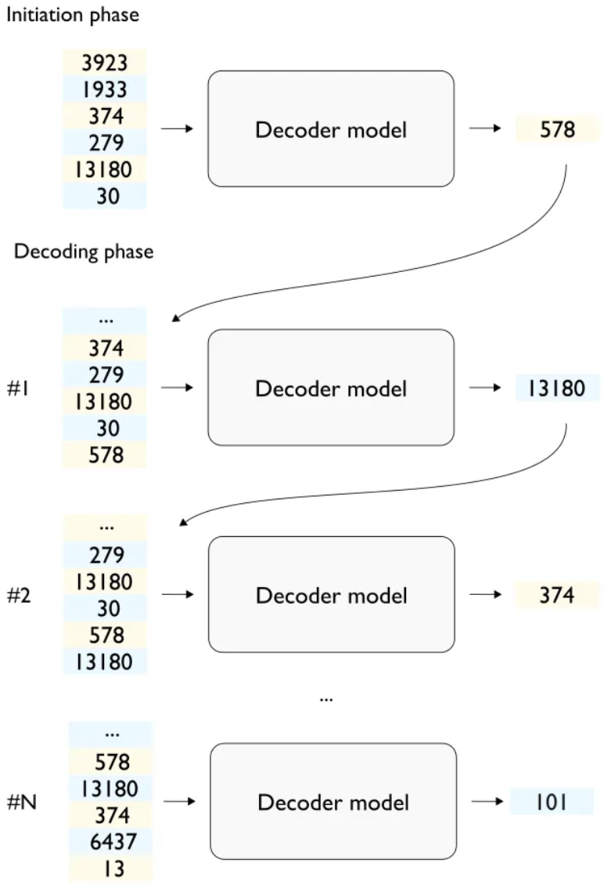
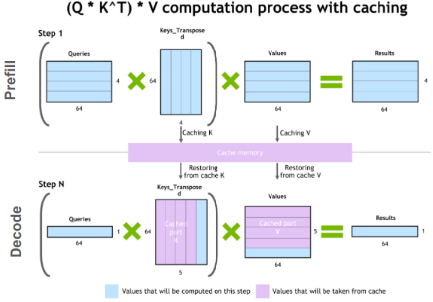

# LLM Inputs and Outputs
## Table of Contents
- [LLM Inputs and Outputs](#llm-inputs-and-outputs)
  - [Table of Contents](#table-of-contents)
  - [LLM Overview](#llm-overview)
  - [Input: Context Length](#input-context-length)
  - [Output: Decoder Output](#output-decoder-output)
  - [References](#references)

## LLM Overview
LLM are deep learning branch used for various language-based tasks, including text generation as the most popular application of LLM. Most common architecture used in LLM is called Transformer, which uses multi-self-attention layer. Currently there are three known types of applied architecture in deploying the Transformer [1]:
1. Encoder-Decoder: Processes inputs through the encoder and passes the intermediate representation to the decoder to generate output. Encoder see and process the complete sequence, while the decoder process the sequence one after another. 
2. Causal Decoder: Does not include encoder, process and generate output using only encoder and it depends on previous time step as input, and next time step as output.
3. Prefix/Non Causal Decoder: doesn't strictly affected by the previous time step and use bidirectional learning.
It can be assumed that the input of an LLM model is scalable based on the time series, or re-train the model for higher computational cost. Below are some terminologies and application used in todays LLM.
## Input: Context Length
**Context length is maximum length of the input sequence** [2]. Todays LLM provides can process larger and longer texts, but the context length relatively the same. Below are example of some models with its context lengths.

Model|Context length
---|---
GPT3.5|4096
GPT 4|8192
GPT 4-32k|32768
Llama 1|2048
Llama 2|4096

Increasing context length must be done by redefining the model and train it again, or with prompt adjustment based on the model context length. The adjustment mainly use batching or chunking, where the prompt is separated into few prompts, with additional information. GPT use sinusoidal encoding to map the token position, while Llama use rotary encoding. Yet the two methods shown degradation in performance in processing huge ammount of input [3].  Another method is called AliBi or Attention Linear Bias, works like positional encoding.

## Output: Decoder Output
Decoder able to predict the next value of the sequence, where the sequence is tokens or encoder processed value. In text generation, there are two main phases, the Initiation phase (which generate the prompt tokens from the prompt, also called as pre-fill phase) and the Decoding phase (also known as auto-regressive or incremental phase). Decoding phase happens by appending the output of the decoder as the last sequence of the input sequence, then iterated again until the end of line token shows up, or any rule-based termination happens. The *stream* output is affected by this iterations, where application like chatbot replies in sequence, not a full response.

About the input that has been chunked previously because of the context length problem, it is possible that the chatbot replies each chunk sequentially, where the next sequence is to be processed after the last sequence is terminated. This raise the problem of unsynchronized response between the chunk, but with the additional information appended (like sinusoidal encoding in GPT or rotary encoding in Llama), the key and value pair in the attention mechanism are trained to expect multichunk query when generating separated responses.

Since the previous value is used once more in each iteration, some optimization method can be implemented, like the key-value caching. For each iterations, the processed part are stored in cache, and called back in the next iteration.

## References
[1] Naveed, H., et. al., A Comprehensive Overview of Large Language Models, 2024, https://arxiv.org/pdf/2307.06435

[2] https://agi-sphere.com/context-length/

[3] https://arxiv.org/abs/2108.12409

[4] https://developer.nvidia.com/blog/mastering-llm-techniques-inference-optimization/ 