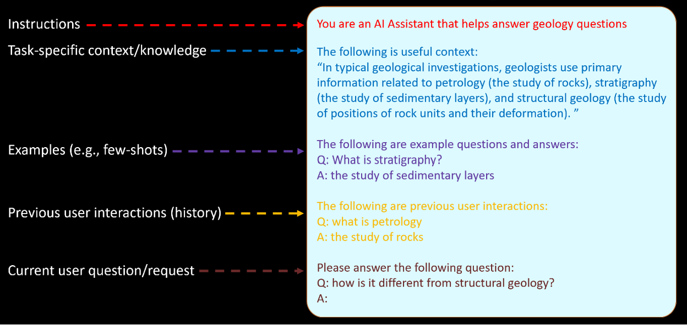
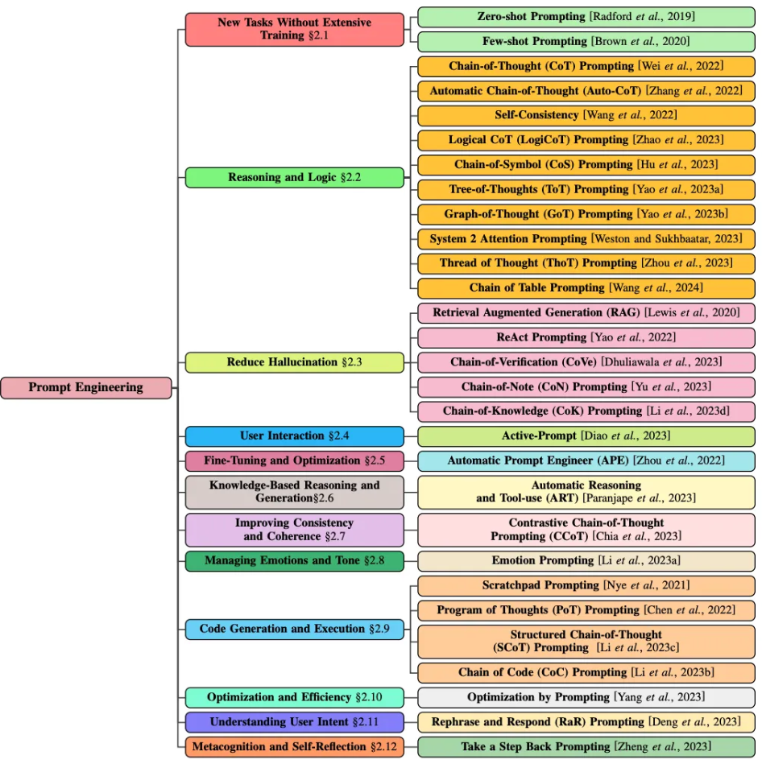
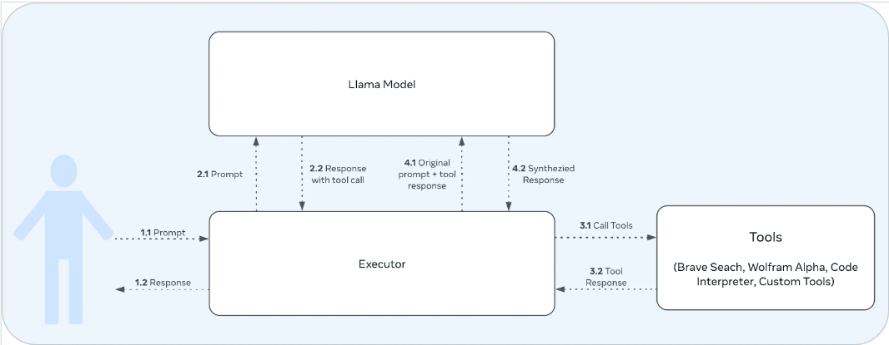

# Prompting in LLM
## Table of Contents
- [Prompting in LLM](#prompting-in-llm)
  - [Table of Contents](#table-of-contents)
  - [Introduction](#introduction)
  - [Prompt Principles](#prompt-principles)
    - [Prompt Engineering Guide](#prompt-engineering-guide)
    - [Prompt Engineering Guide by Microsoft](#prompt-engineering-guide-by-microsoft)
  - [Prompt Structure](#prompt-structure)
    - [Prompt Components by Microsoft](#prompt-components-by-microsoft)
    - [CO-STAR Framework](#co-star-framework)
  - [Prompt Technique/Method](#prompt-techniquemethod)
  - [Case Specific: Llama 3.1](#case-specific-llama-31)
    - [Special Tokens](#special-tokens)
    - [Roles](#roles)
    - [Tools](#tools)
  - [Reference](#reference)

## Introduction
The term *prompt* in LLM refer to the input of a LLM Model in inference phase that generates responses. The term or discipline regarding to *prompt* is called *prompt engineering*, the process or practice of structuring text that can be interpreted and understood by a generative AI model. There are two different aspects of a prompt, the first one is *prompt method* which usually involves multiple interactions to get the desired result, and *prompt structure* which more focused on the structure of a single prompt should have. Another paper also mentioned about *prompt principle*, a general idea and concept of prompt including both method and structure by Bsharat, et. al. 2023 [1].

## Prompt Principles
As defined by Bsharat, et. al., there are 26 ordered prompt principles, categorized into five categories:
1. Prompt Structure and Clarity: Integrate the intended audience in the prompt.
2. Specifity and Information: Implement example-driven prompting (Use few-shot prompting)
3. User Interaction and Engagement: Use precise details and requirements until it has enough information to provide response
4. Content and Language Style: Instruct the tone and style of response
5. Complex Task and Coding Prompts: Breaking down complex tasks into a sequence of simpler steps as prompts

Some of AI development also provide several notes on how to prompt, for example OpenAI mention that a prompt should:
- Written in clear instructions
- Provide reference text
- Split complex tasks into simpler subtasks
- Give model time to "think"

### Prompt Engineering Guide
Rather than focusing on structure, most of developers tend to provide guide on how to build one. For example https://www.promptingguide.ai/introduction/tips mention several tips, including:
1. Mind the instruction, some recommend to place it at the beginning of the prompt, or use clear separator like `###` to separate the instruction and context.
   ```
   ### Instruction ###
   Translate the text below to Spanish:
   Text: "hello!"
   ```
2. Specificity, be specific and keep in mind of the length since there is a limit of input to be processed by the model.
3. Avoid Impreciseness, can be done by using numbers to describe anything countable, rather than adjectives.
   ```
   Explain the concept prompt engineering. Keep the explanation short, only a few sentences, and don't be too descriptive.
   
   # Better to use:
   Use 2-3 sentences to explain the concept of prompt engineering to a high school student.
   ```
4. Avoid saying what not to do, better to tell directly what should the model do to encourage specificity and details.

### Prompt Engineering Guide by Microsoft

## Prompt Structure
Prompt can contains any kind of text, information, and structure, but in general, a prompt consists of:
- Instruction, specific task or instruction you want to the model to perform.
- Context, external information or additional context that can steer the model.
- Input Data, the input or question that need to be responded.
It doesn't need all the three information in one prompt, and it doesn't have to follow one specific structure either.

### Prompt Components by Microsoft
Common technique is to construct prompts from a well-defined set of components:
1. Instructions, it must contains what the model should do, but can be added with role, style, or even tone.
2. Task-specific context/knowledge, additional information for the model to respond the instruction.
3. Examples, providing example of the expected response
4. Previous user interaction, providing context about the previous interaction to make the model continuously understand and enables chain-of-thought method.
5. Current user question/request, mainly about the question of the user, different than the instruction.



### CO-STAR Framework
It also possible to use "Framework" in prompting, such as CO-STAR Framework by Sheila Teo that won Singapore GPT-4 prompt engineering competition. CO-STAR derived as:

- **C = Context**, providing background and information on the task.
- **O = Objective**, defining the task for LLM to perform.
- **S = Style**, specifing the writing style to be used by the LLM.
- **T = Tone**, set the attitude and tone of the response.
- **A = Audience**, identify who the response is for.
- **R = Response**, provide the response format and style.

Example:
```python
    prompt = f"""
    # CONTEXT #
    I want to write a complete and cohesive paragpraph for 
    magazine: Things to know.

    #############
    
    # OBJECTIVE #
    Compete the text ```{user_prompt}``` between three backticks to the best 
    of your acquired knowledge.

    #############

    # STYLE #
    You will use simple, compound, and compound-complex sentences for all your responses, 
    and no more than one paragraph and no more than five sentences.

    Adhere to a litrary magazine writing style. Keep your sentences succinct and cohesive.

    #############

    # TONE #
    Maintain an editorial tone.

    #############

    # AUDIENCE #
    Our audience are generally curious first to second year college
    students.

    #############

    # RESPONSE #
    Finally, keep the response concise and succinct.
    """
```
More example of CO-STAR prompt can be found in (note that the prompt is proven to be effective in OpenAI Chatbot only):
1. https://colab.research.google.com/github/dmatrix/genai-cookbook/blob/main/llm-prompts/1_how_to_use_basic_prompt.ipynb
2. https://colab.research.google.com/github/dmatrix/genai-cookbook/blob/main/llm-prompts/2_how_to_conduct_common_nlp_llm_tasks.ipynb
   

## Prompt Technique/Method
There are several method in prompt engineering, like zero-shot and few-shot prompting, chain of thought, and many more. Sahoo Singh and Saha surveyed and mapped these method as:


## Case Specific: Llama 3.1
### Special Tokens
Llama 3.1 have several special tokens to be used throughout the prompt, some of the tokens are:
- `<|begin_of_text|>`, the start of the prompt.
- `<|end_of_text|>`, stopping the model to generate token, only generated by the base model.
- `<|finetune_right_pad_id>`, padding text sequences to the same length in batch.
- `<|start_header_id|>` ended with `<|end_header_id|>` enclose the role of particulare message, roles are explained later.
- `<|eom_id|>` end of message, represents a possible stopping point for execution to inform executor that a tool call needs to be made. Emitted by the model when the `Environment:ipython` instruction is used in the system prompt, or if the model calls for a built-in tool.
- `<|eot_id|>`, end of turn, represents when the model has determined that it has finished interacting with the user message that initiated its response, used in two scenarios:
  - At the end of a direct interaction between model and user.
  - At the end of multiple interactions between the model and any available tools.
- `<|python_tag|>` special tag used in model's response to signify a tool call.

### Roles
There are four roles currently supported by Llama 3.1:

Role|Description
---|---
`system`|set context to interact with AI Model, including rules, guidelines, or necessary information.
`user`|represents the human interacting with the model, including inputs, commands, and questions to the model.
`ipython`|new role, means 'tool', used to mark messages with the output of a tool call when sent back to the model from the executor.
`assistant`|represents the response generated by the AI model based on the context provided in the `system`, `ipython`, and `user` prompts.

### Tools
Llama 3.1 Instruct is recommended to be used for applications that combine conversation and tool calling. But it can be inferred that the model only knows how to generate a tool call, not automatically, internally, have the tool. A 'middleware' or Executor needed to interpret the generated tool call and execute the tools, and then appending the user prompt and the tool response. The system is ilustrated as this:


To use the tools, the prompt must mention the tools to be used first. Here is an example of enabling tools:

```python
"""
<|begin_of_text|><|start_header_id|>system<|end_header_id|>

Environment: ipython
Tools: brave_search, wolfram_alpha

Cutting Knowledge Date: December 2023
Today Date: 23 Jul 2024

You are a helpful assistant<|eot_id|>
<|start_header_id|>user<|end_header_id|>

What is the current weather in Menlo Park, California?<|eot_id|><|start_header_id|>assistant<|end_header_id|>
"""
```

Prompts with tool call will returns a *python syntax* and not a JSON Format (if not mentioned, or in other words, a zero-shot tools). The python call that is generated is in the form:

```python
"""
# For search
<|python_tag|>
brave_search.call(query="...")
<|eom_id|>

# For Wolfram
<|python_tag|>
wolfram_alpha.call(query="...")
<|eom_id|>
```
After the call has been responded by the tools, the prompt are appended with the tool responses using the `ipython` role.

```python
"""
<|begin_of_text|>
<|start_header_id|>system<|end_header_id|>

Environment: ipython
Tools: brave_search, wolfram_alpha

Cutting Knowledge Date: December 2023
Today Date: 23 Jul 2024

You are a helpful assistant<|eot_id|>
<|start_header_id|>user<|end_header_id|>

Can you help me solve this equation: x^3 - 4x^2 + 6x - 24 = 0<|eot_id|>
<|start_header_id|>assistant<|end_header_id|>

<|python_tag|>wolfram_alpha.call(query="solve x^3 - 4x^2 + 6x - 24 = 0")<|eom_id|>
<|start_header_id|>ipython<|end_header_id|>

{"queryresult": {"success": true, "inputstring": "solve x^3 - 4x^2 + 6x - 24 = 0", "pods": [{"title": "Input interpretation", "subpods": [{"title": "", "plaintext": "solve x^3 - 4 x^2 + 6 x - 24 = 0"}]}, {"title": "Results", "primary": true, "subpods": [{"title": "", "plaintext": "x = 4"}, {"title": "", "plaintext": "x = \u00b1 (i sqrt(6))"}]}, ... ]}}<|eot_id|>
<|start_header_id|>assistant<|end_header_id|>    
"""
```

It is also possible to use a JSON tool calling, by providing tool definition in the user prompt (using the `system` role or `user` role). For example in the `system` role, it is mentioned that the bot must response in JSON format for tool calling, and in the `user` role provide the format. Note that since this kind of implementation doesn't use `Environment: ipython`, the response ends with `eot_id` rather than `eom_id` token. The response from the tool then can be appended using the same format and tokens as previous example.

Other custom tool call is also possible by defining the whole function in JSON format in `system` role. Below is an example of custom tool call:

```python
"""
<|begin_of_text|>
<|start_header_id|>system<|end_header_id|>


Environment: ipython
Tools: brave_search, wolfram_alpha

Cutting Knowledge Date: December 2023
Today Date: 23 Jul 2024

# Tool Instructions
- Always execute python code in messages that you share.
- When looking for real time information use relevant functions if available else fallback to brave_search


You have access to the following functions:

Use the function 'spotify_trending_songs' to: Get top trending songs on Spotify
{
  "name": "spotify_trending_songs",   
  "description": "Get top trending songs on Spotify", 
  "parameters": {
    "n": {
      "param_type": "int", 
      "description": "Number of trending songs to get", 
      "required": true
      }
    }
  }


If a you choose to call a function ONLY reply in the following format:
<{start_tag}={function_name}>{parameters}{end_tag}
where

start_tag => `<function`
parameters => a JSON dict with the function argument name as key and function argument value as value.
end_tag => `</function>`

Here is an example,
<function=example_function_name>{"example_name": "example_value"}</function>

Reminder:
- Function calls MUST follow the specified format
- Required parameters MUST be specified
- Only call one function at a time
- Put the entire function call reply on one line
- Always add your sources when using search results to answer the user query

You are a helpful assistant.<|eot_id|>
<|start_header_id|>user<|end_header_id|>

Can you check the top 5 trending songs on spotify?<|eot_id|>
<|start_header_id|>assistant<|end_header_id|>

<function=spotify_trending_songs>{"n": "5"}</function><|eom_id|>
<|start_header_id|>ipython<|end_header_id|>

["1. BIRDS OF A FEATHER by Billie Eilish", "2. Espresso by Sabrina Carpenter", "3. Please Please Please by Sabrina Carpenter", "4. Not Like Us by Kendrick Lamar", "5. Gata Only by FloyyMenor, Cris Mj"]<|eot_id|>
<|start_header_id|>assistant<|end_header_id|>            
"""
```

## Reference
[1] https://arxiv.org/pdf/2312.16171 

[2] https://learn.microsoft.com/en-us/ai/playbook/technology-guidance/generative-ai/working-with-llms/prompt-engineering

[3] https://medium.com/the-modern-scientist/best-prompt-techniques-for-best-llm-responses-24d2ff4f6bca

[4] https://www.promptingguide.ai/introduction/tips

[5] https://llama.meta.com/docs/model-cards-and-prompt-formats/llama3_1/#user-and-assistant-conversation