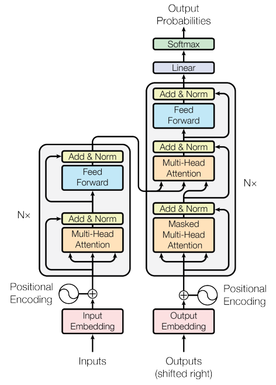
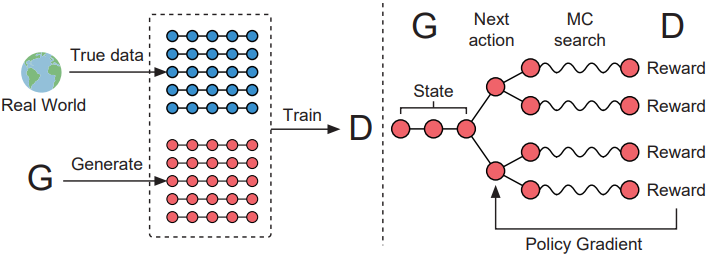
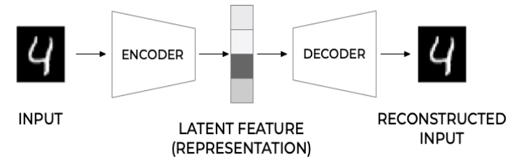

# Generative AI and LLM
## Table of Contents
- [Generative AI and LLM](#generative-ai-and-llm)
  - [Table of Contents](#table-of-contents)
  - [History](#history)
  - [Generative AI](#generative-ai)
    - [Transformer](#transformer)
    - [Generative Adversarial Network](#generative-adversarial-network)
    - [Variational Auto-Encoder (VAE)](#variational-auto-encoder-vae)
- [References](#references)
  
## History
The rise of AI starts from various algorithms that create values from data, one of early adoption of the idea is Hidden Markov Model. Markov model use probabilities, states, and observation, where the states and observation are the data, the probabilities are the one that updates for each transition (in term of sequence data) [1].

$$Pr(O|I,\lambda)=b_{i1}(O_1)b_{i2}(O_2)...b{iT}(O_T)$$

The definition above is the probability for observation O based on state sequence I, given model $\lambda$ and total length of observation sequence T.

The term of AI was first introduced as 'Perceptron' by Frank Rosenblatt in 1958, he introduced the first image binary classification to differentiate papers marked on the right and the left [2]. The perceptron introduced in his paper is used as the basic of later researches. The perceptron learns by using:

 $$a_i*v_i$$

where a is the weight and v is the previous weight, and the weights are updated by the probability of the output and the label assigned to it. This method mentioned as too slow to be used successfully by Rosenblatt, but in the evolution of computers, it became faster, and possible to be implemented such as in DNN, CNN, RNN, and many more. The task of AI became varied based on the tasks, algorithms, and types, including the new field of Generative AI.

## Generative AI
The term of 'Generative AI' refer to AI models or algorithms that take and learn from data to create new data [3,4]. The data format could be text, images, voice, video, or a time-series data. Eventhough the term Generative AI just recently defined and well-known, AI that generates new data has been developed in the past like ELIZA by Joseph Weizenbaum [5] that creates text response based on several keywords (later defined as rule-based type).

### Transformer

The first notable generative AI published paper came from Google in "Attention is all you need", introduced in 2017. The paper introduces a new encoder-decoder AI model, called as the Transformer, that uses attention module to capture specific value based on the key and query. The encoder-decoder architecture also creates a pair of submodel that learn the input (encoder), and learn how to generate the output (decoder) [6]. 

The Transformer soon became very popular in generative AI, creating a lot of new models and architectures based on Transformer like BERT[6], GPT [7], T5 [8], PaLM [9], and LLaMA[11], along with many applications in the later years. The Transformer then applied in image data, with various architecture like DALL-E [12] and ViT [13].

### Generative Adversarial Network
GAN is another branch of generative AI that use game theory between two machine learning models, the generator and the discriminator. The generator tries to create new data that looks like an actual data, while the discriminator tries to detect wether the generated data is a real or fake data [14]. Training a GAN involves training the generator and the discriminator, involving both real data and fake data created by the generator. The generator doesn't know what is the target output, only given reward when the discriminator detects the output as real data. GAN mostly used in image data because of its generator and discriminator process, yet other data is available in its development. For example, SeqGAN which process sequence data with policy gradient, where the data generated and discriminated in sequence, where older data still affecting the newest with a gradient. The SeqGAN is already tested for text generation and music generation [15].

### Variational Auto-Encoder (VAE)
VAE derived from Auto-Encoder, which is another deep learning algorithm that represent a data into its lower dimension than the input in the hidden layer (also called as the "bottleneck"), then reconstruct the input back from the lower dimension [16]. In some paper, the autoencoder use the term 'encoder' for the first part to generate the lower dimension representation, and 'decoder' for the second part to generate the reconstructed data. These term also used in the transformer architecture.

The term 'variational' came from the variational inference or variational Bayes. In normal auto-encoder, the data after the encoder usually is a set of numerical value that works like a normal neural network. In VAE, the term 'variational' refer to the encoder output that are parameters of a distribution (these parameters is inside a 'latent space'). Then a sample is taken from the distribution to be processed in the decoder, so it represents a probability distribution [17,18].

 # References
 [1] Rabiner, L.R., Juang, B.H., "An Introduction to Hidden Markov Models", IEEE ASSP Magazine, January 1986, https://ieeexplore.ieee.org/stamp/stamp.jsp?tp=&arnumber=1165342

 [2] Rosenblatt, F., "Perceptron Simulation Experiments", Proceedings of the IRE, vol. 48, no. 3, pp. 301-309, March 1960. https://doi.org/10.1109/JRPROC.1960.287598

 [3] Zewe, Adam, "Explained: Generative AI", MIT News, November 2023, https://news.mit.edu/2023/explained-generative-ai-1109

[4] Martineau, Kim, "What is generative AI?" IBM, April 2023, https://research.ibm.com/blog/what-is-generative-AI

[5] Weizenbaum, Joseph, "ELIZA-a computer program for the study of natural language communication between man and machine", Communications of the ACM, Vol. 9, Issue 1, pp 36 - 45, January 1966, https://dl.acm.org/doi/10.1145/365153.365168 

[6] Vaswani, et. al., "Attention is All You Need", 31st Conference on Neural Information Processing Systems (NIPS 2017), 2017, https://arxiv.org/pdf/1706.03762

[7] Devlin, et. al., "BERT: Pre-training of Deep Bidirectional Transformers for Language Understanding", ArXiv, 2018, https://arxiv.org/abs/1810.04805

[8] Radford, et. al., "Improving Language Understanding by Generative Pre-Training", Working paper, 2018, https://cdn.openai.com/research-covers/language-unsupervised/language_understanding_paper.pdf

[9] Raffel, et. al., "Exploring the Limits of Transfer Learning with a Unified Text-to-Text Transformer, ArXiv, 2019, https://arxiv.org/abs/1910.10683v4

[10] Chowdhery, et. al., "PaLM: Scaling Language Modeling with Pathways", ArXiv, 2022, https://arxiv.org/abs/2204.02311

[11] Touvron, et. al., "LLaMA: Open and Efficient Foundation Language Models", ArXiv, 2023, https://arxiv.org/abs/2302.13971

[12] Ramesh, et. al., "Zero-Shot Text-to-Image Generation", ArXiv, 2021, https://arxiv.org/pdf/2102.12092

[13] Dosovitskiy, et. al., "An Image is Worth 16x16 Words: Transformers for Image Recognition at Scale", ArXiv, 2021, https://arxiv.org/pdf/2010.11929

[14] Goodfellow, et. al., "Generative Adversarial Networks", Communications of the ACM, Vol 63, Issue 11, pp 139 - 144, https://dl.acm.org/doi/10.1145/3422622

[15] Yu, et. al., "SeqGAN: Sequence Generative Adversarial Nets with Policy Gradient", ArXiv, 2017, https://arxiv.org/pdf/1609.05473

[16] Michelucci, U., "An Introduction to Autoencoders", arXiv, 2022, https://arxiv.org/pdf/2201.03898

[17] Kingma, D. P., Welling, M., "Auto-Encoding Variational Bayes", ArXiv 2022, https://arxiv.org/pdf/1312.6114

[18] Foy, P., "Generative Modeling: What is a Variational Autoencoder (VAE)?", 2021, https://blog.mlq.ai/what-is-a-variational-autoencoder/