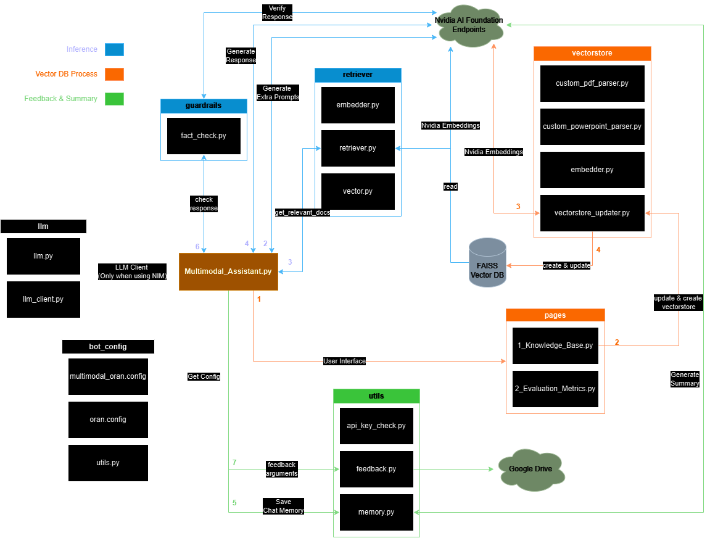

> Michael Harditya (TEEP)
# **O-RAN Chatbot Function Tracking**


## **Table of Contents**
- [**O-RAN Chatbot Function Tracking**](#o-ran-chatbot-function-tracking)
  - [**Table of Contents**](#table-of-contents)
  - [🟧 Vector DB Process](#-vector-db-process)
    - [Vector DB View](#vector-db-view)
    - [VectorDB Updater](#vectordb-updater)
  - [🟦 Inference](#-inference)
    - [Step 1. Prompt Augmentation](#step-1-prompt-augmentation)
    - [Step 2. Document Retrieval](#step-2-document-retrieval)
    - [Step 3. Response Generation](#step-3-response-generation)
    - [Step 4. Response Verification](#step-4-response-verification)
  - [🟩 Utilities](#-utilities)
    - [memory.py](#memorypy)
    - [feedback.py](#feedbackpy)

## 🟧 Vector DB Process
All vector database process can be done through the `Knowledge Base` page on Streamlit.
### Vector DB View
The main page is going to check if a vector database exist in `vectorstore_nv` directory, if not then it won't accept any prompt and print warning:
```python
"Vector DB not found! Create a vector DB by navigating to the Knowledge Base tab."
```
<details>
  <summary>Details</summary>
  
  ```python
    if os.path.exists(os.path.join(CORE_DIR, "vectorstore_nv"))==False:
        st.warning("Vector DB not found! Create a vector DB by navigating to the Knowledge Base tab.")
    else:
  ```
</details>

`pages/1_Knowledge_Base.py` is the page to maintain VectorDB used on the RAG. It provides four options:
1. Upload new file
<details>
<summary>Details</summary>

```python
# File upload
st.subheader("Upload files to the {} Knowledge Base".format(config["name"]))
with st.form("my-form", clear_on_submit=True):
    uploaded_files = st.file_uploader("Upload a file to {}'s Knowledge Base:".format(config["name"]), type=["pdf", "txt", "docx"], accept_multiple_files = True)
    submitted = st.form_submit_button("UPLOAD!")

if uploaded_files and submitted:
    for uploaded_file in uploaded_files:
        st.success("File uploaded successfully!")
        with open(os.path.join(DOCS_DIR_new, uploaded_file.name),"wb") as f:
            f.write(uploaded_file.read())
            st.write("filename: ", uploaded_file.name)

# st.divider()

vectorstore_folder = os.path.join(CORE_DIR, "vectorstore_nv")
```
</details> 

2. Create vector database
<details>
<summary>Details</summary>

```python
  import datetime
  def modification_date(vectorstore_folder):
      t = os.path.getmtime(vectorstore_folder)
      return datetime.datetime.fromtimestamp(t)

  # Create the basic vector DB for comparison
  st.subheader("Create vector database")
  if os.path.exists(vectorstore_folder):
      # st.write(f"Vector store already exists, and it may not need to be created again unless new documents have been added since then. Creation date: {modification_date(vectorstore_folder)}")
      st.write(f"Vector store already exists. Creation date: {modification_date(vectorstore_folder)}.")
  else:
      st.write("To setup the ORAN bot, upload your documents and click to create your vector DB!")

  if st.button("Create vector DB"):
      createDB_error = 0
      with st.spinner("Running vector DB creation..."):
          createDB_error = create_vectorstore(CORE_DIR, config["name"], st.status)
      if not(createDB_error):
          st.success("Completed!")
      else:
          st.warning("To add more documents to the exising DB, please use the Re-Train Multimodal Assistant button.")

  st.divider()
```
</details>

3. Re-train with new files

<details>
<summary>Details</summary>

```python
# Retraining/vector DB creation

st.subheader("Re-train {} with new files".format(config["name"]))
st.write("This section will rerun the information chunking and vector storage algorithms on all documents again. ONLY run if you have uploaded new documents! Note that this can take a minute or more, depending on the number of documents and the sizes.")
if st.button("Re-train {}".format(config["name"])):
    updateDB_error = 0
    with st.status("Loading documents. Expand to see current status", expanded=False) as status:
        updateDB_error = update_vectorstore(DOCS_DIR, config["name"], st.status)
    if not(updateDB_error):
        st.success("Completed re-training. Now {} will use the updated documentation to answer questions!".format(config["name"]))
    else:
        st.warning("Vector DB not found. Please create a vector DB first!")
    # st.rerun()
st.divider()
```
</details>

4. View/Modify the current Knowledge Base

<details>
<summary>Details</summary>

```python
shutil.copytree(DOCS_DIR_new, DOCS_DIR, dirs_exist_ok=True)
filelist = [file for file in os.listdir(DOCS_DIR) if file.endswith(".pdf") or file.endswith(".txt") or file.endswith(".docx")]

st.subheader("View/Modify the current Knowledge Base")
# Create a dropdown for the file list
if len(filelist) > 0:
    selected_file = st.selectbox("The following files/documents are ingested and used as part of {}'s knowledge base. Select to download if you wish".format(config["name"]), filelist)

    file_path = os.path.join(DOCS_DIR, selected_file)
    DOCS_DIR_new = os.path.join(DOCS_DIR, "new_files")
    file_path_new = os.path.join(DOCS_DIR_new, selected_file)
    with open(file_path, "rb") as file:
        col1, col2 = st.columns([1,1])
        file_bytes = file.read()
        with col2:
            st.download_button(
                label="Download File",
                data=file_bytes,
                file_name=selected_file,
                mime="application/octet-stream",
            )
        with col1:
            if st.button("Delete File"):
                st.session_state.delete_clicked = True

        if st.session_state.get("delete_clicked"):
            password = st.text_input('Are you sure? Please confirm the password to delete this file.', key='password_field')
            # if password == "avfleetengineering":
            if password == yaml.safe_load(open('config.yaml', 'r'))['file_delete_password']:
                with st.spinner("Marking file for deletion"):
                    time.sleep(5)
                    os.remove(file_path)
                    if os.path.isfile(file_path_new):
                        os.remove(file_path_new)
                    st.success("File has been deleted!")
                    st.session_state.delete_clicked = False  # Reset delete_clicked for next time
else:
    st.warning("There are no documents available for retrieval. Please upload some documents for the chatbot to use!", icon="⚠️")
```
</details>

### VectorDB Updater
Two main functions used in the `pages/1_Knowledge_Base.py` use `NvidiaEmbeddings()`, a LangChain Nvidia AI Endpoints (use Nvidia API), defined in `vectorstore/vectorstore_updater.py`. The result of the functions are FAISS vector file in `vectorstore_nv`.
1. `create_vectorstore` that creates new vector database by processing the embeddings.
2. `update_vectorstore` that updates the existing vector database by loading and rewrite the newly added embeddings.
<details>
<summary> Details </summary>

- Embedder initiation
```python
  nv_embedder = None
  if yaml.safe_load(open('config.yaml', 'r'))['NREM']:
      # Embeddings with NeMo Retriever Embeddings Microservice (NREM)
      print("Generating embeddings with NREM")
      nv_embedder = NVIDIAEmbeddings(model=yaml.safe_load(open('config.yaml', 'r'))['nrem_model_name'],
                                              truncate = yaml.safe_load(open('config.yaml', 'r'))['nrem_truncate']).mode("nim",
                                              base_url= yaml.safe_load(open('config.yaml', 'r'))['nrem_api_endpoint_url'])

  else:
      # Embeddings with NVIDIA AI Foundation Endpoints
      nv_embedder = NVIDIAEmbeddings(model=yaml.safe_load(open('config.yaml', 'r'))['embedding_model'])

```
- Functions
```python
def update_vectorstore(folder, config_name, status=None):
    """Generates word embeddings for documents and updates the Qdrant collection."""
    # client = QdrantClient(host="localhost", port=6333)
    # collection_name = config_name

    # Create collection if it doesn't exist
    # Attempt to create collection, catch exception if it already exists
    # status(label="[Step 1/4] Creating/loading vector store", state="complete", expanded=False)

    # with open(os.path.join(folder, "vectorstore_nv.pkl"), "rb") as f:
    #     vectorstore = pickle.load(f)
    if not os.path.exists(os.path.join(folder, "vectorstore_nv")):
        st.write("Vector DB not found. Please create a vector DB.")
        return 1
    vectorstore = FAISS.load_local(os.path.join(folder, "vectorstore_nv"), nv_embedder, allow_dangerous_deserialization=True)
    # status("[Step 2/4] Processing and splitting documents", state="complete", expanded=False)
    prev_folder = folder
    folder = os.path.join(folder, "new_files")
    if not os.path.exists(folder):
        os.mkdir(folder)
    raw_documents = load_documents(folder, status)

    documents = split_text(raw_documents)

    #remove short chuncks
    filtered_documents = [item for item in documents if len(item.page_content) >= 200]
    [(len(item.page_content),item.page_content) for item in documents]
    documents = filtered_documents
    pd.DataFrame([doc.metadata for doc in documents])['source'].unique()
    #remove line break
    for i in range(0,len(documents)-1):
        documents[i].page_content=remove_line_break(documents[i].page_content)
    #remove two points
    for i in range(0,len(documents)-1):
        documents[i].page_content=remove_two_points(documents[i].page_content)
    #remove non english characters points
    for i in range(0,len(documents)-1):
        documents[i].page_content=remove_two_slashes(documents[i].page_content)
    #remove two points
    for i in range(0,len(documents)-1):
        documents[i].page_content=remove_two_points(documents[i].page_content)
    [(len(item.page_content),item.page_content) for item in documents]

    print("Loading data to the vector index store...")
    # status("[Step 3/4] Inserting documents into the vector store...", state="complete", expanded=False)
    db1 = FAISS.from_documents(documents, nv_embedder)
    vectorstore.merge_from(db1)
    # with open(os.path.join(prev_folder, "vectorstore_nv.pkl"), "wb") as f:
    #     pickle.dump(vectorstore, f)
    # vectorstore.save_local("vectorstore_nv")
    vectorstore.save_local(os.path.join(folder, "vectorstore_nv"))
    return 0

def create_vectorstore(folder, config_name, status=None):
    """Generates word embeddings for documents and updates the Qdrant collection."""
    # Create vectorstore if it doesn't exist
    # Attempt to create collection, catch exception if it already exists
    # status(label="[Step 1/4] Creating/loading vector store", state="complete", expanded=False)
    # if os.path.isfile(os.path.join(folder, "vectorstore_nv/index.pkl")) == True:
    if os.path.exists(os.path.join(folder, "vectorstore_nv")) == True:
        # st.write("To add more documents to the exising DB, please use the Re-Train Multimodal Assistant button.")
        return 1
    else:
        # status("[Step 2/4] Processing and splitting documents", state="complete", expanded=False)
        raw_documents = load_documents(folder, status)
        print(raw_documents)
        documents = split_text(raw_documents)

        #remove short chuncks
        filtered_documents = [item for item in documents if len(item.page_content) >= 200]
        [(len(item.page_content),item.page_content) for item in documents]
        documents = filtered_documents
        pd.DataFrame([doc.metadata for doc in documents])['source'].unique()
        #remove line break
        for i in range(0,len(documents)-1):
            documents[i].page_content=remove_line_break(documents[i].page_content)
        #remove two points
        for i in range(0,len(documents)-1):
            documents[i].page_content=remove_two_points(documents[i].page_content)
        #remove non english characters points
        for i in range(0,len(documents)-1):
            documents[i].page_content=remove_two_slashes(documents[i].page_content)
        #remove two points
        for i in range(0,len(documents)-1):
            documents[i].page_content=remove_two_points(documents[i].page_content)
        [(len(item.page_content),item.page_content) for item in documents]

        print("Loading data to the vector index store...")
        # status("[Step 3/4] Inserting documents into the vector store...", state="complete", expanded=False)
        vectorstore = FAISS.from_documents(documents, nv_embedder)
        # vectorstore.merge_from(db1)
        # with open(os.path.join(folder, "vectorstore_nv.pkl"), "wb") as f:
        #     pickle.dump(vectorstore, f)
        # vectorstore.save_local("vectorstore_nv")
        vectorstore.save_local(os.path.join(folder, "vectorstore_nv"))
    return 0
```
</details>

## 🟦 Inference
Inference or the process from prompt to response in RAG consists of four steps. All the functions can be found in `Multimodal_Assistant.py`. Each steps use one `Nvidia AI Endpoint API`, with other functionalities excluded throughout the inference phase.
### Step 1. Prompt Augmentation
The prompt taken by the user is used to generate 5 more related prompts using `Nvidia AI Endpoint API`, creating 6 prompts in total to be used in the next step. This creates more contexts to be extracted from the database, thus a better response. 

<details>

```python
def augment_multiple_query(query, model="meta/llama2-70b"):
    #For the given query, lets create 5 additional queries using the LLM
    if NIM_FLAG==True:
        print("Augmentating multiple query with NIM LLM")
        llm = llm_client.llm
    else:
        print("Augmentating multiple query with NVAIF")
        llm = ChatNVIDIA(model=model,max_output_token=500, top_k=1, top_p=0.0, nvidia_api_key=NVIDIA_API_KEY)
    prompt_template = ChatPromptTemplate.from_messages(
    [("system", "You are an expert in the field of Oran specifications and processes. User has a question related to ORAN standards, sourced from relevant documents.\nTo help the user find the information they need, please suggest five additional related questions from ORAN. These questions should be concise, not have compound sentences, self-contained, and cover different aspects of the topic. Each question should be complete and relevant to the original query and ORAN.\nPlease output one question per line without numbering them."), ("user", "{input}")]
        )
    chain = prompt_template | llm | StrOutputParser()
    augmented_user_input = "\n\nQuestion: " + query + "\n"
    full_response = ""
    for response in chain.stream({"input": augmented_user_input}):
        full_response += response
    final_ans = full_response
    final_ans = final_ans.split("\n")
    final_ans = [ans for ans in final_ans if len(ans)!=0]
    return final_ans
```

</details>

### Step 2. Document Retrieval
Each queries (or prompts) generated at the previous steps used to get the relevant documentation using `retriever/retriever.py` with `get_relevant_docs` function. Each documents retrieved merged as a collection of documents, with only unique documents are merged. One `Nvidia AI Endpoint API` also used to fetch the `embedder` to convert vectors back to text.

<details>

```python
 augmented_queries = augment_multiple_query(transformed_query["text"])
                queries = [transformed_query["text"]] + augmented_queries[2:]
                print("Queries are = ", queries)
                retrieved_documents = []
                retrieved_metadatas = []
                for query in queries:
                    ret_docs,cons,srcs = get_relevant_docs(CORE_DIR, query)
                    for doc in ret_docs:
                        retrieved_documents.append(doc.page_content)
                        retrieved_metadatas.append(doc.metadata['source'])
                print("length of retrieved docs: ", len(retrieved_documents))
                #Remove all duplicated documents and retain the original metadata
                unique_documents = []
                unique_documents_metadata = []
                for document,source in zip(retrieved_documents,retrieved_metadatas):
                        if document not in unique_documents:
                            unique_documents.append(document)
                            unique_documents_metadata.append(source)
                
                if len(retrieved_documents) == 0:
                    context = ""
                    print("not context found context")
                else: 
                    print("length of unique docs: ", len(unique_documents))
                    #Instantiate the cross-encoder model and get scores for each retrieved document
                    cross_encoder = CrossEncoder('cross-encoder/ms-marco-MiniLM-L-6-v2') # ('BAAI/bge-reranker-large')('cross-encoder/ms-marco-MiniLM-L-6-v2')
                    pairs = [[prompt, doc] for doc in unique_documents]
                    scores = cross_encoder.predict(pairs)
                    #Sort the scores from highest to least
                    order_ids =  np.argsort(scores)[::-1]
                    # print(order_ids)
                    new_updated_documents = []
                    new_updated_sources = []
                    #Get the top 6 scores
                    if len(order_ids)>=10:
                        for i in range(10):
                            new_updated_documents.append(unique_documents[order_ids[i]])
                            new_updated_sources.append(unique_documents_metadata[order_ids[i]])
                    else:
                        for i in range(len(order_ids)):
                            new_updated_documents.append(unique_documents[order_ids[i]])
                            new_updated_sources.append(unique_documents_metadata[order_ids[i]])
                        
                    print(new_updated_sources)
                    print(len(new_updated_documents))
```

</details>

### Step 3. Response Generation
Retrieved documents then formatted into `augmented_prompt`, and ready to be passed to `llm_client.chat_with_prompt()`. The function also use `Nvidia AI Endpoint API` for the chatbot response. There are two prompts passed to the function:
```python
augmented_prompt = "Relevant documents:" + context + "\n\n[[QUESTION]]\n\n" + transformed_query["text"] #+ "\n" + config["footer"]
system_prompt = config["header"]
response = llm_client.chat_with_prompt(system_prompt, augmented_prompt)
```
<details>

```python
class LLMClient:
    def __init__(self, model_name="mixtral_8x7b", model_type="NVIDIA"):
        self.llm = create_llm(model_name, model_type)

    def chat_with_prompt(self, system_prompt, prompt):
        langchain_prompt = ChatPromptTemplate.from_messages([("system", system_prompt), ("user", "{input}")])
        chain = langchain_prompt | self.llm | StrOutputParser()
        response = chain.stream({"input": prompt})

        return response

    def multimodal_invoke(self, b64_string, steer=False, creativity=0, quality=9, complexity=0, verbosity=8):
        message = HumanMessage(content=[{"type": "text", "text": "Describe this image in detail:"},
                                        {"type": "image_url", "image_url": {"url": f"data:image/png;base64,{b64_string}"},}])
        if steer:
            return self.llm.invoke([message], labels={"creativity": creativity, "quality": quality, "complexity": complexity, "verbosity": verbosity})
        else:
            return self.llm.invoke([message])
```
</details>

### Step 4. Response Verification
The inference continues to saving prompt and response as chat memory using `utils/memory.py` that is going to be discussed in [Utilities](#-utilities). After being saved, the `response` then being verified once more using `guardrails/fact_check.py` that validates the `response`, `context`, and `prompt` using `Nvidia AI Endpoint API` once more to get the chatbot response.

<details>

```python
NVIDIA_API_KEY = yaml.safe_load(open("config.yaml"))['nvidia_api_key']
os.environ['NVIDIA_API_KEY'] = NVIDIA_API_KEY

llm = ChatNVIDIA(model=yaml.safe_load(open("config.yaml"))["llm_model"], max_tokens = 10000)

def fact_check(evidence, query, response):

    system_message = f"""Your task is to conduct a thorough fact-check of a response provided by a large language model. You will be given the context documents as [[CONTEXT]], the original question posed by the user as [[QUESTION]], and the model's response as [[RESPONSE]]. Your primary objective is to meticulously verify each part of the model's response to ensure it aligns accurately and directly with the information presented in the context documents. Please refrain from using any external information or relying on prior knowledge. Focus on determining whether the response is entirely factual based on the provided context and whether it fully addresses the user's question. This process is crucial for maintaining the accuracy and reliability of the information given by the language model. You can provide suggestions to the user for follow-up questions based on the documents, that will provide them more information about the topic they are interested in. If your fact check returns True, start your reply with '**:green[TRUE]**' in your response, and if it returns False, start your reply with '**:red[FALSE]**' in your response."""
    
    user_message = f"""[[CONTEXT]]\n\n{evidence}\n\n[[QUESTION]]\n\n{query}\n\n[[RESPONSE]]\n\n{response}"""

    langchain_prompt = ChatPromptTemplate.from_messages([("system", system_message), ("user", "{input}")])

    chain = langchain_prompt | llm | StrOutputParser()
    response = chain.stream({"input": user_message})
    return response
  ```

  </details>

## 🟩 Utilities
The Utilities is used as extra functionalities besides the main RAG, defined in `utils` directory. There are two functions used along with the `Inference` phase.
### memory.py
Memory is used to save `prompt` and `response` generated by the RAG **before being validated at Step 4 in the Inference Phase**. It provides better overview of the ongoing chat session, and providing context (if needed) to the next prompt by summarize the previous interactions. The summarizing process use one `Nvidia AI Endpoint API`.

<details>

```python
def init_memory(llm, prompt_str):
    SUMMARY_PROMPT = PromptTemplate(
            input_variables=["summary", "new_lines"], template=prompt_str
    )
    memory = ConversationSummaryMemory(llm=llm, prompt=SUMMARY_PROMPT)

    return memory

def get_summary(memory):
    return memory.buffer

def add_history_to_memory(memory, input_str, output_str):

    # add message to memory
    chat_memory = memory.chat_memory
    chat_memory.add_user_message(input_str)
    chat_memory.add_ai_message(output_str)

    # generate new summary
    buffer = memory.buffer
    new_buffer = memory.predict_new_summary(
            chat_memory.messages[-2:], buffer
            )
    # update buffer
    memory.buffer = new_buffer
    print("\n\nUpdated summary: ", new_buffer)

    return memory
```

</details>


### feedback.py
Feedback used for further development of the system, by gathering `feedback` from the user after each `prompt` and generated `response` along with the `validation`. The feedback are gathered and sent into `Google Sheets` using `Google API`, without using additional `Nvidia AI Endpoint API` during the process.

<details>

```python
def add_row_to_sheet(values):
    scope = ['https://spreadsheets.google.com/feeds', 'https://www.googleapis.com/auth/drive']
    gc = gspread.service_account(filename="service.json")

    sh = gc.open_by_url("https://docs.google.com/spreadsheets/d/1R8sDCJ2jBSvEKh4awAOXgfhJIaftEtTBhP2SuDxutD4/edit#gid=930743170")

    worksheet = sh.get_worksheet(0)

    worksheet.append_row(values)

def submit_feedback(feedback, query, response):
    face = feedback['score']
    score = {"😀": 5, "🙂": 4, "😐": 3, "🙁": 2, "😞": 1}[face]
    comment = "Score: " + str(score) + "/5. Feedback: " + feedback['text'] or "none"
    feedback_time = datetime.datetime.now().strftime("%Y-%m-%d %H:%M:%S")
    feedback_data = (feedback_time, score, query, response, comment)
    st.toast("Thank you for your feedback!")
    # add to Google Sheet here
    try:
        add_row_to_sheet(feedback_data)
    except Exception as e:
        st.toast(f"Failed to add to Google Sheet. Exception: {e}")

feedback_kwargs = {
        "feedback_type": "faces",
        "optional_text_label": "Please provide feedback",
        "on_submit": submit_feedback,
    }
```
</details>