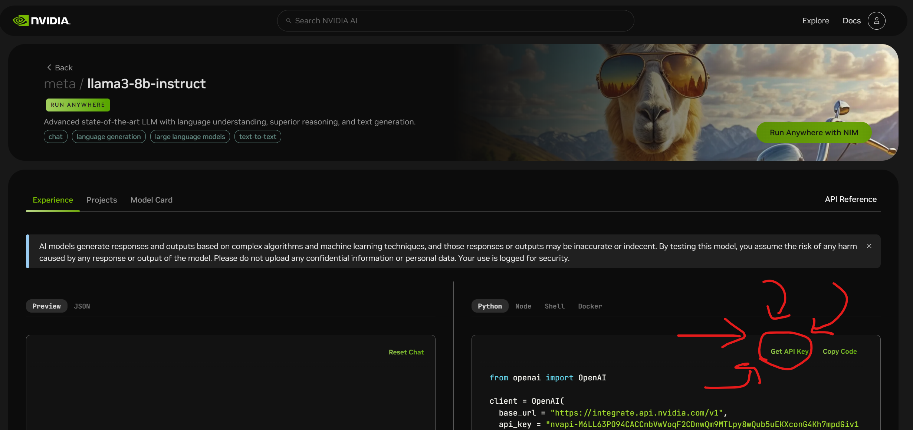
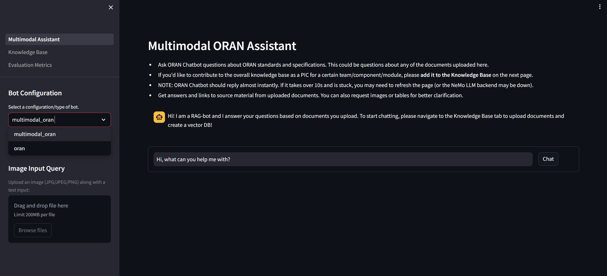
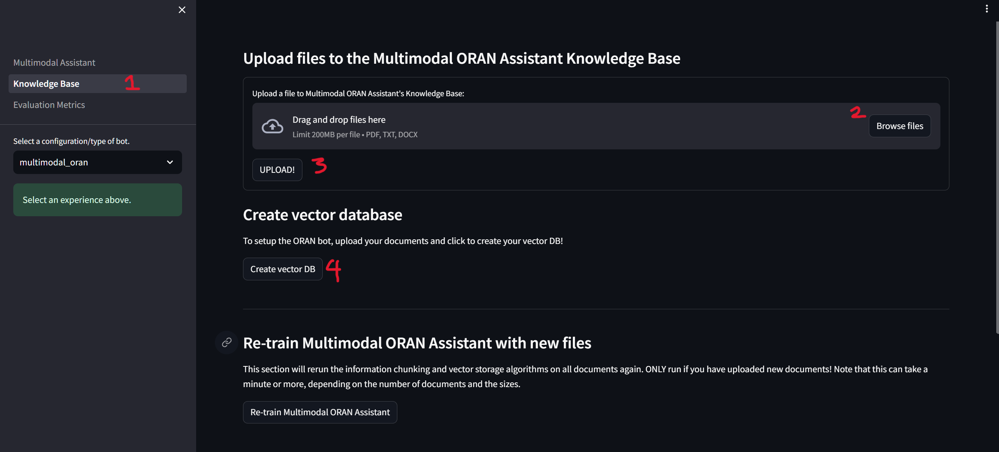
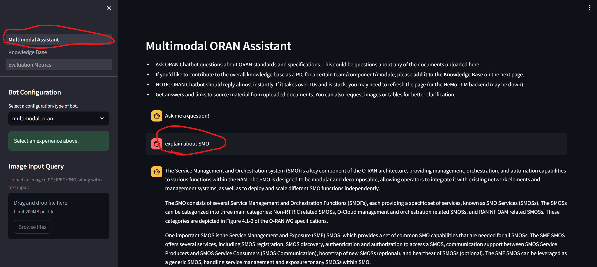
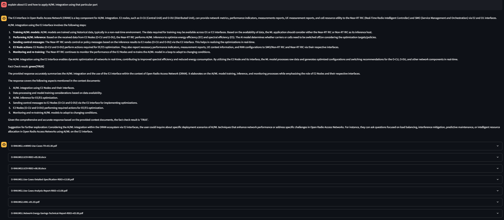

> Michael Harditya (TEEP)
# O-RAN Chatbot RAG
## **Table of Contents**
- [O-RAN Chatbot RAG](#o-ran-chatbot-rag)
  - [**Table of Contents**](#table-of-contents)
  - [Preliminaries](#preliminaries)
    - [Versions](#versions)
    - [Create Nvidia Account and get API Key](#create-nvidia-account-and-get-api-key)
  - [Step 1: Create and activate python venv](#step-1-create-and-activate-python-venv)
  - [Step 2: Clone the repository](#step-2-clone-the-repository)
  - [Step 3: Install the requirements](#step-3-install-the-requirements)
  - [Step 4: Setup PowerPoint parsing](#step-4-setup-powerpoint-parsing)
  - [Step 5: Setup API Key](#step-5-setup-api-key)
  - [Step 6: Run the chatbot streamlit](#step-6-run-the-chatbot-streamlit)
  - [Step 7: Adding documents and creating vector database](#step-7-adding-documents-and-creating-vector-database)
  - [Step 7: Try to Prompt!](#step-7-try-to-prompt)
  - [Inference Test](#inference-test)
  - [**Troubleshooting**](#troubleshooting)
  - [**Notes**](#notes)


## Preliminaries
### Versions
```
Python 3.10.12
virtualenv-20.29.3-py3
```

### Create Nvidia Account and get API Key
Step 1: Go to https://build.nvidia.com/explore/discover and make account.

Step 2: Choose the model, for example Llama3

Step 3: Get API Key, copy and save it


## Step 1: Create and activate python venv
```bash
pip install virtualenv
python3 -m virtualenv oranbot
source oranbot/bin/activate
```

The kernel became:
```bash
(oranbot) user@computer-name:~$
```

## Step 2: Clone the repository
```bash
git clone https://github.com/NVIDIA/GenerativeAIExamples.git && cd GenerativeAIExamples/experimental/oran-chatbot-multimodal
```
Check using `ls`:
```bash
bot_config      guardrails               pages             standalone_embed.sh
config.yaml     llm                      README.md         synthetic_data_openai.json
embedEtcd.yaml  Multimodal_Assistant.py  requirements.txt  utils
evals           oran_diagram.png         retriever         vectorstore
```

## Step 3: Install the requirements
```bash
pip install -r requirements.txt
```

To check if the requirements has been downloaded:
```bash
cd ~/oranbot/lib/python3.10/site-packages/ && ls
```
it will return all the libraries of the virtual environment.

## Step 4: Setup PowerPoint parsing
```bash
sudo apt install libreoffice
```

## Step 5: Setup API Key
```bash
nano config.yaml
```
Change the `nvidia_api_key` according to your API key, and `embedding_model` to `"nvolveqa_40k"`:
```bash
## Default settings
nvidia_api_key: "nvapi-****"
## Set these to required models endpoints from NVIDIA NGC
llm_model: "mistralai/mixtral-8x7b-instruct-v0.1"
# Augmentation_model:
embedding_model: "nvolveqa_40k"

NIM: false
nim_model_name: "meta-llama3-8b-instruct"
nim_base_url: "http://localhost:8019/v1"
temperature: 0.1
top_p: 0.5
max_tokens: 1600

NREM: false
nrem_model_name: "NV-Embed-QA"
nrem_api_endpoint_url: "http://localhost:8084/v1"
nrem_truncate: "END"

file_delete_password: "oranpwd"
```

>The change of `embedding_model` will result a warning of deprecated model, ignore this since the `"NV-Embed-QA"` the newest model, returns `400 Error`. See more at [Troubleshooting](#troubleshooting).

## Step 6: Run the chatbot streamlit
```bash
streamlit run Multimodal_Assistant.py --server.port 8011
```

Access the streamlit using the `<ip address>:<port>`.



## Step 7: Adding documents and creating vector database
Before the chatbot is ready to use, create the vector database first by uploading it into the system. There are two methods:
- Using streamlit UI, navigate to `Knowledge Base` tab and select the files using `Browse Files` button and click `Upload!`.
- Using backend:
  - Make directory in the `vectorstore` folder:
  - Move O-RAN documents inside the directory created before.

After the documents are uploaded, click `Create vector DB` button.

**About Addition and Deletion**

The documents in the folder can be accessed via Streamlit UI, to add new folder use the same process above, then click on `Re-train Multimodal ORAN Assistant` to updates the vector database.

To delete files, use the `Delete File` button with the default password to delete files is `oranpwd`, can be changed in the `config.yaml` file.

## Step 7: Try to Prompt!
use the `Multimodal Assitant` tab on Streamlit then try to type a prompt.



## Inference Test

Cost: 4 API Calls:



## **Troubleshooting**
The `Create vector DB` button is not working, it returns:
```bash
Exception: [400] Bad Request Inference error RequestID: 854889c8-7173-4ce5-b765-e2bf7202ce7e
Traceback:
File "/home/oran/oranbot/lib/python3.10/site-packages/streamlit/runtime/scriptrunner/script_runner.py", line 535, in _run_script
    exec(code, module.__dict__)
File "/home/oran/GenerativeAIExamples/experimental/oran-chatbot-multimodal/pages/1_Knowledge_Base.py", line 102, in <module>
    createDB_error = create_vectorstore(CORE_DIR, config["name"], st.status)
File "/home/oran/GenerativeAIExamples/experimental/oran-chatbot-multimodal/vectorstore/vectorstore_updater.py", line 290, in create_vectorstore
    vectorstore = FAISS.from_documents(documents, nv_embedder)
File "/home/oran/oranbot/lib/python3.10/site-packages/langchain_core/vectorstores.py", line 635, in from_documents
    return cls.from_texts(texts, embedding, metadatas=metadatas, **kwargs)
File "/home/oran/oranbot/lib/python3.10/site-packages/langchain_community/vectorstores/faiss.py", line 930, in from_texts
    embeddings = embedding.embed_documents(texts)
File "/home/oran/oranbot/lib/python3.10/site-packages/langchain_nvidia_ai_endpoints/embeddings.py", line 169, in embed_documents
    self._embed(batch, model_type=self.model_type or "passage")
File "/home/oran/oranbot/lib/python3.10/site-packages/langchain_nvidia_ai_endpoints/embeddings.py", line 142, in _embed
    response = self._client.client.get_req(
File "/home/oran/oranbot/lib/python3.10/site-packages/langchain_nvidia_ai_endpoints/_common.py", line 356, in get_req
    response, session = self._post(invoke_url, payload)
File "/home/oran/oranbot/lib/python3.10/site-packages/langchain_nvidia_ai_endpoints/_common.py", line 204, in _post
    self._try_raise(response)
File "/home/oran/oranbot/lib/python3.10/site-packages/langchain_nvidia_ai_endpoints/_common.py", line 298, in _try_raise
    raise Exception(f"{header}\n{body}") from None
```
Possible Method:
- Use deprecated `"nvolveqa_40K"` instead as the `embedding_model`.

## **Notes**
- Whole O-RAN Documents in the https://orandownloadsweb.azurewebsites.net/specifications (YANG model and .xlsx files are excluded) costs: 695 API Calls and +- 71 minutes.
- Expanding the response 'sources' might cost an API Call.
- Access the vectorstore file here: https://drive.google.com/drive/folders/1amvYptJ7gzBzKQHSiW36OEVBojgxTSQO?usp=sharing