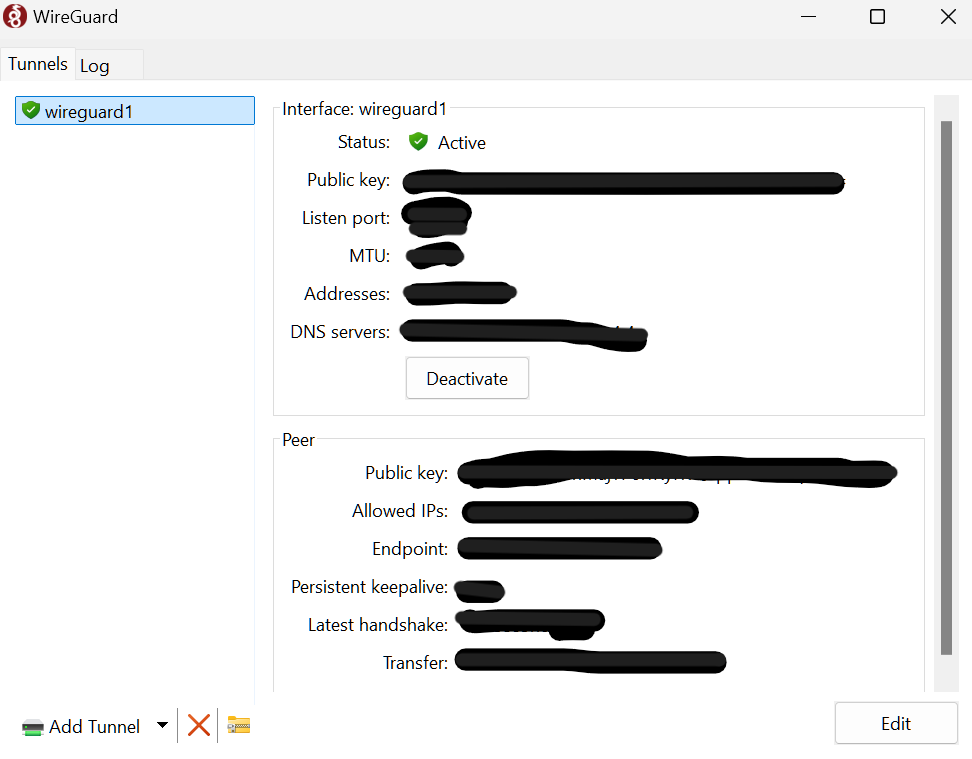
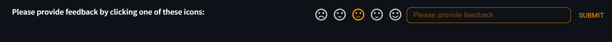

# O-RAN Chatbot Usage Guide
The O-RAN Chatbot is taken from [Nvidia Generative AI Examples repository](https://github.com/NVIDIA/GenerativeAIExamples/blob/main/experimental/oran-chatbot-multimodal/README.md), edited to align BMW Lab interest. The chatbot implements Retrieval Augmented Generation (RAG) that uses O-RAN Documentations specifically as the knowledge base. It is designed to answer questions about O-RAN specifications and standards according to the O-RAN specification documents.

This document created as guidance in using the chatbot.

## Table of Contents
- [O-RAN Chatbot Usage Guide](#o-ran-chatbot-usage-guide)
  - [Table of Contents](#table-of-contents)
  - [Accessing the Chatbot](#accessing-the-chatbot)
  - [Prompting](#prompting)
  - [Feedback (Important!)](#feedback-important)

## Accessing the Chatbot
>The chatbot is available in BMW Lab network, **if you don't have access, please contact person in charge**.

1. Connect to BMW Lab network with WireGuard and Activate.

2. Open browser and type `192.168.8.16:8011`.

## Prompting
Type question on the chatbox, keep in mind that chatbot instruction should be clear and concise to get the best answer.

   
## Feedback (Important!)
At the end of every response, please provide feedback. Your feedback is needed to enhance the chatbot development, and creating a better chatbot to help you.

