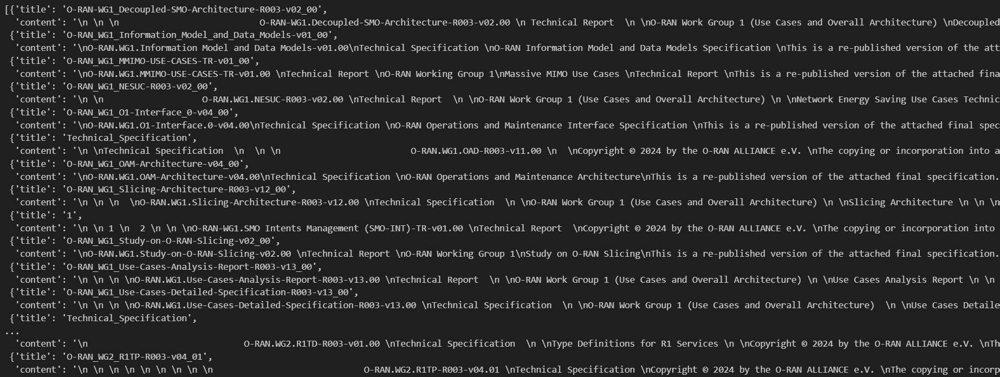
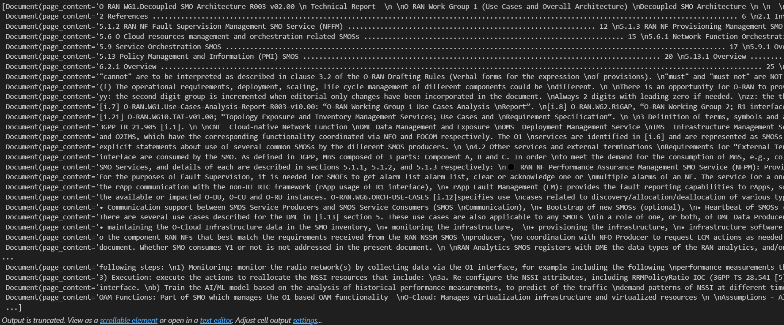
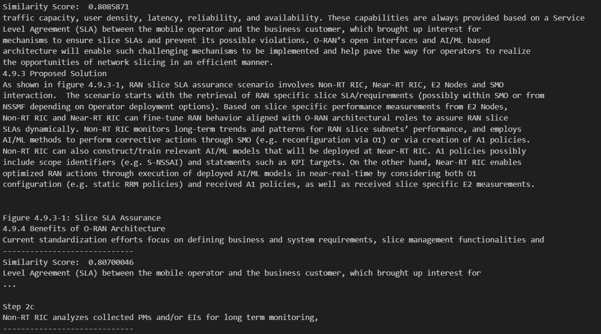

> Michael Harditya (TEEP)
# PDF to Embeddings
To create RAG, first the data (in this case, PDF file of ORAN Documentation) strings must be converted into embeddings and placed in a vector database. This note is the summary about the task.
## **Table of Contents**
- [PDF to Embeddings](#pdf-to-embeddings)
  - [**Table of Contents**](#table-of-contents)
  - [**Parse PDF to Text with Tika**](#parse-pdf-to-text-with-tika)
    - [**About Apache Tika**](#about-apache-tika)
    - [**Implementation**](#implementation)
    - [Chunking](#chunking)
  - [Embedding with HuggingFace](#embedding-with-huggingface)
  - [Storing Vector Database with Langchain](#storing-vector-database-with-langchain)

## **Parse PDF to Text with Tika**
To easily parse PDF files into text, this implementation use [Apache Tika](https://tika.apache.org/), a content analysis toolkit from Apache. This toolkit runs asynchronously in the background using `java` as a server, and can be called using `tika` Python library. 

### **About Apache Tika**
Apache Tika is another software from Apache that detects and extracts metadata and text from over a thousand different file types (such as PPT, XLS, and PDF). Tika captures both metadata and content of the file, with various extra configuration like language to be used, the text encoding used on the file, and many more.

Tika have two kind of interfaces, the first one is `Parser`. The `parse` method takes the document to be parsed and related metadata as input and outputs the results as XHTML SAX events and extra metadata. `Parser` use various parser classes from various existing libraries, and automatically assign the best parser to be used on the document.

The second interface is the `Detector`, this interface captures specific data defined by a special features of the data. The `detect` method also takes the document to be scanned and its metadata as input, and previously assigned features in the `Detector` interface. Some of available detections are Mime Magic Detection, Resource Name Based Detection, Container Aware Detection, and Language Detection.

> [!NOTE]
> The `Detector` interface is not going to be implemented for this case.

### **Implementation**
This commit includes a new utility [`utils/pdf_parser.py`](../utils/pdf_parser.py) to parse pdf file using implementation mentioned before. There are several steps to be done before using the utility:
1. **Download the Apache Tika jar file**, 
   
   Download the `tika-server-standard-x.x.x.jar`, can be accessed from this [link](https://tika.apache.org/download.html).
2. **Run the Tika Server Jar**, using:
   ```
   java -jar /path/to/tika-server-standard-x.x.x.jar
   ```
   The command should start sending logs, here is what it shows after the command executed:
   ```
    INFO  [main] 11:41:29,147 org.apache.tika.server.core.TikaServerProcess Starting Apache Tika 2.9.2 server
    INFO  [main] 11:41:30,606 org.apache.tika.server.core.TikaServerProcess loading resource from SPI: class org.apache.tika.server.standard.resource.XMPMetadataResource
    May 11, 2024 11:41:30 AM org.apache.cxf.endpoint.ServerImpl initDestination
    INFO: Setting the server's publish address to be http://localhost:9998/
    INFO  [main] 11:41:30,796 org.eclipse.jetty.util.log Logging initialized @2169ms to org.eclipse.jetty.util.log.Slf4jLog
    INFO  [main] 11:41:30,840 org.eclipse.jetty.server.Server jetty-9.4.54.v20240208; built: 2024-02-08T19:42:39.027Z; git: cef3fbd6d736a21e7d541a5db490381d95a2047d; jvm 11.0.16.1+1-LTS
    INFO  [main] 11:41:30,886 org.eclipse.jetty.server.AbstractConnector Started ServerConnector@15f2eda3{HTTP/1.1, (http/1.1)}{localhost:9998}
    INFO  [main] 11:41:30,886 org.eclipse.jetty.server.Server Started @2260ms
    WARN  [main] 11:41:30,891 org.eclipse.jetty.server.handler.ContextHandler Empty contextPath
    INFO  [main] 11:41:30,902 org.eclipse.jetty.server.handler.ContextHandler Started o.e.j.s.h.ContextHandler@aaee2a2{/,null,AVAILABLE}
    INFO  [main] 11:41:30,907 org.apache.tika.server.core.TikaServerProcess Started Apache Tika server ebac38c9-a629-461f-98d7-0a9803d8614c at http://localhost:9998/
   ```
   **To Check:** It should be running on `http://localhost:9998/tika`, check using
   ```
   netstat -ano | findstr :9998
   ```
   The output:
   ```
     TCP    127.0.0.1:9998         0.0.0.0:0              LISTENING       18948
     ```
   > [!IMPORTANT] 
   > If it failed (the log says it failed), it is possible that another process is using port number `9998`, try to change to another port or kill that process.
3. **Install Tika for Python**
   
   Tika is a server, so it can be accessed as a normal `http` access, but it returns as a XML object. To speed up implementation process, use `tika` Python library instead to fetch the content as text. Install the library using
   ```
   pip install tika
   ```
4. **Call PDFParser Class from Utilities**
   
   This step can be done by calling the [`PDFParser`](utils/pdf_parser) class, it automatically uses local Tika server instead of remote. Here is a short demonstration to use the utility.
   ```python
    from utils.pdf_parser import PDFParser
    folder = 'pdf_folder'
    parser = PDFParser()
    text = parser.parse_folder(folder)
    print(text[0])
    ```
    This example calls `parse_folder(folder)` method that automatically opens a folder, and find pdfs inside that folder and send it to Tika server. The output:
    
    

> [!NOTE]
> The output above includes Document Preprocessing.
## Document Preprocessing
The document parsed by Tika is 'as is', so it contains tables, footers, headers, texts from images, and many unnecessary information. Before convert it to vectors, removing these informations might boost performance of the vector database similarity search. This preprocessing steps only remove footers by detecting it's pattern.

### Removing Footers
Footers from the parsed document has specific pattern like this:
```
_______________________________________________
[document information]
[page]
```
This patterns repetitively spotted, informing the parsed document that they are going to the next page. The information of the footer is less likely to be used since adding information about the pages might separate information between pages, like incomplete sentences or incomplete lists. By removing and joining the lines between pages create better view of the information between sentences. Removing the footers can be done using `RegEx` to find the underscore-lines.
```re
_{3,}
```
This `RegEx` captures the underscore-lines, and the next part is to remove the next two lines and joins them as a single newline.
```python
# Split the text into lines
        lines = text.splitlines()
        # Initialize a list to store non-footer lines
        non_footer_lines = []
        flag = 0
        # Iterate through each line
        for line in lines:
            # Check if the line matches the footer pattern
            if flag == 0:
                if not re.match(r"_{3,}", line):
                    non_footer_lines.append(line)
                else:
                    # Footer found, removing next 2 lines
                    flag = 3
            else:
                flag -= 1
        # Join the non-footer lines back into a single string
        cleaned_text = "\n".join(non_footer_lines)
```
Implementation can be found in [`text_processor.py`](../utils/text_processor.py), and used in [`pdf_parser.py`](../utils/pdf_parser.py).

### Chunking
Chunking is another process to be done before building the vector space of the document. By chunking, the process of the whole vectorizing and vector search are optimized. Chunking can be done using langchain library, `CharacterTextSplitter`, to split the documents into chunks of documents. The chunks then stored in vector database to be used in similarity search. Example below use separator `\n`, with 1000 size for each chunks.
```python
from langchain.text_splitter import CharacterTextSplitter
# create character chunks
text_splitter = CharacterTextSplitter(
    separator="\n",
    chunk_size=2000,
    chunk_overlap=200,
    length_function=len,
    is_separator_regex=False,
)
# chunks = text_splitter.create_documents([text[0]['content']])
chunks = []
for content in text:
    chunks.extend(text_splitter.create_documents([content['content']]))
print(len(chunks))
chunks
```
The output:
```
2021
```

## Embedding with HuggingFace
Embeddings are representation of a string, where many strings can be converted into embeddings, then processed as numerical data. This implementation use Embedding Model, a defined algorithm that converts strings into vector embeddings, using HuggingFace API. Code example below is how to define an embeddings model, using MiniLM L6 V2 as the model.
```python
from langchain.embeddings import HuggingFaceEmbeddings
embeddings_model = HuggingFaceEmbeddings(model_name="sentence-transformers/all-MiniLM-L6-v2",
                                         model_kwargs={"device": "cpu"},
                                         encode_kwargs={'normalize_embeddings':False})
```
## Storing Vector Database with Langchain
Langchain is a library that integrate several machine learning model and algorithm, and for this implementation, the models defined on previous section is going to be used to create vector embeddings of all the documents that has been processed into chunks, then place it into FAISS vector database. The database then stored inside [`data/faiss_index`](./data/faiss_index). The code implementation is attached below.
```python
# First install the faiss-cpu library
%pip install faiss-cpu
# Define the vector stores first, then load the chunks and the embeddings_model
from langchain_community.vectorstores import FAISS
db = FAISS.from_documents(chunks, embeddings_model)
# Save the database into the file
db.save_local('data/faiss_index')
# To load, use
db = FAISS.load_local('data/faiss_index')
```
To check if the database file is created and ready to use, the `similarity_search_with_score(query)` can be used to find related document based on the query.
```python
query = "What is RAN Slice SLA Assurance"
docs = db.similarity_search_with_score(query)

#Sort the documents by similarity score
docs = sorted(docs,key=lambda x:x[1],reverse=True)

for doc in docs:
    print("Similarity Score: ",doc[1])
    print(doc[0].page_content)
    print('-----------------------------')
```
The output:

> [!NOTE]
> Documents that has been added into the database up until: *WG3: Near-real-time RIC and E2 Interface Workgroup*
>
> Database file can be located in [data/faiss_index](../data/faiss_index).