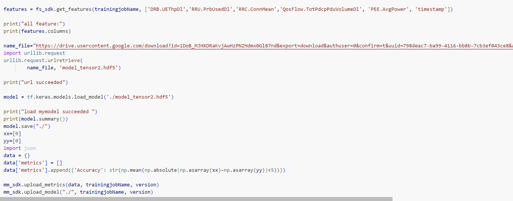
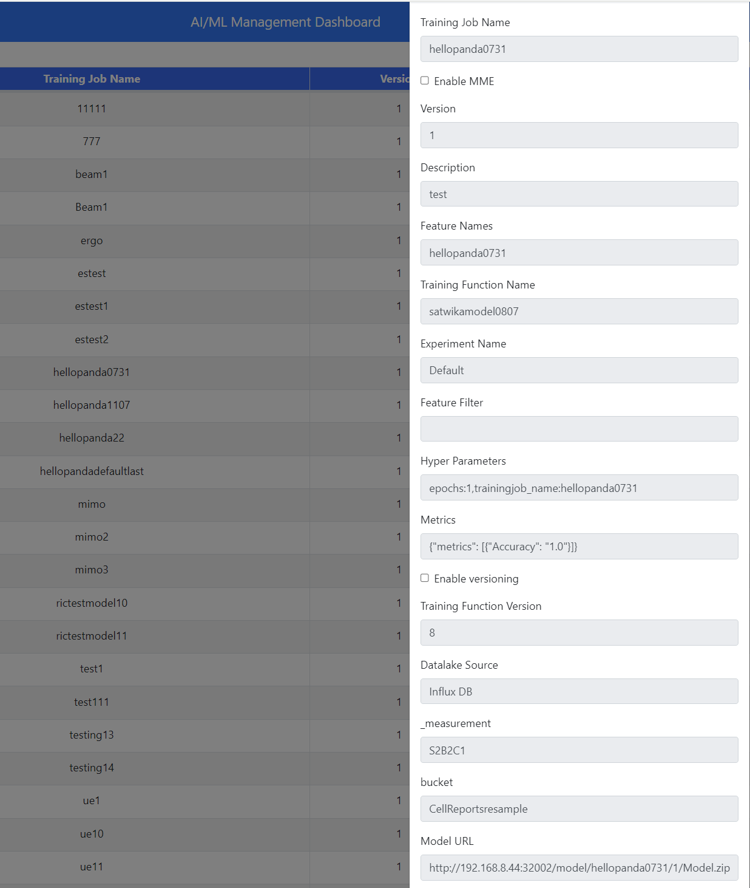

## 1. Load model from google drive to AIMLFW
### Make sure to change the folder or file of your model from private to public in Google Drive
```python
   name_file="copy link download from your googledrive"
    import urllib.request
    urllib.request.urlretrieve(
            name_file, 'name_model.hdf5')
    
    print("url succeeded")
    
    model = tf.keras.models.load_model('./name_model.hdf5')
```
example


## 2. [Tutorial to Create Training job](https://github.com/bmw-ece-ntust/internship/blob/e86b1e57a1157180f300cfb8dc73ad9810e77b3c/study%20notes%20onsite/Guide%20dashboard%20JupyterNotebook/dashboard.md). This is my training Job


## 3. Model prediction on Kserve

- neeed to change inside input_qoe.json because the data input shape is (1,240,3). 
- The model uing 240 data from the past (4 hour) to forecast 60 data (1 hour) in the future. 
- The model uses three input features: the first feature is RRU.PrbUsedDl, the second is RRC.ConnMean, and the third is DRB.UEThpDl.


## For file python aimlfw, [check this link github](https://github.com/bmw-ece-ntust/internship/tree/cb8087a95fc48c8599af9f946089a7b18927d8cd/jupyternotebook/aimlfw)
