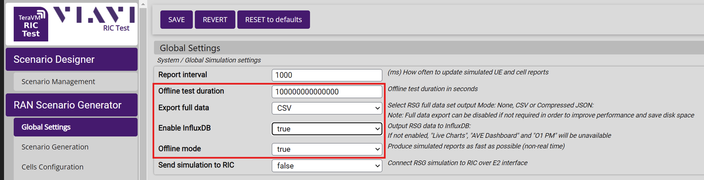
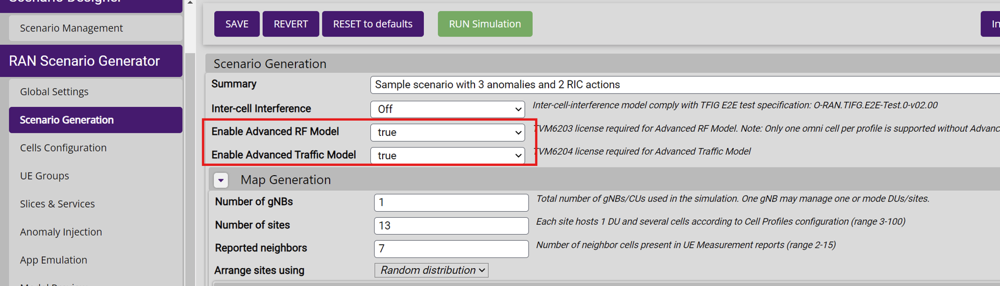
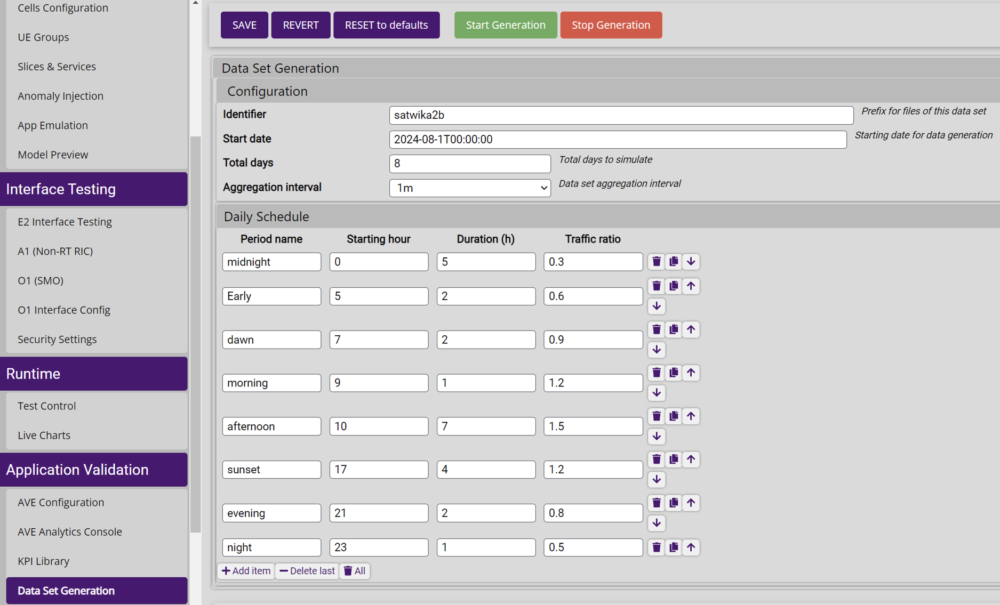
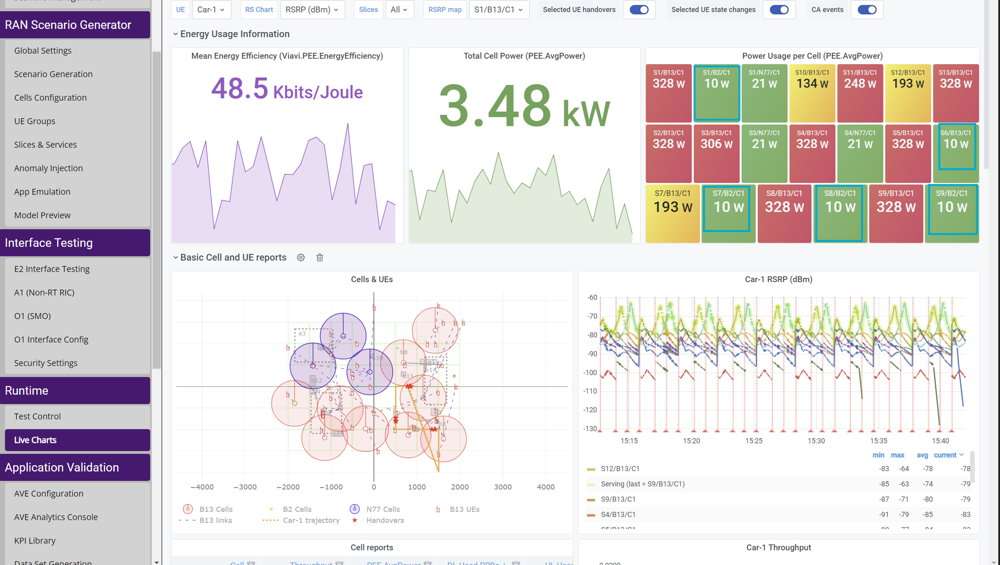
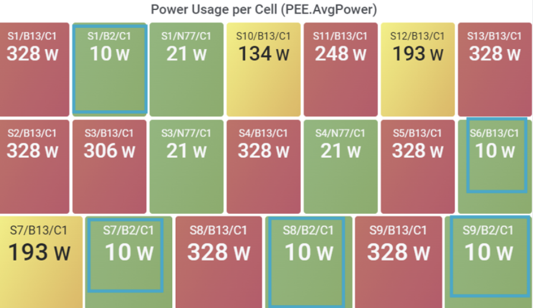

# Viavi Scenario for  on/off Cell
References : 
1. [netconf](https://hackmd.io/@Winnie27/r1BajOitT)
2. [O1 Ves collector](https://hackmd.io/@Winnie27/r1uReJjxp)
## To Generate dataset from Viavi
```
1. Reset all defaults
2. Set Global setting to this
3. Click save
```



```
1. set True for Advanced RF model and Traffic Model
2. Click save
```



```
1. Go to Data Set Generation and stop Generation
2. Set start date, total days, and aggregation interval
3. Set daily schedule. Smaller traffic ratio means there are fewer UE
```



**Data generation can take hours, depending on the total number of days and the aggregation interval.**

##  Turn on/off Cell manually using Netconf
```
python3
```
```
1 | from ncclient import manager
2 | smo = manager.connect(host='192.168.8.28', port="31237", timeout=5, username="root")
```

### at "energySavingControl", turn on cell = "toBeNotEnergySaving" and turn off cell = "toBeEnergySaving"
```
conf= '''
<config xmlns:nc="urn:ietf:params:xml:ns:netconf:base:1.0">
<ManagedElement xmlns="urn:3gpp:sa5:_3gpp-common-managed-element">
  <id>1193046</id>
  <GNBCUCPFunction xmlns="urn:3gpp:sa5:_3gpp-nr-nrm-gnbcucpfunction">
    <id>1</id>
    <NRCellCU xmlns="urn:3gpp:sa5:_3gpp-nr-nrm-nrcellcu">
      <id>2</id>
      <CESManagementFunction xmlns="urn:3gpp:sa5:_3gpp-nr-nrm-cesmanagementfunction">
        <id>2</id>
        <attributes>
          <energySavingState>isNotEnergySaving</energySavingState>
          <energySavingControl>toBeEnergySaving</energySavingControl>
        </attributes>
      </CESManagementFunction>
    </NRCellCU>
  </GNBCUCPFunction>
</ManagedElement>
</config>
'''
```
```
smo.edit_config (target = "running", config=conf)
```

### The image shows that four cells are off. By default, each cell consumes only 10 watts when turned off
