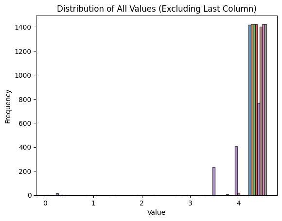
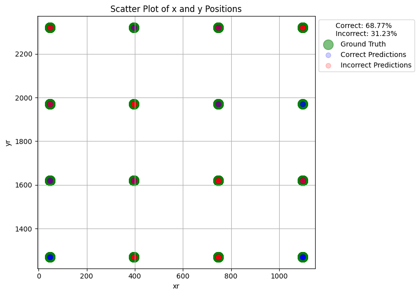
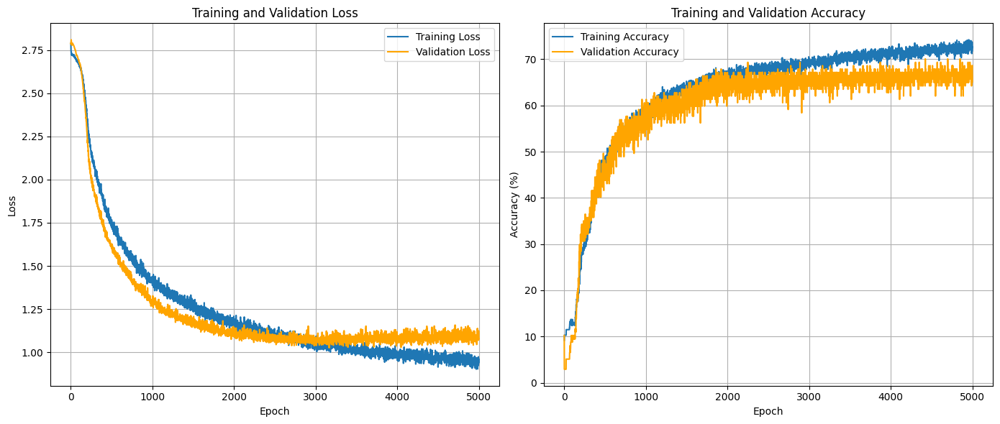
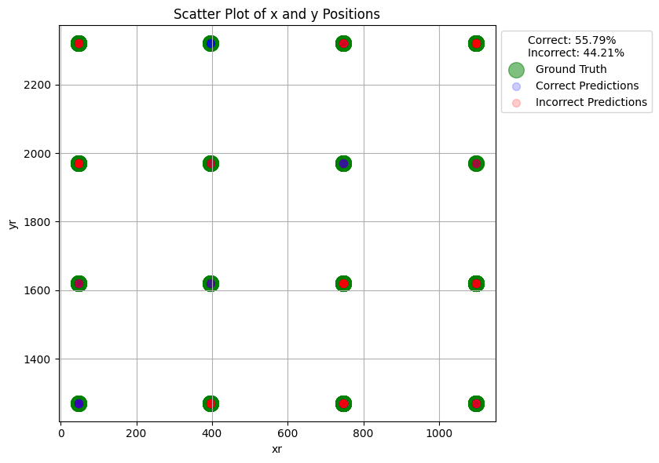
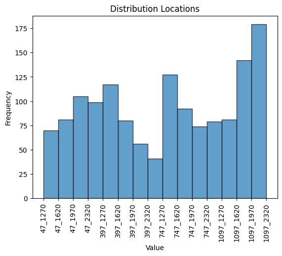
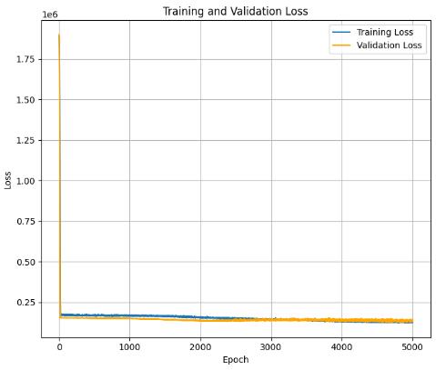
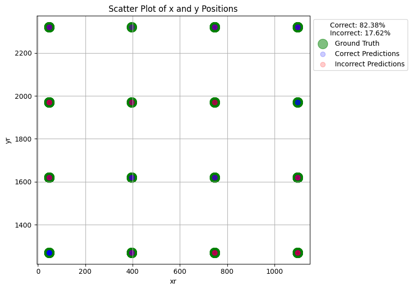
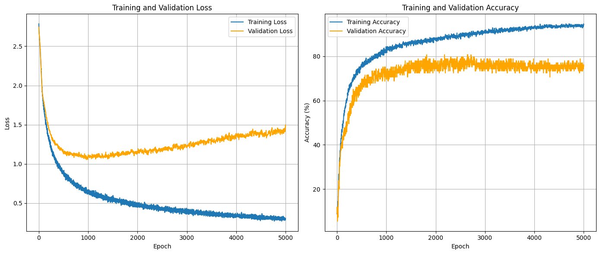
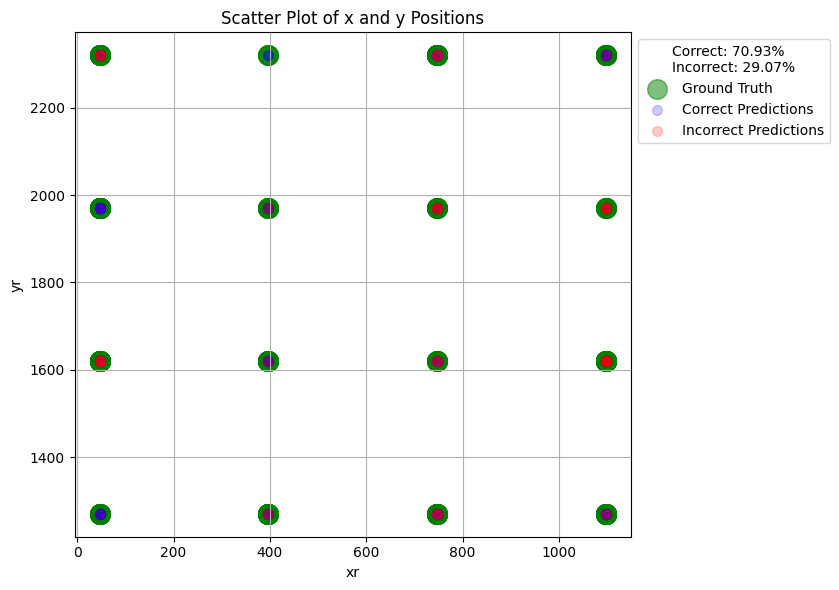

# Improvement over: [AP-localization-regression](https://github.com/bmw-ece-ntust/AP-localization-regression/blob/master/NTUST_RSS_Modeling.ipynb)

1. Handling of the NaN values:
   - Previously: RSSI values were treated using the formal definitions of dB values, which involved converting them to negative values. Consequently, NaNs were treated as 0, representing a maximum value.
   - Possible improvement: Treat the values as they are given (positive values), as neural networks interpret them better. Convert NaNs to 100, as -100 dB represents a very weak signal. Additionally, consider changing the scaler. Since the data does not follow a normal distribution and is skewed in the positive direction, you might use either the Robust Scaler or apply a Log transformation.

2. Handling the position:
   - Previously: Positions were treated as given.
   - Possible improvement: Treat the pair of values `xr` and `yr` as a single set representing the position, and label encode it so that the network predicts only one value. 
     - Possible drawback of this improvement: The network will only be able to identify access point positions from those already present in the dataset.
     - Possible mitigation of the drawback: If using a softmax output layer, the network can extrapolate between the most probable results, weighted by the given probability.


## Methodolgy
We have created the splits as follows:

```python
X_train, X_test, y_train, y_test = train_test_split(log_transofmed_data, y, test_size=0.2, random_state=1)
X_train, X_val, y_train, y_val = train_test_split(X_train, y_train, test_size=0.12, random_state=1)
```
This ensures that all future experiments use the same splits.

For the initial experiments, we applied a log transform to scale our data:

```python
log_transofmed_data = np.log1p(X)
```

This is the distribution of the data after the log transform: 




## Results of the improvments: 
After applying the improvements, we tested `XGBoost` and a `MLP` on the data.


### XGBoost Results
We use it with the default parameters.

**Accuracy:** 0.69

**Classification Report:**

| Class | Precision | Recall | F1-Score | Support |
|-------|-----------|--------|----------|---------|
| 0     | 1.00      | 0.87   | 0.93     | 15      |
| 1     | 0.71      | 0.75   | 0.73     | 32      |
| 2     | 0.82      | 0.82   | 0.82     | 11      |
| 3     | 0.62      | 0.76   | 0.68     | 21      |
| 4     | 0.72      | 0.67   | 0.69     | 27      |
| 5     | 0.41      | 0.39   | 0.40     | 18      |
| 6     | 0.45      | 0.38   | 0.42     | 13      |
| 7     | 0.75      | 0.86   | 0.80     | 7       |
| 8     | 1.00      | 1.00   | 1.00     | 11      |
| 9     | 0.50      | 0.75   | 0.60     | 12      |
| 10    | 0.71      | 0.91   | 0.80     | 22      |
| 11    | 0.78      | 0.60   | 0.68     | 30      |
| 12    | 0.69      | 0.74   | 0.71     | 27      |
| 13    | 0.63      | 0.67   | 0.65     | 18      |
| 14    | 0.60      | 0.25   | 0.35     | 12      |
| 15    | 0.71      | 0.56   | 0.62     | 9       |
| **Accuracy** |           |        | **0.69**  | **285**  |
| **Macro avg** | 0.69      | 0.69   | 0.68     | 285     |
| **Weighted avg** | 0.69      | 0.69   | 0.68     | 285     |


This is a plot of the accuracy of the predictions:




### MLP
This are the initial results of the `MLP` (still work in progress):

#### MLP Hyperparmeters
Model: 

```
class MLP(nn.Module):
    def __init__(self, input_size, output_size):
        super(MLP, self).__init__()
        self.hidden1 = nn.Linear(input_size, 256)   
        self.hidden2 = nn.Linear(256, 128)          
        self.hidden3 = nn.Linear(128, 64)           
        self.output = nn.Linear(64, output_size)
        self.relu = nn.ReLU()
        self.dropout = nn.Dropout(p=0.3)            

    def forward(self, x):
        x = self.relu(self.hidden1(x))
        x = self.dropout(x)                        
        x = self.relu(self.hidden2(x))
        x = self.dropout(x)                        
        x = self.relu(self.hidden3(x))
        x = self.output(x)
        return x
```

Training Paramters:

```
batch_size = 1024 
num_epochs = 5000
learning_rate= 0.001
criterion = nn.CrossEntropyLoss()
optimizer = optim.Adam(model.parameters(), lr=learning_rate)
```


#### MLP Results 

```
Epoch 500/5000, Training Loss: 1.7238
Validation Loss: 1.5819, Validation Accuracy: 54.74%
                                                             
Epoch 1000/5000, Training Loss: 1.3897
Validation Loss: 1.4499, Validation Accuracy: 56.20%
                                                              
Epoch 1500/5000, Training Loss: 1.2496
Validation Loss: 1.3951, Validation Accuracy: 63.50%
                                                              
Epoch 2000/5000, Training Loss: 1.1415
Validation Loss: 1.3930, Validation Accuracy: 60.58%
                                                              
Epoch 2500/5000, Training Loss: 1.1254
Validation Loss: 1.4064, Validation Accuracy: 62.04%
                                                              
Epoch 3000/5000, Training Loss: 1.0269
Validation Loss: 1.5006, Validation Accuracy: 62.04%
                                                              
Epoch 3500/5000, Training Loss: 1.0118
Validation Loss: 1.4874, Validation Accuracy: 65.69%
                                                              
Epoch 4000/5000, Training Loss: 0.9974
Validation Loss: 1.4800, Validation Accuracy: 63.50%
                                                              
Epoch 4500/5000, Training Loss: 0.9454
Validation Loss: 1.5575, Validation Accuracy: 64.23%
                                                              
Epoch 5000/5000, Training Loss: 0.9026
Validation Loss: 1.5861, Validation Accuracy: 65.69%
```

This is the traning and validations plots:



And this the test resulting map: 



Achieving a test accuracy of 57.89%

### Initial conclusions 
From the initial results, we can observe that both models consistently find it easier to predict certain AP Coordinates over others. These AP Coordinates are not concentrated in specific locations—neither in the center nor in the middle. Instead, the models perform better on the same seven or eight AP Coordinates across different runs and models.

There are several possible explanations for this behavior. One is the uneven distribution of data points per location in the training set; having more data points for certain locations may cause the model to guess those locations more frequently, leading to more errors. Another possibility is that we lack sufficient data to achieve better results, or that we are missing crucial information necessary for more accurate predictions.


This is a plot of the labels distribution:




Looking at this distribution and comparing it with the results from the previous map plot, we can see that the number of data points per location could indeed be the problem. Having more data points per location may lead to increased errors in the test set because of the effects of overfitting. 

### MLP for Predicting (xr, yr) Real Distances
Building upon the implementation from the previous section and aiming for a better comparison of results, we have replicated the methods used earlier to predict the distances xrxr​ and yryr​ using regression with our neural network.

The following plot demonstrates that this method does not effectively regress the coordinates with the current data:




### XGBoost for Prediction (xr, yr) 
Given the default parameters of the model this are the MSE results found:

```
Mean Squared Error for x predictions: 111574.9296875
Mean Squared Error for y predictions: 67023.921875
```


#### Removing Ambiguous Data

After exploring the dataset more thoroughly, we discovered some ambiguous data—rows that have the same values when rounded to integer levels but different labels. Therefore, we decided to eliminate these ambiguous rows and retrain the best models.

Here are the results:

`XGBOOST`

```
Accuracy: 0.82
Classification Report:
              precision    recall  f1-score   support

           0       0.80      0.95      0.87        21
           1       0.83      0.77      0.80        26
           2       1.00      0.71      0.83         7
           3       0.92      0.92      0.92        13
           4       0.83      0.62      0.71        16
           5       0.89      0.67      0.76        12
           6       0.62      0.62      0.62         8
           7       0.75      0.75      0.75         4
           8       1.00      1.00      1.00        12
           9       0.79      0.75      0.77        20
          10       0.81      0.96      0.88        23
          11       0.86      0.92      0.89        13
          12       0.76      0.94      0.84        17
          13       0.88      0.78      0.82         9
          14       0.56      0.62      0.59         8
          15       0.88      0.83      0.86        18

    accuracy                           0.82       227
   macro avg       0.82      0.80      0.81       227
weighted avg       0.83      0.82      0.82       227
```




From these results, we see that the model improved significantly, performing much better at many of the locations where it was previously failing.


`MLP`



We can see that we achieved much better training accuracy, as well as significantly improved test accuracy (71%). Additionally, the training dynamics have improved. With further fine-tuning, we could likely achieve even better results.

Here is the resulting map plot:


