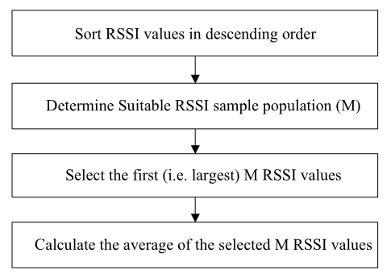
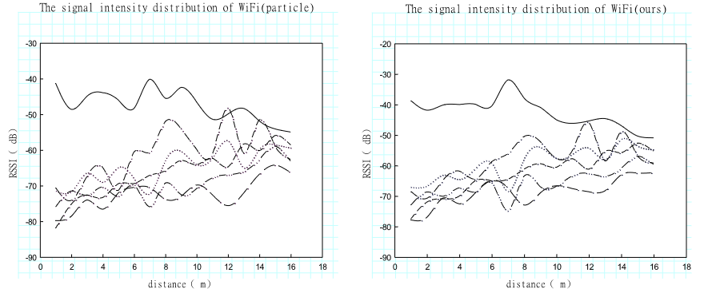
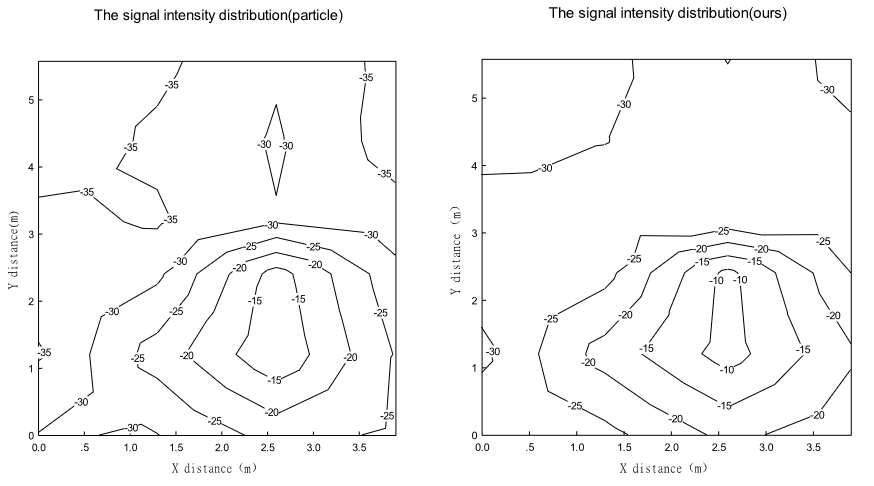

# Improved Wi-Fi RSSI Measurement for Indoor Localization

[Read the paper here](https://ieeexplore.ieee.org/stamp/stamp.jsp?tp=&arnumber=7835628)

## Basic Definitions

Indoor localization based on Wi-Fi received signal strength indication (RSSI) offers several advantages, including low cost, wide coverage, and ease of implementation without requiring any hardware modifications. However, Wi-Fi RSSI is highly susceptible to multipath interference in indoor environments, leading to significant errors in RSSI observations. This paper introduces an algorithm designed to improve RSSI observations by averaging a number of selected maximum RSSI measurements. A smoothness index is used to evaluate the quality of RSSI and to select an appropriate number of RSSI observations for averaging.

### Trilateration Algorithm

The trilateration algorithm is a method used in positioning systems to determine an object's location by measuring its distances from three or more known reference points, such as Wi-Fi access points. It operates on the principle of Distance Intersection, where the object’s location is identified as the point where the circles (or spheres in 3D) centered on each reference point, with radii equal to the measured distances, intersect.

To derive distance from RSSI, the log-distance path model is commonly used:

$$d = 10^{((P_{ref} - P_{rssi}) / 10n)}$$

Here, \( n \) is the path loss exponent, which should be measured or estimated based on environmental factors like walls, floors, and other structures.

### Fingerprint Positioning

Fingerprint positioning is another method used in indoor Wi-Fi positioning systems. It estimates a device's location by comparing the current RSSI measurements with a pre-recorded database of signal strength values, known as fingerprints. Each fingerprint corresponds to a specific location within the indoor environment.

### RSSI Measurement Considerations

To achieve better resolution, measurements with higher RSSI should be preferred, with RSSI values recorded to one decimal place for finer granularity.

## Proposed RSSI Extraction Algorithm

RSSI is significantly impacted by fading, shadowing, and interference, which may be caused by devices like Bluetooth or microwave ovens. The paper categorizes RSSI signal measurements into four general situations:

1. **Normal Distribution:** Observed under a steady-state environment with no multipath interference.
2. **Bimodal Distribution:** Occurs when the multipath interference is as strong as the line-of-sight signal, resulting in two stable centers.
3. **Left-Skewed Distribution:** Happens when there is weak multipath interference.
4. **Right-Skewed Distribution:** Occurs when multipath interference is stronger than the signal.

To mitigate the effects of shadowing and interference, the weakest RSSI values should be excluded. The paper proposes using the maximum RSSI values for localization, which also improves differential distance measurements. Since maximum RSSI values are often affected by fading, averaging these values can reduce the fading effect, leading to better localization performance. Averaging also produces fractional RSSI values, allowing for smaller differential distances, as mentioned earlier.

Below is a schematic representation of the proposed RSSI calculation algorithm:

## Experimentation

To evaluate the performance of the proposed RSSI extraction algorithm, experiments were conducted in four rooms (404, 408, 412, and 414) and a corridor on the fourth floor of the Office Building of the School of Geodesy and Geomatics at Wuhan University. 

The data was collected at a sampling rate of 1 second for 6 minutes at each grid point. To ensure consistency, all data were collected using the same mobile phone. An independent coordinate system was established in each room for position determination purposes.

The resulting RSSI plot is compared to another method (the particle method), showing that the proposed algorithm produces smoother RSSI signal curves, which is advantageous for recognizing the locations of access points (APs) later on.

When examining the signal two-dimensionally, the contour map generated by the proposed algorithm shows fewer saltation points than the previous method, indicating a more stable and reliable measurement.

# RSSI Data Preparation for Machine Learning

[Read the paper here](https://ieeexplore.ieee.org/stamp/stamp.jsp?tp=&arnumber=9354273)

This paper outlines the steps involved in preparing RSSI data for machine learning, starting from data collection to model training.

## Data Collection

The data collection process was conducted using Vistumbler, a tool designed for gathering Wi-Fi signal strength (RSSI) data from various access points (APs).

## Main Steps in Data Preparation

After collecting the data, the following steps are suggested to prepare the RSSI data for machine learning:

### 1. Filtering Access Points

Filter the access points in the dataset to ensure that all RSSI values come from known access points. This step helps in refining the dataset by excluding irrelevant or unknown APs.

### 2. Labeling the RSSI Data

Label the RSSI data by assigning it the corresponding X, Y, and Z coordinates of the associated access points. This labeling is essential for creating a structured dataset that can be used for training machine learning models.

### 3. Data Cleaning

Data cleaning is a crucial step to improve the quality of the dataset. The following procedures are recommended:

- **Remove Rows with Single RSSI Values:** Eliminate any rows that contain only one RSSI value, as they provide insufficient information for accurate modeling.
  
- **Remove Low Variance Columns:** Exclude columns with low variance in RSSI values, as they do not contribute significantly to the model and may introduce noise.

- **Remove Duplicate Data:** Identify and remove duplicate entries to avoid redundancy and ensure that the dataset is representative.

- **Standardize and Normalize the Data:** Apply standardization and normalization techniques to the dataset to ensure that the RSSI values are on a comparable scale, which helps in improving model performance.

By following these steps, the paper provides a comprehensive approach to preparing RSSI data for machine learning, ensuring that the dataset is clean, well-structured, and ready for training models.

# Never Use Labels: Signal Strength-Based Bayesian Device-Free Localization in Changing Environments
[Read the paper here](https://ieeexplore.ieee.org/stamp/stamp.jsp?tp=&arnumber=8653300)

Device-Free Localization (DFL) is a method used to estimate a person's location inside a building by measuring changes in Wi-Fi signal strength between various Wi-Fi nodes. The system measures the strength of Wi-Fi signals between various pairs of these Wi-Fi nodes (APs). The key idea is that the presence of a person in the environment affects the Wi-Fi signal strength due to their physical presence and the way they interact with the signals.

When a person moves around, they change how Wi-Fi signals are reflected, absorbed, or blocked. The DFL system detects these changes in the RSSI (Received Signal Strength Indicator) values between the APs and uses this information to estimate the person’s location. The authors developed two new Bayesian localization methods based on their mixture model and experimentally validated their system at three test sites with seven days of measurements. They demonstrate that their methods localize a person with non-degrading performance in changing environments and, additionally, reduce localization error by 11-51 percent compared to other DFL methods.

## Basic Concepts

- **Device-Free Localization (DFL):** DFL is a tag-less localization technology. Previous research has shown that a person, without an RF tag, can be localized through walls by processing received signal strength (RSS) measurements between many pairs of statically deployed RF nodes.

- **Challenges with DFL:** The problem with DFL methods is that they require preprocessing, empty-area calibration, or fingerprint training. They also need frequent recalibration and retraining.

## Contributions

- **Improved Localization System:** One significant contribution of this paper is the development and validation of a localization system that addresses the drawbacks of traditional empty room calibration, fingerprint training, and online calibration methods.

- **Continuous Recalibration:** After the system setup is complete, the system localizes the building occupant. Unlabeled training data continues to be fed to the system after setup to adapt to non-stationary RSS measurements in changing environments, a method termed continuous recalibration.

- **New Mixture Model:** The authors developed a new mixture model where a link may be affected or unaffected regardless of the person’s position, but with probabilities that are a function of the person’s distance from the link line. In this system, RSS distribution parameters are learned for both the affected and unaffected states of each link using unlabeled measurements. The weights in the mixture model are derived from a spatial model such that the affected RSS distribution is weighted more when a person is on the link line and weighted less the further the person is from the link line.

What sets their work apart is that MPL can perform DFL without fingerprinting, without a vacant area, and can localize stationary people.

This is the architecture developed:

## Measurements

In this paper, wireless measurements were conducted using Texas Instruments CC2531 dongles operating with IEEE 802.15.4 in the 2.4 GHz band. A set of N nodes was deployed around the area of interest, with each node taking turns transmitting packets on different channels according to a timed sequence (TDMA) and a token-ring protocol. Another node logs the received signal strength (RSS) for each pair of nodes on each channel. The RSS measurements, which are typically discrete, are represented as a vector including values for all links, with special notation for missed packets.

## Mixture Model

### Probabilistic Approach

The proposed mixture model diverges from deterministic assumptions by incorporating a probabilistic framework. The model posits that a link can be affected or unaffected regardless of the person's exact position, but the probabilities of these states are influenced by the person's distance from the link line. Specifically:

- **Affected State:** The probability of a link being in the affected state increases as the person approaches the link line.
- **Unaffected State:** Conversely, the probability decreases as the person moves further away from the link line.

### Learning RSS Distribution Parameters

The mixture model allows for the learning of RSS distribution parameters for both affected and unaffected states using unlabeled measurements. This is achieved through a continuous recalibration process that adapts to environmental changes over time. The weights in the mixture model are derived from a spatial model, meaning that the affected RSS distribution is weighted more heavily when a person is closer to the link line and less so when they are further away.

### Bayesian Localization Methods

The mixture model is integrated into two Bayesian localization methods: Maximum Likelihood Localization (MLL) and Hidden Markov Model Localization (HMML). Both methods compute the probability of observing the measured RSS given a person's location, with HMML also considering temporal aspects by estimating the current location based on the previous one.

### Summary of Results

The experimental validation of the mixture model showed significant improvements in localization accuracy compared to traditional methods. The authors report a reduction in localization error by 11% to 55% and demonstrate the system's ability to track stationary individuals in changing environments without requiring labeled calibration data.

# Implementation of a WiFi-Based Indoor Location System on a Mobile Device for a University Area
[Read the paper here](https://ieeexplore.ieee.org/stamp/stamp.jsp?tp=&arnumber=8853556)

This paper implements a real-time indoor location system for mobile devices using Wi-Fi signals and a Bayes filter, achieving 92.31% position accuracy without the need for additional hardware.

## Method

The proposed real-time indoor location system uses six unknown-location Wi-Fi access points and is designed for low-resource Android devices. It employs a simple Bayesian filter to meet energy and performance demands. The system has two phases: 

1. **Offline Phase:** Wi-Fi signals are captured, RSSI tables are created, and histograms are generated using cleaned data.
2. **Online Phase:** The Bayesian filter predicts the user's location based on the captured Wi-Fi levels and the cleaned RSSI data. This system is implemented directly on an Android device.

### Data Capturing

Data collection was conducted at the Faculty of Electrical, Electronic, and Telecommunications at Universidad Nacional de Ingeniería, Peru. The environment was divided into regions between 2x2 and 5x5 meters, with green regions used for indoor location. A Java-based Android app was used to capture Wi-Fi data (SSID/MAC/RSSI) with 150 samples per region, collected over three non-consecutive days at different times. The data was saved in CSV files, transferred to a PC, and the best access points were selected for further analysis.

### Data Preprocessing

The captured RSSI data is organized into tables per region, then shuffled and split into 80% for training and 20% for testing. Normalized histograms are calculated from the training data but are affected by noise and missing values due to limited samples. Many papers assume a Gaussian distribution for RSSI values, citing radio-receiver noise and average white Gaussian noise (AWGN) as the justification.

### Model

A Bayes-based estimator is used to predict the region based on Wi-Fi measurements. It starts with a uniform prior probability, then recursively updates the posterior probability for each region using data from access points. The region with the highest probability is selected, and the prior is updated with this result for the next iteration.

### Results

The indoor localization system was tested on a Samsung J2 device across different regions and positions. It correctly predicted locations with an accuracy of over 97% in most cases. Experiments show promising results, achieving an accuracy of 92.31% and a response time of around 20 milliseconds. The proposed methodology could also be applied to similar localization tasks such as asset tracking, immersive experiences, augmented reality, controlling robots, and more.

# A Novel Trilateration Algorithm for RSSI-Based Indoor Localization

This paper presents a new trilateration algorithm for indoor localization using RSSI. The approach involves several key steps:

## Methodology

1. **Data Preprocessing:** The raw RSSI measurements are first processed using a Gaussian filter to smooth out the noise and prepare the data for further analysis.

2. **Parameter Estimation:** A Least Squares Curve Fitting (LSCF) algorithm is employed to estimate critical radio propagation parameters, such as transmit power and path loss exponent. This method aims to find a feasible solution by fitting the curve to the filtered data.

3. **Trilateration Algorithm:** A novel trilateration algorithm is introduced to improve positioning results. This algorithm minimizes the nonlinear position error function using a Taylor series approximation, which reduces computational complexity. An iterative condition is also designed to enhance positioning accuracy.

4. **Bayesian Filtering:** To further refine localization accuracy, Bayesian filtering techniques are used to smooth errors and manage measurement noise effectively.

## Key Contributions

- **Gaussian Filter for Preprocessing:** This technique is applied to clean the RSSI measurements before further processing.
- **LSCF Algorithm for Parameter Estimation:** This algorithm helps in estimating critical parameters such as transmit power and path loss exponent.
- **Novel Trilateration Approach:** The algorithm defines a nonlinear function based on the Pythagorean theorem and approximates the solution using a Taylor series. This approach improves positioning accuracy by handling intersecting points more effectively.
- **Bayesian Filtering for Error Smoothing:** This statistical tool helps manage measurement noise and further enhances localization performance.

## Evaluation

The performance of the proposed algorithm is evaluated through simulations and experiments. The novel trilateration algorithm demonstrates improved accuracy in indoor localization by effectively managing errors and reducing computational complexity.

<!-- PART 2 -->

# Fundamentals of Wireless Sensor Networks: Theory and Practice (Chapter 10 - Localization)

Sensors provide valuable data about the physical world, but their effectiveness depends on knowing their exact positions. Accurate spatial relationships are crucial for event detection, routing, object tracking, and location-aware services. Localization techniques are essential, especially in environments where GPS is impractical, such as indoors or under dense foliage. This summary covers methods for localization and location services in resource-constrained wireless sensor networks.

## Ranging Techniques

### Time of Arrival (ToA)
The ToA method measures the time it takes for a signal to travel from a transmitter to a receiver. By calculating the distance based on the signal’s travel time and knowing the signal speed (e.g., the speed of light for radio waves), the sensor's position can be determined. Multiple measurements from different transmitters allow for triangulation. However, ToA is expensive due to the need for synchronized clocks and high precision, as radio waves travel at the speed of light.

### Time Difference of Arrival (TDoA)
TDoA is similar to ToA but uses two signals traveling at different velocities, which allows position calculation without synchronizing clocks between the sender and receiver. However, TDoA requires additional hardware, such as microphones and speakers.

### Angle of Arrival (AoA)
AoA determines a sensor’s location by analyzing the angle of incoming signals using microphones or antennas, focusing on signal amplitude and phase. AoA measurement hardware can significantly increase the size and cost of sensor nodes.

### Received Signal Strength (RSS)
The RSS method measures signal decay with distance using RSSI values, which indicate the amplitude of the incoming signal. RSSI values vary by vendor and lack standardized relationships to signal power levels. In free space, RSS decreases with the square of the distance from the sender.

### Trilateration
Trilateration determines a point's position by measuring distances from known reference points. Using RSSI for trilateration involves:
1. Receiving signals from multiple reference points (e.g., Wi-Fi access points).
2. Estimating distances based on RSSI values.
3. Applying trilateration equations to calculate the sensor’s position relative to the reference points' coordinates.

The accuracy of this method depends on the precision of the RSSI-to-distance conversion and environmental factors affecting signal strength.

## Range-Free Localization

### Approximate Point in Triangulation (APIT)
APIT is a range-free localization method using anchor nodes with known locations to estimate a node’s position. In APIT:
- Any combination of three anchors forms a triangular region.
- A node’s presence inside or outside these triangles helps narrow down its location.
- The Point In Triangulation (PIT) test checks if a node is inside or outside a triangle based on the relative distances of neighboring nodes to the anchors.

Due to practical limitations, such as the inability to move nodes, APIT uses beacon messages and signal strengths for estimation. After the PIT test, the node’s position is estimated as the center of gravity of all triangles in which it resides.

### Multidimensional Scaling (MDS)
MDS is used to geometrically visualize distance-like data and can be applied to localization. In centralized localization:
1. A central device collects distance information from the network.
2. MDS reconstructs the network layout based on this information.
3. The MDS–MAP method involves:
   - Constructing a distance matrix from node connectivity.
   - Applying MDS to obtain relative coordinates.
   - Transforming these into absolute coordinates by aligning with known anchor locations.
   - Refining the location estimates using least-squares minimization.

# Received signal strength based least squares lateration algorithm for indoor localization
The abstract highlights the challenge of accurate indoor location estimation, which is crucial for applications like public safety, social networking, and mapping services. Unlike outdoor environments where GPS is effective, indoor localization lacks this technology. The paper proposes a cost-effective received signal strength (RSS) based least squares lateration algorithm that leverages existing infrastructure. By using multiple access points and applying least squares approximations to RSS values, the algorithm improves location estimation accuracy while remaining affordable compared to high-cost positioning systems.

In this paper, a Received Signal Strength (RSS) based least squares lateration
algorithm which uses redundant access points is introduced.The significance of
this algorithm is its ability to use the existing 802.11 infrastructure inside
the buildings and mobile phones without any additional hardware requirements.

The core of the proposed method lies in lateration, which involves determining the position of a target by measuring its distances from multiple reference points. RSS-based lateration method takes this further by converting the RSS values from multiple APs into distance. 

Given that RSS measurements are often noisy and affected by different factors, the algorithm employs a least squares approximation to minimize the errors in distance estimation. The least squares method fits the collected data to a mathematical model, effectively reducing the impact of inaccuracies inherent in RSS readings. By applying this technique, the model improves the reliability of the position estimation process.

One of the key innovations in this method is the introduction of redundant access points. By increasing the number of access points beyond the traditional three, the algorithm further refines the location estimation. The redundancy helps to mitigate errors and enhance the accuracy of the position determination.

In practical terms, the algorithm demonstrates significant improvements over traditional lateration. It achieves an average location error of 1.352 meters, which is a considerable reduction compared to methods that do not incorporate the least squares approximation or redundant access points. This increased accuracy is particularly beneficial in indoor settings, where precise localization can support a wide range of applications, from navigation in large buildings to emergency response in critical situations.

# Dynamic Wi-Fi RSSI normalization in unmapped locations 
In commercial venues, accurately identifying visitors based on WLAN data, particularly by analyzing the Received Signal Strength Indicator (RSSI) of signals from mobile devices, is challenging due to indoor signal distortion. Traditional methods for indoor localization using WLAN technologies have not shown significant precision benefits compared to other approaches. However, the widespread availability and distribution of free Wi-Fi in cities and commercial venues over the last decade have made WLAN-based localization increasingly feasible without the need for additional infrastructure deployment.

This work proposes an algorithm for the dynamic adjustment of RSSI measurements on Access Points (APs) to improve the reliability of identifying visitors within these environments. The algorithm operates in two main steps: first, it selects anchor devices that serve as reference points for the RSSI, and second, it dynamically adjusts the measured RSSI values from mobile devices. The goal is to normalize the received signal strength, thereby mitigating the effects of indoor signal distortion.

The algorithm was evaluated using 2.4 GBs of textual data collected over a month (May 2018) from six different locations in Italy, provided by the Cloud4Wi company. In the first step, the algorithm detects devices whose RSSI can be considered as a reference or "basic" RSSI based on the collected data. In the second step, it uses this basic RSSI to normalize the signal strength measurements from other mobile devices, making the RSSI-based methods more reliable for visitor identification.

<!-- Part 3
# A Novel Bayesian Filter for RSS-Based Device-Free Localization and Tracking
The paper presents an improved method for device-free localization using received signal strength (RSS) in indoor environments. Traditional localization methods, such as imaging approaches and Bayesian filters, face limitations; Bayesian filters, while accurate, often suffer from divergence issues. The paper introduces a novel Bayesian filter that integrates position estimates from imaging techniques, combining the robustness of imaging with the tracking accuracy of Bayesian filters. This hybrid approach reduces measurement errors and significantly enhances localization accuracy, achieving errors as low as 0.11 meters in open spaces and 0.29 meters in apartments, with a 30-48% improvement over existing imaging methods.
--> 

<!-- Other visited references -->
<!-- Characterizing Usage of a Campus-wide Wireless Network: Large scale study (161 bulding of univeristy campus)  showcasing network usage--> 
<!-- Analysis of a Local-Area Wireless Network: User usage and mobility withing a network -->
<!-- Understanding the WiFi Usage of University Students: Understanding usage and when used -->
<!-- arubaOS docs: --->
<!-- A dynamic optimization model for school network planning: where to set up schools (Not related to IT networks) --> 
