# AP Location Prediction Process
This is a summary of the process followed to achive the results.

## Flowchart of the process 
Before the summary, here is a simplified flowchart of the process followed to achive the results. 

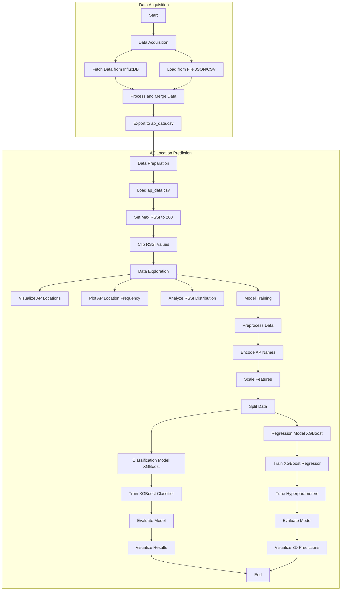

<!--  -->


## Data Acquisition Process [(Notebook)](../src/data_adquisition.ipynb)

### Overview
The data acquisition process involves collecting and processing WiFi signal strength data from access points (APs) in a building. This process is detailed in the `data_adquisition.ipynb` notebook.

### Data Sources
1. **InfluxDB**: The notebook is configured to fetch data from an InfluxDB database, though this option is not currently used.
2. **From File**: Another option is to read data from either a CSV or JSON file. In the current setup, the primary data source is a JSON file (`aruba_07_15.json`) containing WiFi signal strength measurements.
3. **AP Coordinate File**: Additional information about AP locations is sourced from CSV files (`3f.csv` and `2f.csv`).


### Process Steps
1. **Environment Setup**: 
   - Import necessary libraries.
   - Load environment variables (e.g., database token).
   - Set configuration parameters (e.g., source of the data and other settings).

2. **Data Loading**:
   - Fetch data directly from InfluxDB or read it from a file.
   - Convert the data into a pandas DataFrame.

3. **Data Processing**:
   - Filter the data to include only the 2.4GHz band, and clean it by removing any APs with `NaN` values and APs that are not from floors 2 or 3.
   - Process BSSID information to match it with known APs for which exact coordinates are available.
   - Pivot the data to create a wide-format table, with RSSI values for each AP.

4. **AP Information Integration**:
   - Load AP coordinate data from CSV files.
   - Merge AP location information with the signal strength data.

5. **Data Export**:
   - Save the processed data to a CSV file (`ap_data.csv`).


#### (Example) 3f.csv File Structure
The `3f.csv` file contains information about the location of access points on the 3rd floor. Each line in the file represents an AP with the following structure:

```
AP_Name,X_Coordinate,Y_Coordinate,Z_Coordinate
```

For example:
```
D1_3F_AP10,137.17,82.934,55.648
```
This structure facilitates the mapping of access points to their precise physical locations within the building. The `z` coordinate is consistent across all APs. Additionally, the AP name contains information about its location: in the example, `D1_3F_AP1` indicates Building D1, Floor 3, Room 10.


### Resulting Dataset Structure (ap_data.csv)
The final dataset in `ap_data.csv` has the following structure:

1. **Timestamp**: The time of the measurement (`_time`)
2. **Network Information**: 
   - ESSID 
   - BSSID
   - Frequency Band
3. **RSSI Values**: Multiple columns (rssi_D1_2F_AP01, rssi_D1_2F_AP02, etc.) representing the Received Signal Strength Indicator for each AP
4. **AP Information**:
   - AP Name
   - X, Y, and Z coordinates of the AP

This structure combines the signal strength measurements with the physical location data of the APs, providing a comprehensive dataset for further analysis and modeling of WiFi signal propagation in the building.

## AP Location Prediction Process

### Data Preparation and Exploration

#### 1. Data Loading
- Load the preprocessed data from `ap_data.csv`
- Set maximum valid RSSI to 200 and clip values accordingly

#### 2. Data Visualization

**AP Locations on the 2nd and 3rd Floors**

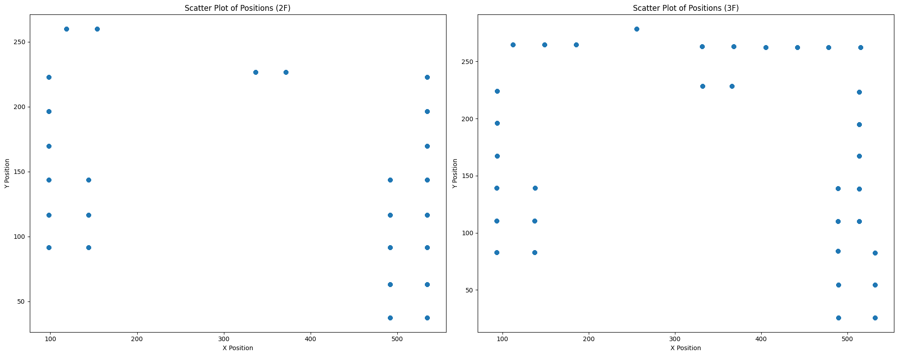

**AP Location Frequency**

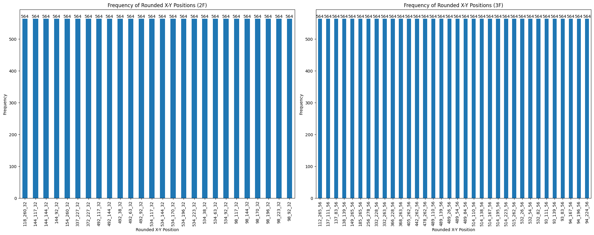


#### 3. Data Distribution Analysis

**Distribution of RSSI Values by Location**

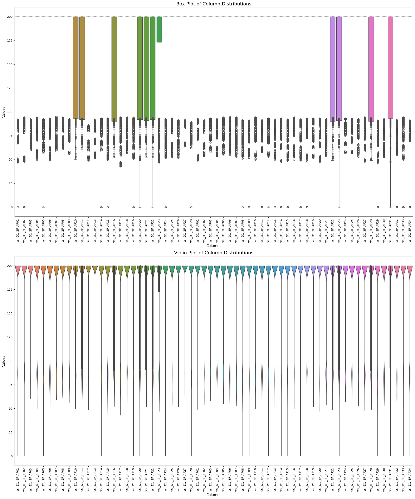


### Classification Model (XGBoost)

The initial step was to use a classification model to leverage the AP names, which encode the floor and room information. This can provide valuable context for estimating AP positions and simplifies the learning process compared to using just floating-point coordinates. 

We performed classification using RSSI values received from each known AP, with the AP generating them as the label. Below are the detailed steps of the process:


#### 1. Data Preprocessing
- Encode AP names using LabelEncoder
- Scale features using RobustScaler
- Split data into training, validation, and test sets

#### 2. Model Training
- Initialize and train XGBoost Classifier

#### 3. Model Evaluation
- Make predictions on the test set
- Calculate accuracy and generate classification report

```
Accuracy: 1.00
Classification Report:
              precision    recall  f1-score   support

           0       1.00      1.00      1.00       110
           1       1.00      1.00      1.00       100
           2       1.00      1.00      1.00       121
           3       1.00      1.00      1.00       122
           4       1.00      1.00      1.00       113
           5       1.00      1.00      1.00       107
           6       1.00      1.00      1.00        99
           7       1.00      1.00      1.00       105
           8       0.99      1.00      1.00       113
           9       1.00      1.00      1.00       118
          10       0.99      0.99      0.99        88
          11       1.00      1.00      1.00       113
          12       1.00      1.00      1.00       114
          13       1.00      1.00      1.00       104
          14       1.00      1.00      1.00       124
          15       0.99      1.00      1.00       102
          16       1.00      1.00      1.00       120
          17       1.00      0.99      1.00       126
          18       1.00      1.00      1.00       102
          19       1.00      1.00      1.00       103
          20       1.00      1.00      1.00       112
...
    accuracy                           1.00      6768
   macro avg       1.00      1.00      1.00      6768
weighted avg       1.00      1.00      1.00      6768

```

#### 4. Visualization of Results

**2F Predictions**

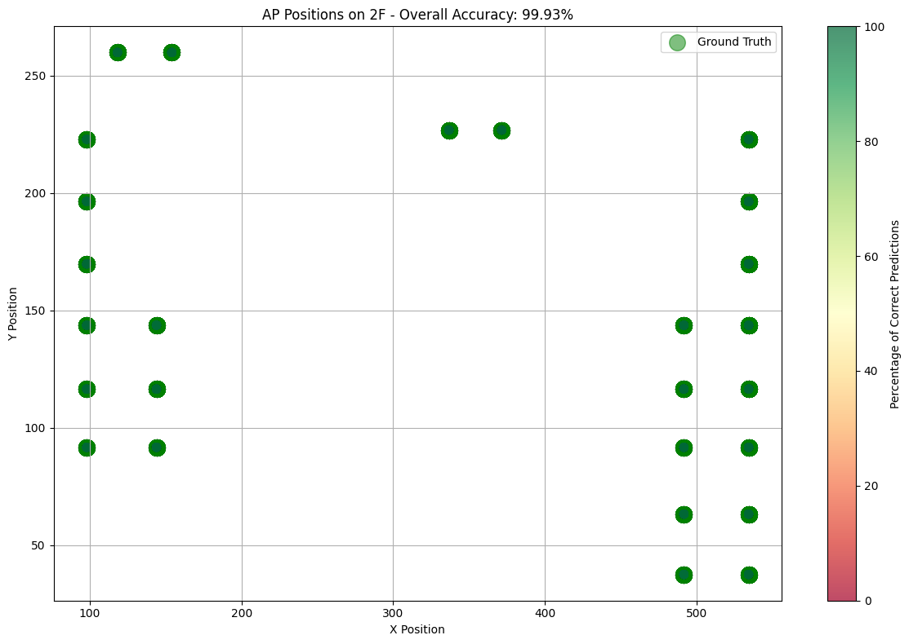

**3F Predictions**

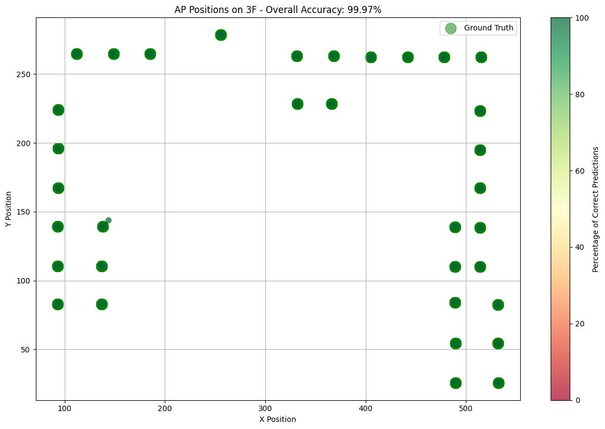

### Regression Model (XGBoost)
The next approach involved training a regression model to predict the exact coordinates of the AP positions. Unlike the classification model, which uses categorical labels, this model aims to provide precise numerical estimates for the AP locations.


#### 1. Data Preparation
- Prepare features (X) and target variables (y) for regression
- Scale features using RobustScaler
- Split data into training, validation, and test sets

#### 2. Model Training and Hyperparameter Tuning
- Set up XGBoost Regressor with MultiOutputRegressor
- Perform grid search with cross-validation for hyperparameter tuning

#### 3. Model Evaluation
- Make predictions using the best model
- Calculate Mean Squared Error (MSE) for each coordinate (x, y, z)

```
Overall Mean Squared Error: 2.275571252158504
MSE for x: 0.1400330895714517
MSE for y: 6.663314017327542
MSE for z: 0.023366649576518992
```

### 4. 3D Visualization of Predictions
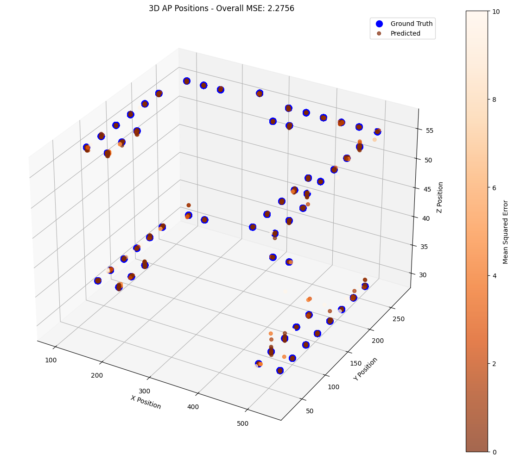

This process shows classification and regression approaches to predict AP locations based on RSSI values. The classification model predicts the specific AP, while the regression model estimates the exact 3D coordinates of the APs.


## Predictions Across All Floors

Following the previous results, we decided to extend the analysis to cover all floors. To achieve this, we adapted the notebooks `data_acquisition.ipynb` and `ap_location_prediction_ntustdata.ipynb` to process data across all floors.

### Experimentation

After modifying the notebooks, we ran the same experiments on the same dataset. The initial data, collected over a single day in August, is insufficient to cover all APs. As a result, certain floors have APs with no associated data points in the dataset. In other words, although each floor has the same number of APs, not all floors have an equal number of data points mapped to them, and not all APs on every floor have associated data.

This is evident in the following images: some floors lack data for certain APs, and the distribution of data points varies across floors.

* **AP Locations Across Floors**  
  In this first image, we can see the locations of the APs that have data associated with them:  
  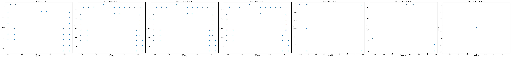

* **Data Distribution by Floor**  
  In this image, we can observe the distribution of data points across the APs on each floor:  
  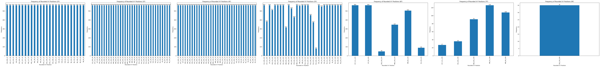

It is clear that many APs have no associated data in the dataset. For example, floors 10 to 13 (which have the same number of APs as every other floor) do not even appear in the plot because no data points are associated with them. Additionally, in the upper floors, only a few APs have data, and in general, they have fewer data points than APs on the lower floors.

Here is a summary of the key results:

### 2D Classification: 
#### Metrics 

Here are the results of the classification:

```
Accuracy: 1.00
Classification Report:
              precision    recall  f1-score   support

           0       1.00      1.00      1.00       105
           1       1.00      1.00      1.00       126
           2       1.00      1.00      1.00       115
           3       1.00      1.00      1.00       110
           4       1.00      1.00      1.00       108
           5       1.00      1.00      1.00       115
           6       1.00      1.00      1.00       135
           7       1.00      1.00      1.00        97
           8       1.00      1.00      1.00       117
           9       1.00      1.00      1.00       101
          10       1.00      1.00      1.00       102
          11       1.00      1.00      1.00       112
          12       1.00      1.00      1.00        97
          13       1.00      0.99      1.00       124
          14       1.00      1.00      1.00       113
          15       1.00      1.00      1.00        94
          16       1.00      1.00      1.00       120
          17       1.00      1.00      1.00       113
          18       1.00      1.00      1.00       116
          19       1.00      1.00      1.00       107
          20       1.00      1.00      1.00       114
...
    accuracy                           1.00     14091
   macro avg       0.98      0.99      0.98     14091
weighted avg       1.00      1.00      1.00     14091
```

#### Visualization  


### 3D Regression 
#### Metrics

Here are the results of the regression:

```
Overall Mean Squared Error: 102.84645869221747
MSE for x: 282.3698563415208
MSE for y: 22.845010840643134
MSE for z: 3.3245088944885013
```

#### Visualization  
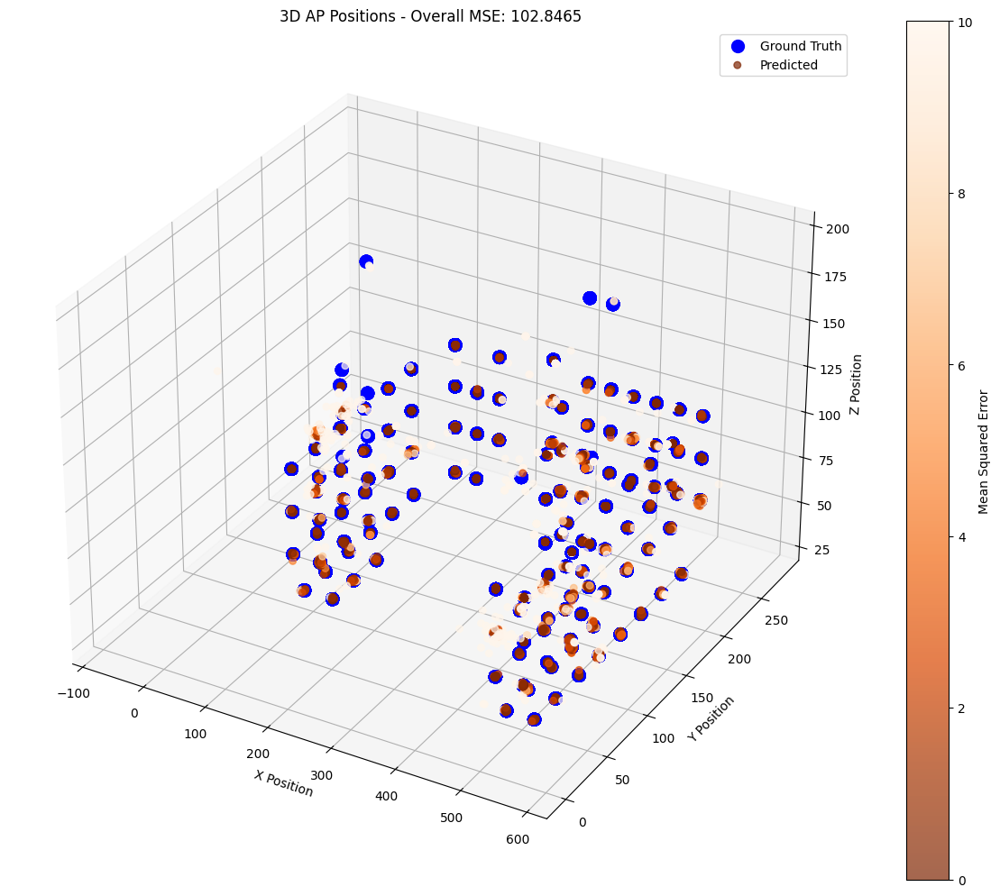