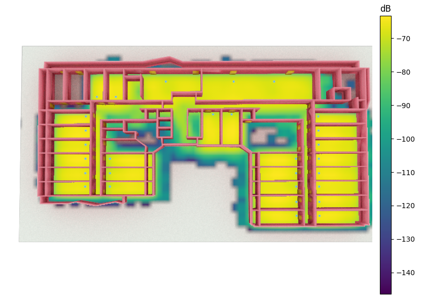
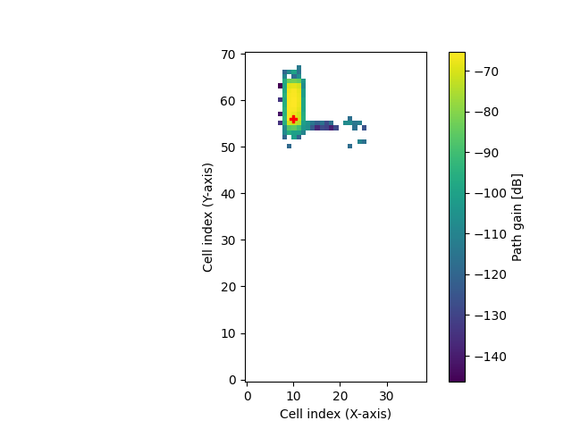
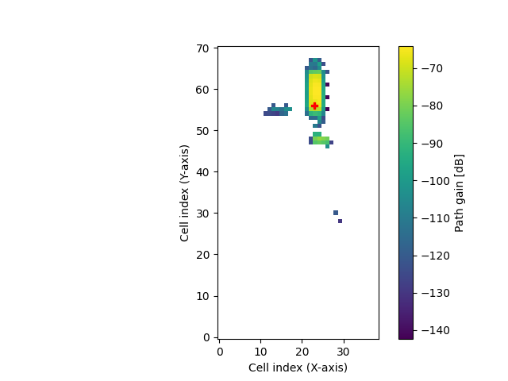
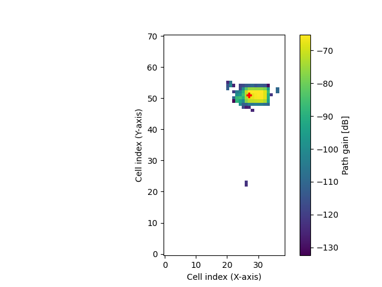
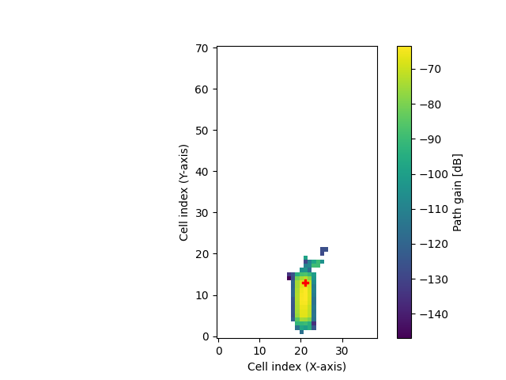
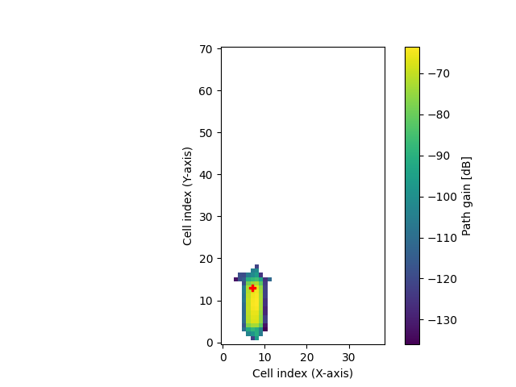
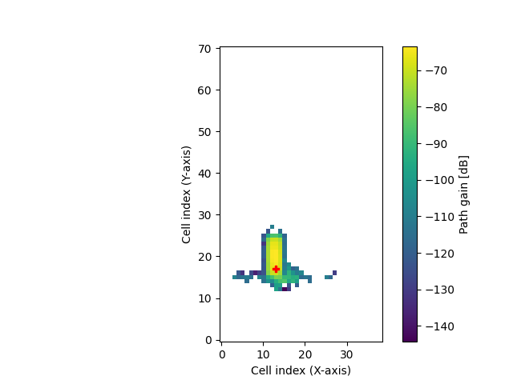

# Sionna Modeling

## Blender Steps

1. Load the desired Blender file in Blender.
2. (Optional) Group similar structures. For example, group all walls into a collection called "Walls".
3. (Optional) Ensure that all collections or objects have the desired `itu_material`. If not, create a new material and add the relevant `itu_*` name (see [Sionna Docs](https://nvlabs.github.io/sionna/api/rt.html#radio-materials)).
4. Add the [Mitsuba addon](https://github.com/mitsuba-renderer/mitsuba-blender) to Blender and export the Blender file to Mitsuba. Before exporting:
   - Ensure that the world coordinates of the model are in the desired position.
   - Choose the desired axis of export (you don't need to follow the Blender convention).

## Preprocessing

We had some data files about the position of the AP in a previous Blender model. Since we didn't change the relative position of the AP, we decided to load the previous data and add the necessary rotations and translations. This process can be seen in the [Sionna_APS notebook](../src/sionna/sionna_add_aps.ipynb).

## Sionna

(To use Sionna 0.18, make sure you are using TensorFlow 2.15)

You can view the detailed steps in the [Sionna modeling notebook](../src/sionna/sionna_modeling.ipynb).

These are the basic steps to model the signal propagation of all the APs in the scene in Sionna:

1. Load the scene from the Mitsuba file.
2. Add the transmitters from the data file.
3. Create antenna arrays for all transmitters and receivers.
4. Compute the coverage map (it will automatically compute the coverage map for all the transmitters in the scene).
   - Remember that the coverage maps by default will appear at 1.5m from the floor, so be careful not to obstruct the signal unintentionally by making the ground solid higher than 1.5m.
5. Visualize either each coverage map individually or use the code in the notebook to combine all of them into a single coverage map.

Here's the corrected and improved markdown with all images set to a width of 400 pixels:

### Results

These are some of the results we obtained.

Coverage map of full environment:

Single AP coverage maps:

