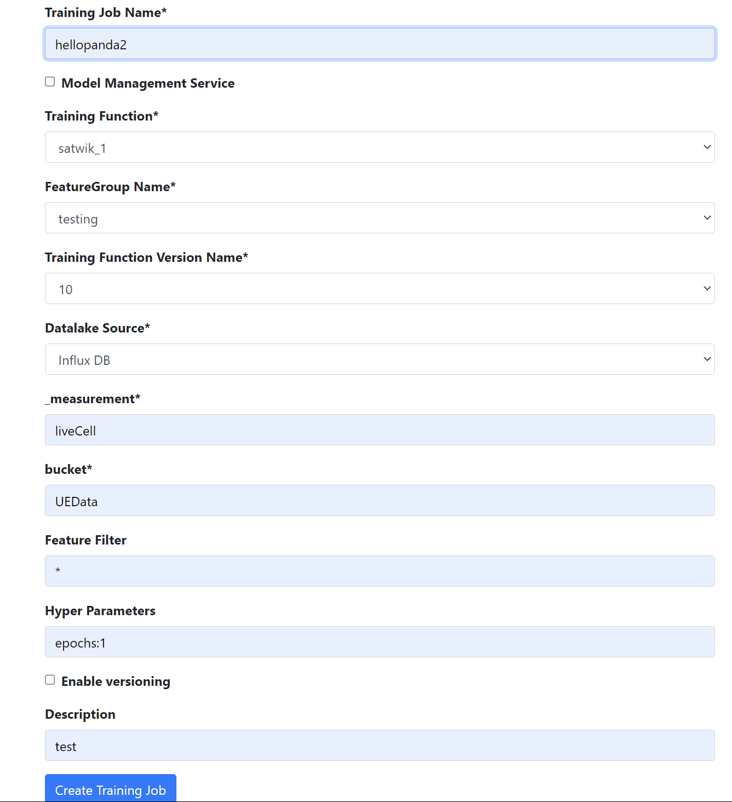
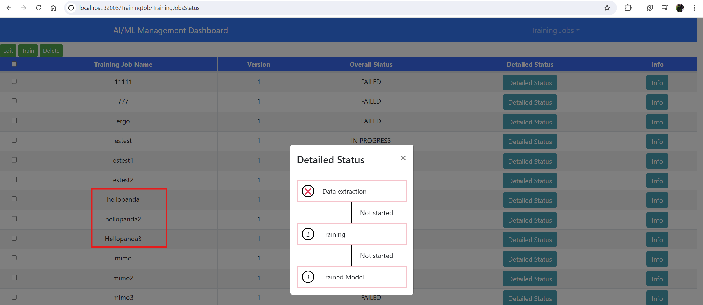
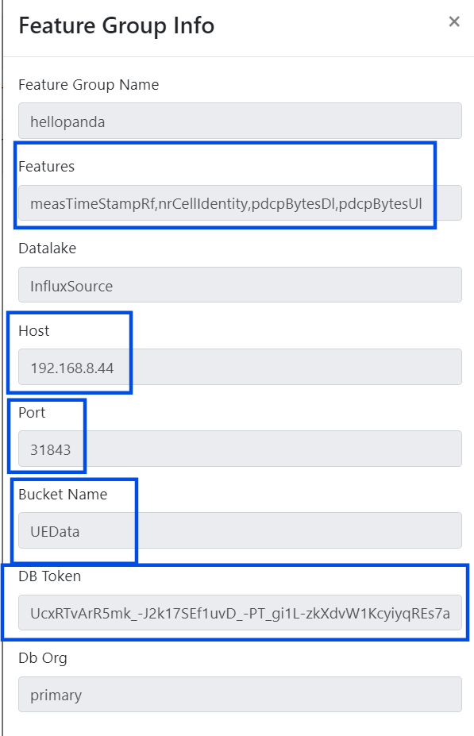

# Guide of AI/ML Management Dashboard - Satwika Bintang
## 1. Follow the Guide of AIMLFW
### Open Browser
```
http://localhost:32005/
```
## 2.Create training Function


### Click **Create Training Function**

## 3. Create New ipynb file
### copy the untitled.ipynb code to new ipynb file

### 4 Copy "In[7]" code and modify "pipeline_name" and "request.post_URI" to the "qoetest" before you running.
## 5. checklist zip file and download 

## 6.Go to localhost:32005 and fill the "Create training Job"

## 7. Check "Training Job Status"

### Data extraction  is still failed because the data is still empty. [Solution](https://hackmd.io/ai9WR29zTl2Rmle8K4-Yog#7-2-Rroblem-2%EF%BC%9AInfluxDB-datalake-cant-able-to-training-)

## 8. Create Feature Group
### Feature Group  Name: Hellopanda

## 9. Create Training Job

## 10. Training Job Status succeeded
### Trajining Job Name: Hellopanda22
