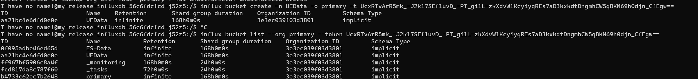
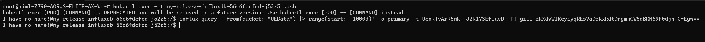
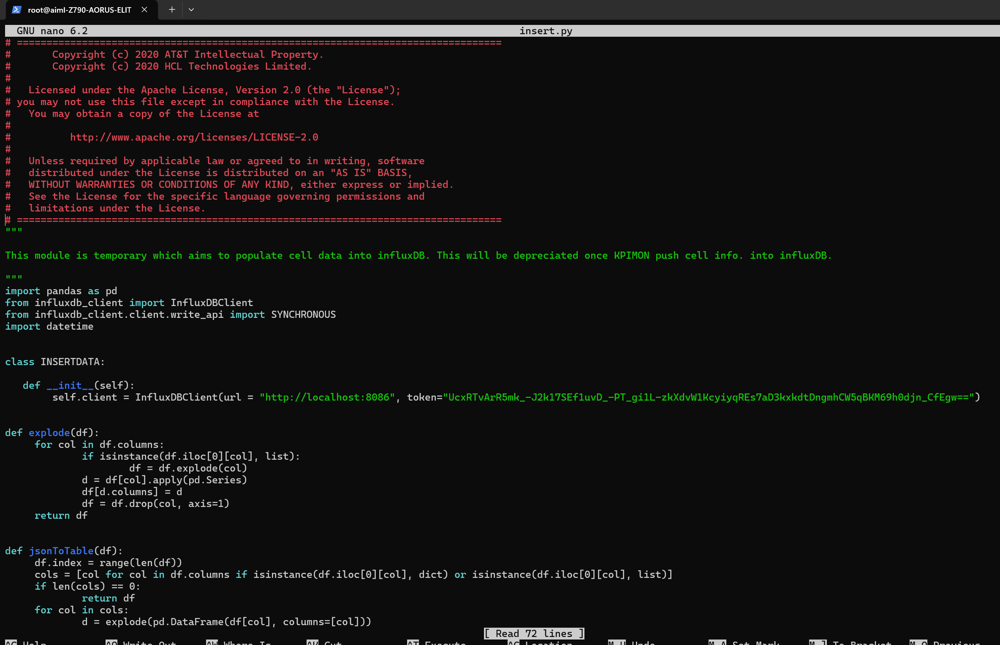
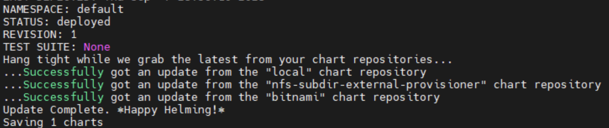
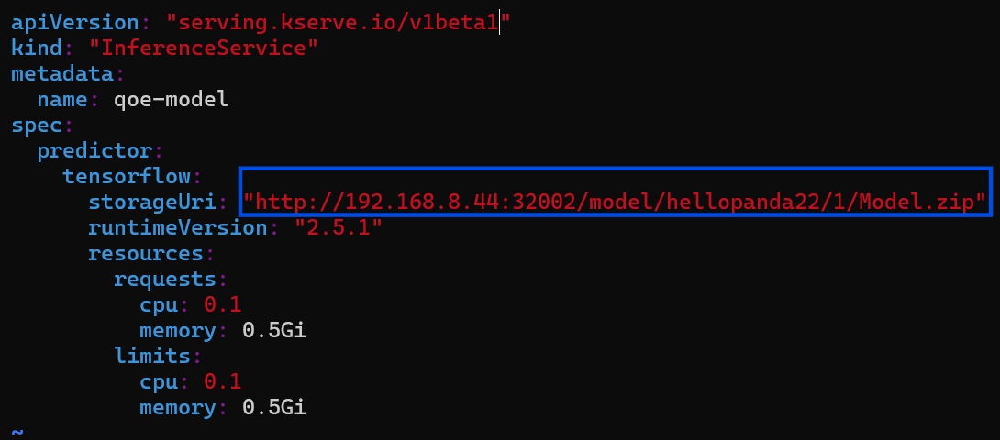
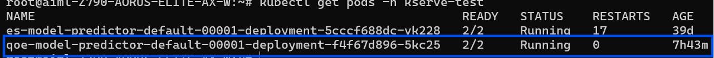
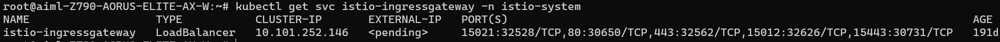
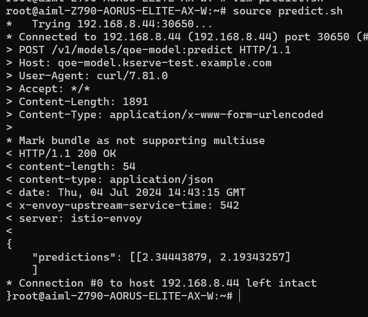

# Guide of AIMLFW Server - Satwika Bintang
## References:
1. [Installation Guide of AIMLFW](https://hackmd.io/@Jerry0714/rkdJx5gph)
2. [H Release User Guide of AIMLFW](https://hackmd.io/@Jerry0714/HJmhjj-kT)
3. [Integration of the AIMLFW, Non-RT RIC and SMO](https://hackmd.io/@Jerry0714/ryCs5xmep)
4. [Wireguard VPN Connection and VM Access](https://hackmd.io/@Yueh-Huan/r1Ti7Y0cq) 
5. [Testing new training method in AI/ML](https://hackmd.io/slNyjq7MTHe5TEmMa7xo_g)
## 1.  upload VPN's zip file from your mentor to WireGuard , then activate.
### I.  Download & Install Wireguard: [link](https://www.wireguard.com/install/)
 ### II. upload VPN's zip file from your mentor to WireGuard , then activate.

## 2. Open terminal, then ssh to server
```
ssh <Username>@<IP Address>
example:
ssh -L 32005:localhost:32005 aiml@192.168.8.44
```
### **Password: bmwlab**
### Result:

## 3. If InfluxDB has been installed
```
1.  sudo -i
2.  cd aimlfw-dep
3. kubectl get pod -A
```
### Result:

### After you find, use this command to in to the pod.
```
kubectl exec -it <pod name> bash
example:
kubectl exec -it my-release-influxdb-56c6fdcfcd-j52z5 -- bash
```
### **Result**
```
I have no name!@my-release-influxdb-56c6fdcfcd-j52z5#
```
## 4. Find Username and Token

### I. if the token is empty, go to [influxdb website](http://192.168.8.44:31843/) to generate token
``` 
username: admin
password: tXrOx1Hul 
```
### II. Go to API Tokens

### II. Clone AI/ML FW and copy and save the Token  (One time only)


## 5. After you find username and Token, use this command to in to the pod (ony for the first time).
``` 
influx bucket create -n UEData -o <org_name> -t <API_Token>
example:
influx bucket create -n UEData -o primary -t UcxRTvArR5mk_-J2k17SEf1uvD_-PT_gi1L-zkXdvW1KcyiyqREs7aD3kxkdtDngmhCW5qBKM69h0djn_CfEgw==
```
### Check the all bucket by this command.
``` 
influx bucket list --org <org_name> --token <API_Token>
example:
influx bucket list --org primary --token UcxRTvArR5mk_-J2k17SEf1uvD_-PT_gi1L-zkXdvW1KcyiyqREs7aD3kxkdtDngmhCW5qBKM69h0djn_CfEgw==
```
### Result


## 6. Enter the Database (QoE Data)
``` javascript
1. kubectl exec -it my-release-influxdb-56c6fdcfcd-j52z5 -- bash
2. influx query  'from(bucket: "UEData") |> range(start: -1000d)' -o primary -t UcxRTvArR5mk_-J2k17SEf1uvD_-PT_gi1L-zkXdvW1KcyiyqREs7aD3kxkdtDngmhCW5qBKM69h0djn_CfEgw==
```
### if data successfuly uploaded

### If see an empty space like in this image, it means there is no dataset. need to upload data first


## 7. Upload the data (if the data empty)
```javascript
1. exit
2. sudo -i
3. "(only clone for the first time, no need to clone again)" git clone -b f-release https://gerrit.o-ran-sc.org/r/ric-app/qp
4. cd qp/qp
5. sudo nano insert.py
```
### result

### Update the code into insert.py file. [Link code](https://hackmd.io/@Jerry0714/rkdJx5gph#3-2-Accessing-Applications-in-the-Cluster-Using-Port-Forwarding-to-send-data)

### Wait for few hours for uploading dataset

## 8.  Influx DB datalake not available

```javascript
cd aimlfw-dep/
vim RECIPE_EXAMPLE/example_recipe_latest_stable.yaml
```

```
press "i" + "escape" to edit 
press "escape" + ":wq" to save and quit
```
### use this command only for re-install datalake
```javascript
1. bin/uninstall.sh
2. bin/install.sh -f RECIPE_EXAMPLE/example_recipe_latest_stable.yaml
```
### if show error "can't locate the aimlfw-common helm package"

```javascript
cd aimlfw-dep/bin
./install_common_templates_to_helm.sh
```
### Check the chart is install or not.
```javascript
helm search repo | grep aiml
```

### reinstall the yaml
```javascript
bin/install.sh -f RECIPE_EXAMPLE/example_recipe_latest_stable.yaml
```


## 9. [Go to dashboard website](Guide dashboard JupyterNotebook\dashboard.md)

## 10. Deploy trained qoe prediction model on Kserv
```javascript
1. kubectl create namespace kserve-test
2. cd
3. vim qoe.yaml
```

```
press "i" + "escape" to edit 
press "escape" + ":wq" to save and quit
```
### Copy Mode URL to storage URL

### To deploy model update the Model URL in the qoe.yaml fil
```javascript
1. kubectl apply -f qoe.yaml -n kserve-test
2. kubectl get pod -A
```

```javascript
kubectl get pods -n kserve-test
```


## 11. Test predictions using model deployed on Kserve
###  to obtain Ingress port for Kserve
```javascript
kubectl get svc istio-ingressgateway -n istio-system
```
### change  your IP and port inside vim predict

```javascript
vim predict.sh
```

### obtain your IP and Port

```javascript
1. ip a
2. kubectl get svc istio-ingressgateway -n istio-system
```
```javascript
my IP: 192.168.8.44
my Port: 30650
```
### create sample data for predictions in file input_qoe.json.
```javascript
vim input_qoe.json
```
```javascript
{"signature_name": "serving_default", "instances": [[[2.56, 2.56],
       [2.56, 2.56],
       [2.56, 2.56],
       [2.56, 2.56],
       [2.56, 2.56],
       [2.56, 2.56],
       [2.56, 2.56],
       [2.56, 2.56],
       [2.56, 2.56],
       [2.56, 2.56]]]}
```
### Use command below to trigger predictions
```javascript
source predict.sh
```
### SUCCESS OUTPUT

