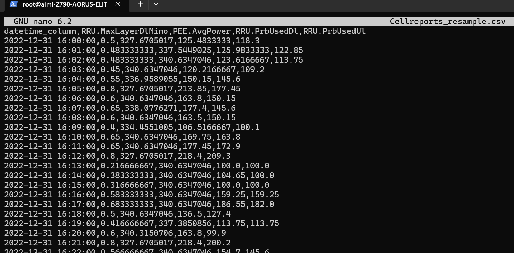
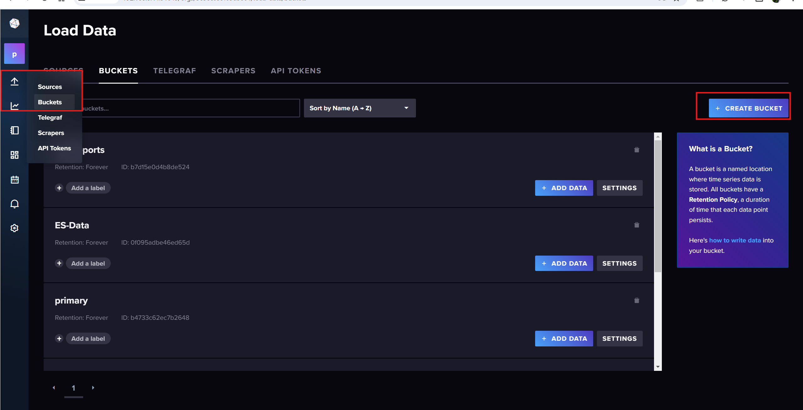
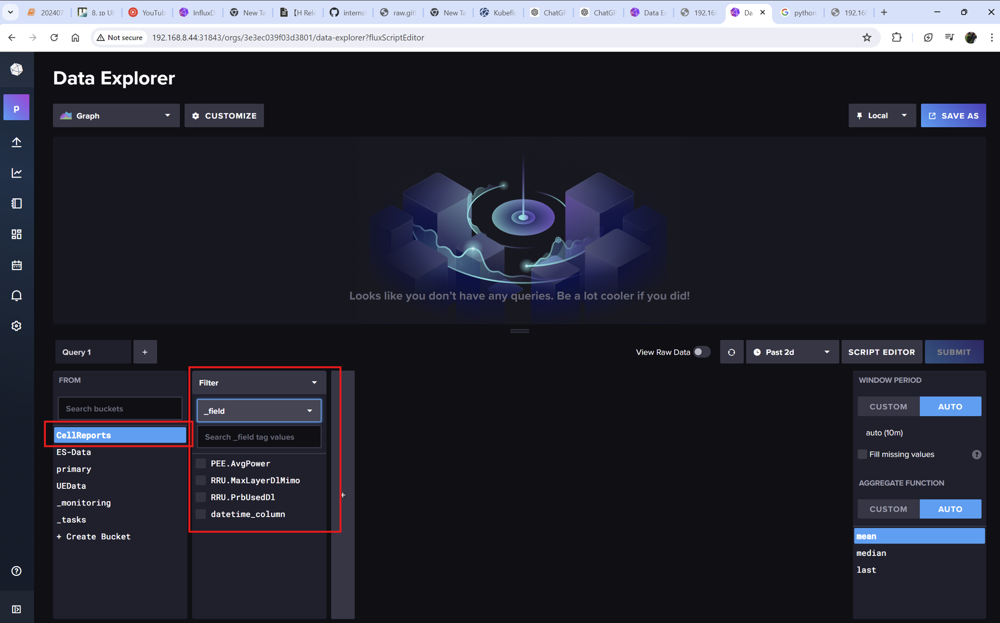

# Upload Data into InfluxDB
## 1. Check if your csv file avaliable or not. If not follow step 2.
```Javasrcipt
1. sudo -i
2. cd aimlfw-dep/demos/hrelease/scripts/
3. ls
```


## 2. Upload file into github/googledrive and access to public. Then, download using "wget"
```Javascript
wget https://raw.githubusercontent.com/bmw-ece-ntust/internship/2024-TEEP-17-Satwika/jupyternotebook/dataset/CellReports_resample.csv -O Cellreports_resample.csv
```
## 3.Check inside csv file
```
sudo nano Cellreports_resample.csv
```

### WARNING: if the csv have columns's name, the for loop in **step 4**  start from 1. If doesn't have, the for loop start from 0.
## 3. Go to Inside csv file
### I.
```
sudo nano Cellreports_resample.csv
```
### II.
```
change this parameter:
1. myorg
2. mybucket
3. mytoken
4. myurl
```
### III.
```
1. Adjust the range of the for loop to match the amount of samples data
2. Rename and adjust the fields for each column in the CSV
```


#### [link to get token  and org](https://github.com/bmw-ece-ntust/internship/blob/2024-TEEP-17-Satwika/vscode%20notes/notes%20AIMLF%20Server/Guide%20of%20AIMLFW%20Server.md#4-find-username-and-token)

### How to define bucket
Go to website: http://192.168.8.44:31843/


## 4. insertdata into influx db
```
pyhton3 pushdata.py
```
Go to website: http://192.168.8.44:31843/. The output if the data is successfully uploaded.
